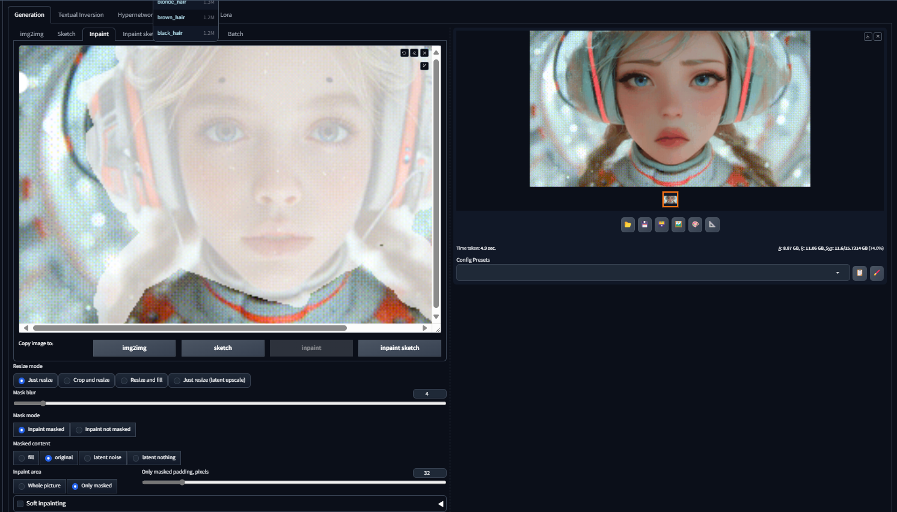

<script async src="https://pagead2.googlesyndication.com/pagead/js/adsbygoogle.js?client=ca-pub-2844921131740253"
     crossorigin="anonymous"></script>
<!-- Global site tag (gtag.js) - Google Analytics -->
<script async src="https://www.googletagmanager.com/gtag/js?id=G-H1234VX5NE"></script>
<script>
  window.dataLayer = window.dataLayer || [];
  function gtag(){dataLayer.push(arguments);}
  gtag('js', new Date());

  gtag('config', 'G-H1234VX5NE');
</script>


```
この記事にはこんなことが書かれています。
- Stable diffusion(Automatic1111)でgif動画を作る
- 動画をつくる色々な方法について
- 試してみた
```

----

## 動画を作る色々な方法<br>
Civitaiの色んな動画をみていて、いろんな方法があるなと。例えば全部じゃないけど以下の方法がありそう。<br>
１ txt2img→img2vid<br>
２ temporalkit<br>
３ Ebsynth+ control net<br>
４ annimation diff<br>
５ gif2gif<br>
<br>
色々軽く試してはみたけど、手軽にまずやるなら５と感じました。<br>
ので、今回は５の方法を紹介します。<br>
<br>
最初に結論：作ったGIF画像はこんな感じです<br>
  
<!-- 参考
https://www.youtube.com/watch?v=AN2Qf7Gek4g&t=2s
サンプル
https://civitai.com/images/13619186
https://civitai.com/images/1737027 -->
<br>

----
## gif to gif（その１。元のGIFを作る）<br>
まず、ffmpegでgifを作る。<br>
[ここからはじめる](https://jp.videoproc.com/edit-convert/how-to-download-and-install-ffmpeg.htm)<br>
<br>
上記でインストール完了したら、以下コマンドを実行<br>
普通にやると数秒の動画でもかなり重いので、結論以下が良さげ<br>
<br>
```
ffmpeg -i input.mp4 -r 10 output.gif
```
<br>
これでも動画によっては重い。体感1.5MBくらいのgifが限度（Automatic 1111UIに読み込みができなかった）なので<br>
```
ffmpeg -ss 0 -t 3 -i src.mp4 -vf "fps=10,scale=320:-1:flags=lanczos" -c:v gif output.gif
```
<br>
を実行して通した。3秒の動画にしてGIF化<br>
<br>

```
上記コマンドの補足
-ss 0: 動画の開始位置を0秒に設定します。
-t 3: 変換する動画の長さを3秒に設定します。
-i input.mp4: 入力動画ファイルの名前を指定します。
-vf "fps=10,scale=320:-1:flags=lanczos": フレームレートを10fpsに設定し、幅を320ピクセルにスケーリングします。flags=lanczosは高品質なスケーリングを行います。
-c:v gif: 出力形式をGIFに設定します。
output.gif: 出力されるGIFファイルの名前を指定します。
```


サンプルとして、例えば以下動画を使わせてもらうことにする<br>
[サンプル](https://pixabay.com/ja/videos/%E3%83%98%E3%83%83%E3%83%89%E3%83%9B%E3%83%B3-%E5%A5%B3%E3%81%AE%E5%AD%90-%E5%A5%B3%E6%80%A7-202718/)<br>
<br>
その他ffmpeg補足。<br>
genspark.aiの回答をそのまま貼り付ける<br>
<br>

```
AIによる直接回答
ffmpegで任意の動画からgifを作る方法を詳しく解説して
FFmpegを使用して任意の動画からGIFを作成する方法は、非常にシンプルでありながら強力な機能を持っています。以下に、具体的な手順とオプションについて詳しく解説します。

まず、FFmpegをインストールする必要があります。Windowsでは公式サイトからバイナリをダウンロードし、macOSではHomebrewを使ってインストールできます。Linuxでは、ターミナルから簡単にインストール可能です。

基本的なGIF変換コマンド
動画ファイルをGIFに変換するための基本的なコマンドは以下の通りです：

ffmpeg -i input.mp4 output.gif
ここで、input.mp4は変換元の動画ファイル名、output.gifは出力されるGIFファイル名です。このコマンドを実行すると、指定した動画がそのままGIF形式に変換されますが、ファイルサイズが大きくなることがあります。

解像度とフレームレートの調整
GIFの品質やサイズを最適化するためには、解像度やフレームレートを調整することが重要です。以下のオプションを使用します。

解像度の指定
解像度を指定するには、-vf scaleオプションを使用します。例えば、幅320ピクセルにリサイズし、高さはアスペクト比を保つ場合は次のようにします：

ffmpeg -i input.mp4 -vf scale=320:-1 output.gif
ここで、-1は自動的に高さを計算させるための指定です。

フレームレートの指定
フレームレートを指定するには、-rオプションを使用します。例えば、フレームレートを10fpsに設定する場合は次のようになります：

ffmpeg -i input.mp4 -r 10 output.gif
フレームレートが低いほどファイルサイズは小さくなりますが、滑らかさが失われる可能性があります。

高品質なGIF作成
より高品質なGIFを作成するためには、パレット生成機能を利用することが推奨されます。以下の手順で行います：

パレット生成: 最初に動画から256色のパレットを生成します。

ffmpeg -i input.mp4 -vf palettegen palette.png
パレットを使用してGIF作成: 次に、そのパレットを使ってGIFを生成します。

ffmpeg -i input.mp4 -i palette.png -lavfi paletteuse output.gif
この方法では、色数が制限されるGIFでも画質が向上します。

まとめ
FFmpegを使った動画からGIFへの変換は非常に柔軟で、多くのカスタマイズが可能です。基本的なコマンドから始めて、解像度やフレームレートの調整、高品質なGIF作成のためのパレット生成など、自分のニーズに合わせて設定していくことができます。これにより、SNSやプレゼンテーション用に最適なGIFアニメーションを作成できるでしょう。
```
<br>

----
## gif to gif（その２。WEB UI上の操作）<br>
作成したGIFを食わせて、まずimg to imgでプロンプトの正確性の確認をする。<br>
ここで、Seedも良いのを探す。<br>
ポイントは、<br>
Denoising strength = 0.3くらいがよい。0.2～0.4くらいで調整する。<br>
ちらつきが多くなるし、元動画から崩れてしまうので。<br>

上記については、以下動画を参考にしています。<br>
[参考動画](https://www.youtube.com/watch?v=F0oaHFVUSeY)
<br>

Seedとプロンプトが固定できたら、gif2gifにしてGenerate！！
<br>


うまくいかなかったら、上記動画にあるように
変更したい対象を絞る
inpaintで対象範囲を塗り、Only maskedにチェックを入れてGenerate<br>
  <br>
<br>
これでおわり！<br>

----
## その他参考<br>
[参考サイト](https://www.kombitz.com/2023/02/24/how-to-use-gif2gif-with-automatic1111s-stable-diffusion-web-ui/)


## [Mainページに戻る](https://kissshot-skup.github.io/webpage)

