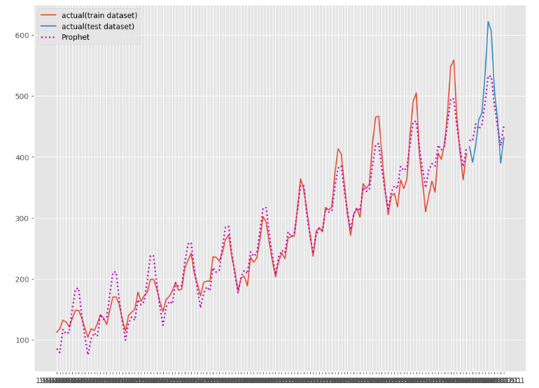

<script async src="https://pagead2.googlesyndication.com/pagead/js/adsbygoogle.js?client=ca-pub-2844921131740253"
     crossorigin="anonymous"></script>
<!-- Global site tag (gtag.js) - Google Analytics -->
<script async src="https://www.googletagmanager.com/gtag/js?id=G-H1234VX5NE"></script>
<script>
  window.dataLayer = window.dataLayer || [];
  function gtag(){dataLayer.push(arguments);}
  gtag('js', new Date());

  gtag('config', 'G-H1234VX5NE');
</script>


```
この記事にはこんなことが書かれています。
- Pythonを使ってデータ分析をはじめよう
- 時系列データの予測をしよう
- prophetを使おう
```

----
 <br>
### ■環境の準備<br>
様々な環境で実行することができるが、中でも下記条件で実施することにした。 <br>

```
・Anacondaを使用する
・prophetのライブラリを使いたい
```

Anacondaはデータ分析を始める上で有益なプラットフォームとのことで選択。 <br>
Prophetは、旧Facebookが開発した時系列データを予測するライブラリで、かなり有用そうと思われたため選択。 <br> <br>
よし、さっそくとりかかったところ数時間… <br>
めちゃくちゃ時間がかかった。エラーが出まくった。 <br>
以下参考になればと思うので、やり方を展開します↓ <br>
※Anacondaのインストールはされていることが前提です。 <br>
　ここは簡単だと思うので省略します。 <br> <br>

まず、必要なライブラリのインストールから始めます。
ここが一番の関門でした。
ほしかったライブラリであるprophetは、pythonのバージョンを選ぶらしいです。
下記サイトを参考に旧バージョンpython 3.7.11でAnaconda上で立ち上げ。
それから下記サイトのとおり、コマンドを実行していきます <br>

```
conda install libpython
conda install -c msys2 m2w64-toolchain
conda install numpy cython matplotlib pandas statsmodels scikit-learn
conda install -c conda-forge fbprophet
conda install -n base -c conda-forge jupyterlab_widgets
conda install -n Python_ex -c conda-forge ipywidgets
```

上記を順に実行。5分くらいかかるかな。 <br>
[参考サイト](https://sukkiri.jp/technologies/ides/anaconda/%E6%9C%80%E6%96%B0%E7%89%88anaconda21%E5%B9%B45%E6%9C%8827%E6%97%A5%E7%8F%BE%E5%9C%A8%E3%81%ABpython3-7%E3%81%AE%E7%92%B0%E5%A2%83%E3%82%92%E4%BD%9C%E3%82%8Aprophet%E3%82%92%E3%82%A4%E3%83%B3.html) <br>

そのほか参照したこと↓ <br>
・JupiterLabを使ったことがなかったため、こちらを参照 <br>
[JupiterLabで新規ファイルの作成](https://udemy.benesse.co.jp/development/python-work/jupyter-notebook.html) <br>

NewからPython3クリックで新規ファイルを作成すればよい <br>
※もちろんPythonのプロンプトで実行でも同様の処理が可能。 <br>
<br>
<br>

----
 <br>
### ■時系列データ解析テスト<br>
環境ができたところで、時系列データを読み込み学習していこう。 <br>
下記サイトが優秀なので、これを上から実行していく <br>
[参考サイト2](https://www.salesanalytics.co.jp/datascience/datascience091/) <br>
で、できた・・・ <br>
 
 <br>
環境の構築が長かったと思いますが、ここまでできた方お疲れ様でした。 <br>

<br>
上記データ解析結果のアレンジに挑戦するなら以下を参考にが良さそう <br>
・[入力データを変えてみる](https://qiita.com/ishiken3/items/71f1d354b3119ae6c09f) <br>
・[詳細にパラメータチューニングするなら](https://amateur-engineer-blog.com/getting-started-prophet/) <br>


私がでつまづいたところを記しておきます。 <br>
・Optunaが無いよ～というエラーが出た <br>
下記サイトを参考にインストール <br>
[Optunaが無いというエラーの対処法](https://rin-effort.com/2019/12/30/machine-learning-7/) <br>
端的に言えば以下コマンドを実行 <br>
```
conda install -c conda-forge optuna
```
※上記サイトのとおりconda install optunaではNG <br>

その他もっと初心者的につまづいたところは最下段で案内しています。 <br>
 <br>

---

### ■その他初心者的に悩んだところ <br>
・パッケージのインストール時に、色々やり方があること <br>
例えば <br>
①pip ～ <br>
②!pip ～ <br>
③conda ～ <br>
 <br>
①はコマンドプロンプトで実行する時のコード <br>
②はJupyter Notebookでの実行コード <br>
③はAnacondaでの実行コード <br>
 <br>
エラーが出まくるので、一つずつgoogle先生に聞いてつぶしていくしかない <br>
SSLエラー系は、管理者権限でコマンドプロンプトを起動したら直るとか <br>
Pathの設定がおかしかったりという記事が多く、四苦八苦しながら対処した。 <br>
あとはバージョン違いだと動かないということがざらにある。 <br>
ダウングレードしたりすると解消するが、先駆者が実行した環境と同じバージョンを用意してやってみるのが最短だと思った。 <br>
それで通らないなら、別の問題がある。 <br>
試行錯誤した結果、エラーを出しながらも出力結果は問題なかったり、いつの間にか解消したり、最終的に何が良かったのかはわからないというのが多い。 <br>

・python構文で調べたところ <br>
例として調べた構文の意味合いをメモ <br>
```
【import x as y】：ライブラリを読み込んで好きな名前にリネームする
　xはライブラリ名
　yは自分の好きな名前
　
メリット：長い名前のライブラリ名を省略できる。
例：
　import pandas as pd
　～
　df = pd.read_csv(url)
　
　#pandasというライブラリをpdと呼び
　#pdライブラリ内のread_csv()関数を使ってcsvを読み込みdfに保存
```
　
```
【from x import y】
　x:モジュール名
　y:クラス名
　
例：from math import pi
　  print(pi)
　#表示は 3.141592653589793となる
　#mathモジュールをインポートし、pi変数を利用
　#piは円周率の値
```
```
【iloc】
ilocは行と列を「行番号」「列番号」で指定します
df_sample.iloc[0:5,0:3]　←df_sampleのテーブルから1～5行目×1～3列目を取り出し
```
```
【配列[始点:終点]】
https://qiita.com/tanuk1647/items/276d2be36f5abb8ea52e
```
```
【plt.subplots()】
軸追加する時に使う
```
```
【plt.legend()】
凡例を追加する
```

----


## [Mainページに戻る](https://kissshot-skup.github.io/webpage)

