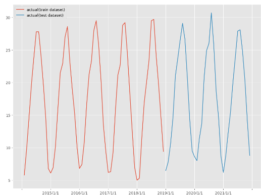
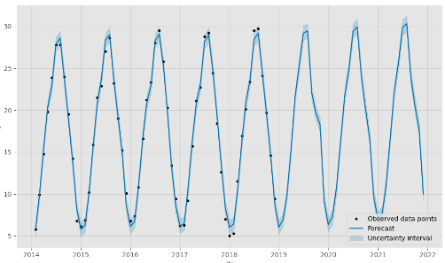
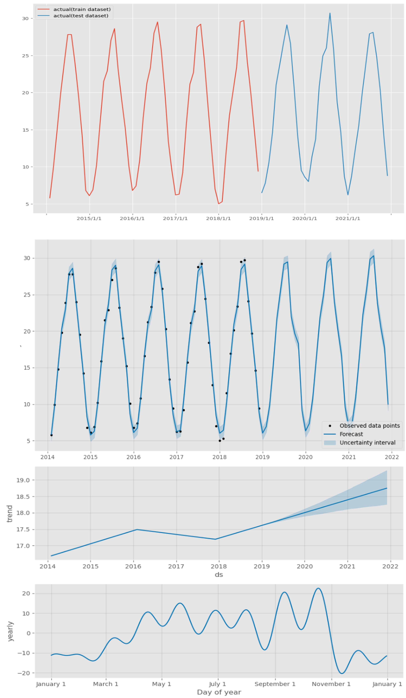

<script async src="https://pagead2.googlesyndication.com/pagead/js/adsbygoogle.js?client=ca-pub-2844921131740253"
     crossorigin="anonymous"></script>
<!-- Global site tag (gtag.js) - Google Analytics -->
<script async src="https://www.googletagmanager.com/gtag/js?id=G-H1234VX5NE"></script>
<script>
  window.dataLayer = window.dataLayer || [];
  function gtag(){dataLayer.push(arguments);}
  gtag('js', new Date());

  gtag('config', 'G-H1234VX5NE');
</script>


```
この記事にはこんなことが書かれています。
- prophetによる時系列データの学習
- 気象庁のデータから気温予測してみる
```

----
 <br>
■環境の準備他<br>
前回の記事を参考にして環境を構築してみましょう。<br>
[前回の記事](https://kissshot-skup.github.io/webpage/aiskillup/) 
 <br>
----
 <br>
■データセットの用意<br>
気象庁から月間の平均気温データを取得しました。 <br>
[気象庁HP](https://www.data.jma.go.jp/obd/stats/etrn/view/monthly_s3.php?prec_no=62&block_no=47772) <br>
今回は2014年1月から2021年12月までのデータを使用します。 <br>
学習データは、2014年～2016年の12×3のデータとし、2017年～2021年の傾向を予測できるか試します <br>
圧倒的にデータ点数が足りない気がしますが、練習としてやってみます <br>
 <br> <br>
ライブラリのインポート等は前回ソースから変更なし。学習データを分割する部分は以下。 <br>

```
# # 学習データとテストデータ12の分割
test_length = 36
df_train = df.iloc[:-test_length]
df_test = df.iloc[-test_length:]
# # グラフ化
fig, ax = plt.subplots()
plt.xticks(np.arange(-1, 132, 12))
ax.plot(df_train.ds, df_train.y, label="actual(train dataset)")
ax.plot(df_test.ds, df_test.y, label="actual(test dataset)")
plt.legend()
```

オレンジが学習データとした部分で、青が予測したいデータです。 <br>
 
<br>
<br>
次に、予測の部分のソースです。 <br>

```
# create instance
m = Prophet()

# fitting 
#m.fit(df)
m.fit(df_train)
# first create datetime of datetime
future = m.make_future_dataframe(periods=36,freq='M')
forecast = m.predict(future)
forecast

#描画
# plt.figure(figsize=(2,3))
m.plot(forecast)
plt.legend()
```
青線が学習結果です。黒い点が入力点になります。 <br>
 

それなりの精度で予測できいそうです。 <br>
以下に、二つの図を並べて正解データと比べてみました。<br>
また、以下ソースで、prophetで予測した傾向を表示することができるようで、trendグラフも追加で表示してみました。 <br>

 
 <br>
パラメータチューニングをしていないのにそれなりの精度で予測できていそうです。 <br>
<br>
以下、メモ。<br>
学習結果をcsvに吐き出したいと思って調べました。以下コードでできました。1行だけで樂ですね。<br>
```
forecast.to_csv("output.csv")
```


‐---
 <br>
■今後やっていきたいこと <br>
prophetで使う関数の数学的意味も理解しないといけないと思っています。<br>
下記記事で紹介してくれていて、とても参考になりそうです。理解を深めていきます<br>
[数式説明](https://devblog.thebase.in/entry/2019/12/20/110000_1) 
----


## [Mainページに戻る](https://kissshot-skup.github.io/webpage)

