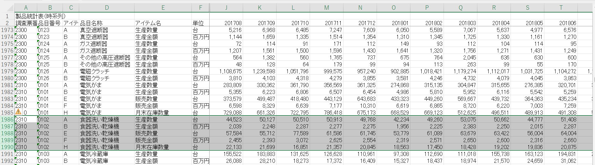
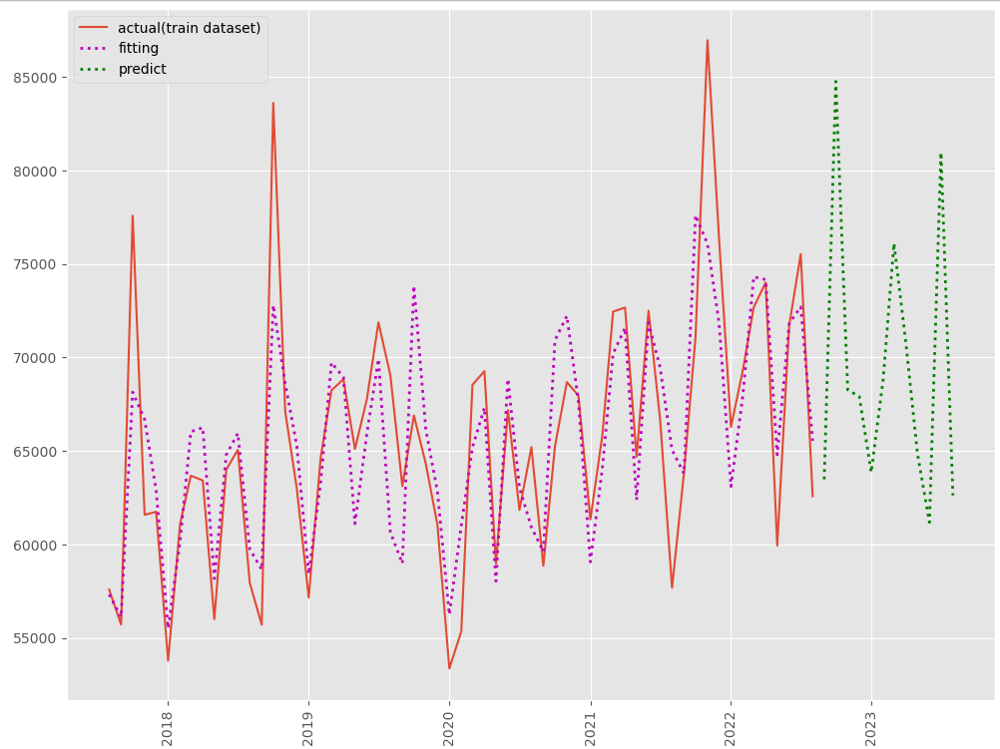
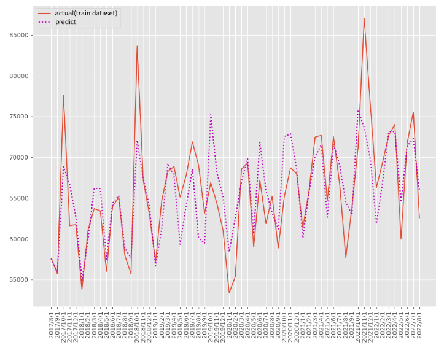
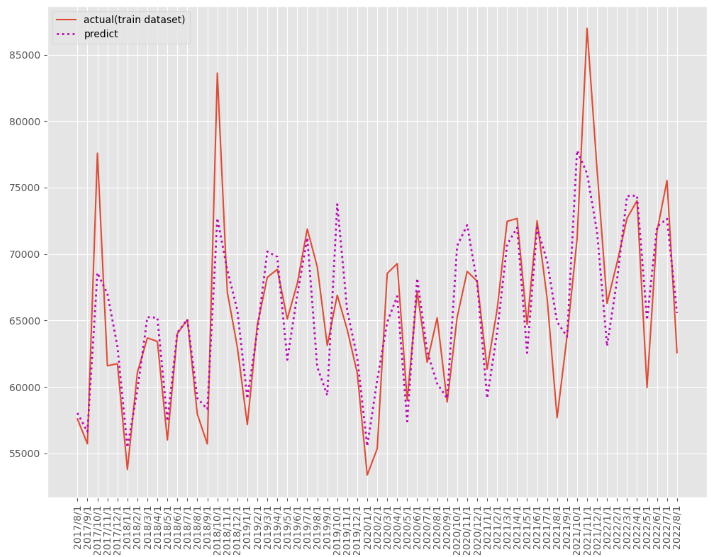

<script async src="https://pagead2.googlesyndication.com/pagead/js/adsbygoogle.js?client=ca-pub-2844921131740253"
     crossorigin="anonymous"></script>
<!-- Global site tag (gtag.js) - Google Analytics -->
<script async src="https://www.googletagmanager.com/gtag/js?id=G-H1234VX5NE"></script>
<script>
  window.dataLayer = window.dataLayer || [];
  function gtag(){dataLayer.push(arguments);}
  gtag('js', new Date());

  gtag('config', 'G-H1234VX5NE');
</script>


```
この記事にはこんなことが書かれています。
- 食洗器が欲しい。前回学んだ機械学習の手法で将来予測してみよう。
```
----
<br>
■経緯<br>
ただ、食洗器が欲しいという理由で、前回学んだ機械学習の手法からいつ安くなりそうか予測したい。<br>
色々パラメータとしては考えられるが、とりあえず生産品がだぶつきそうな月がわかれば安くなる月が予測できるかな・・・？<br>
ということで、前回の学習データを置き換え＆ソース改修してみました。前回までの記事は以下を参照ください<br>
[前回の記事](https://kissshot-skup.github.io/webpage/aiskillup2/) 
[前々回の記事](https://kissshot-skup.github.io/webpage/aiskillup/) 
<br>

----

■学習のインプットとなるデータを探す<br>
食洗器関係のデータをグーグル先生に聞いてみたところ、経産省が良いデータを出しているではありませんか<br>
[経産省HP](https://www.meti.go.jp/statistics/tyo/seidou/result/ichiran/08_seidou.html#menu2) 
 
 素晴らしい。こんな感じ↓<br>
 
<br>
他にもいろいろなデータが格納されているので、学習にはもってこいですね。<br>
 さっそく機械学習にぶち込んでいきましょう<br>
<br>

---- 
■Prophetで学習<br>
 <br>
ソースコードは汚いですが、下の方に載せておきます<br>
結論的には以下の図です。<br>

経産省が出してる実績データが赤線で、これをもとに、紫点線が予測したモデル。<br>
モデルから将来を予測したのが緑点線。<br><br>
11月にピークが来てる...まもなく売れ時？<br>
11月は寒くなってきて欲しくなる人が多いんかな(笑<br>
つまり、生産品がだぶつきそうな12月ごろが買い時か？<br>

 
<br>

以下、ソースコードです。確認用の行も残ったままなので、参考までにという感じです。悪しからず<br>

```
# ライブラリーの読み込み
import numpy as np
import pandas as pd
import optuna
import warnings
from prophet import Prophet
from prophet.diagnostics import cross_validation
from prophet.diagnostics import performance_metrics
from sklearn.metrics import mean_absolute_error
from sklearn.metrics import mean_squared_error
from sklearn.metrics import mean_absolute_percentage_error
import matplotlib.pyplot as plt
plt.style.use('ggplot') #グラフスタイル
plt.rcParams['figure.figsize'] = [12, 9] # グラフサイズ
# データセット読み込み
#url = 'https://www.salesanalytics.co.jp/591h'
#df = pd.read_csv(url)
df = pd.read_csv("pact.csv")
df.columns = ['ds','y'] #日付：DS、目的変数：y
df.head() #確認

# プロット
#df.plot(kind='line',x='ds', y='y')
df.plot(kind='line',x='ds', y='y')
plt.title('data value')                            #グラフタイトル
plt.ylabel('Monthly data') #タテ軸のラベル
plt.xlabel('Month')                                #ヨコ軸のラベル
plt.show()

# # 学習データ指定
df_train = df.iloc[:]

# create instance
m = Prophet()
# fitting 
m.fit(df_train)

# first create datetime of datetime
future = m.make_future_dataframe(periods=12,freq='M')
forecast = m.predict(future)
# print(forecast['yhat'])

# 予測の実施（学習期間＋テスト期間）
# 元のデータセットに予測値を結合
df['Predict'] = forecast['yhat']
dfx= forecast['ds']
# print(df['Predict'])

#予測値2022年まで
train_pred = df['Predict']
# print(train_pred)

#実測値
y_train = df.iloc[:].loc[:, 'y']
print(y_train)

# 精度指標（テストデータ）
print('RMSE:')
print(np.sqrt(mean_squared_error(df_train.y, train_pred)))
print('MAE:')
print(mean_absolute_error(df_train.y, train_pred))
print('MAPE:')
print(mean_absolute_percentage_error(df_train.y, train_pred))

# グラフ化
fig, ax = plt.subplots()
ax.plot(df.ds, df_train.y, label="actual(train dataset)")
ax.plot(df.ds, train_pred, linestyle="dotted", lw=2,color="m",label="predict")
plt.xticks(rotation=90)
plt.legend()

```
ここまでで、以下の図となります。<br>

 
<br>
MAPEは4.6パーセント。まずまずです。<br>
<br>
RMSE:<br>
4261.930592119231<br>
MAE:<br>
3137.788017133628<br>
MAPE:<br>
0.046864292367735316<br><br>

ここから以下コードでより精度よくFittingさせていきます。<br><br>

```
# 目的関数の設定
def objective(trial):
    params = {'changepoint_prior_scale' : 
                 trial.suggest_float('changepoint_prior_scale',
                                       0.3,1
                                      ),
              'seasonality_prior_scale' : 
                 trial.suggest_float('seasonality_prior_scale',
                                       1,80
                                      ),
              'seasonality_mode' : 
                 trial.suggest_categorical('seasonality_mode',
                                           ['additive', 'multiplicative']
                                          ),
              'changepoint_range' : 
                  trial.suggest_discrete_uniform('changepoint_range', 
                                                 0.8, 0.95, 
                                                 0.001),
              'n_changepoints' : 
                  trial.suggest_int('n_changepoints', 
                                    30, 60),
             }
    m = Prophet(**params)
    m.fit(df_train)
    df_future = m.make_future_dataframe(periods=test_length,freq='M')
    df_pred = m.predict(df_future) 
    preds = df_pred.tail(len(df_test))

    val_rmse = np.sqrt(mean_squared_error(df_train.y, train_pred))   
    # val_rmse = np.sqrt(mean_squared_error(df_test.y, preds.yhat))
    return val_rmse

# ハイパーパラメータの探索の実施
study = optuna.create_study(direction="minimize")
study.optimize(objective, n_trials=100)

# 最適パラメータの出力
print(f"The best parameters are : \n {study.best_params}")

# 最適パラメータでモデル学習
m = Prophet(**study.best_params)
m.fit(df_train)

# first create datetime of datetime
future = m.make_future_dataframe(periods=12,freq='M')
forecast = m.predict(future)
print(forecast['yhat'])

# 予測の実施（学習期間＋テスト期間）
# 元のデータセットに予測値を結合
df['Predict'] = forecast['yhat']
dfx= forecast['ds']
print(dfx)
# print(df['Predict'])

#実測値
y_train = df.iloc[:].loc[:, 'y']
print(y_train)

# 精度指標（テストデータ）
print('RMSE:')
print(np.sqrt(mean_squared_error(df_train.y, train_pred)))
print('MAE:')
print(mean_absolute_error(df_train.y, train_pred))
print('MAPE:')
print(mean_absolute_percentage_error(df_train.y, train_pred))
```

結果MAPEはMAPEは4.0パーセント。若干精度が上がりました<br>
図はこんな感じ。<br>
 
<br>
RMSE:<br>
3721.6224253275905<br>
MAE:<br>
2706.765348269671<br>
MAPE:<br>
0.04038301708695606<br><br>
あとは一番最初に示したグラフですが、以下ソース（グラフ化成形用）です。<br>
```
df_byougay = forecast.iloc[:-test_length].loc[:, 'yhat']
df_byougayf = forecast.iloc[-test_length:].loc[:, 'yhat']
df_byougax = forecast.iloc[:-test_length].loc[:, 'ds']
df_byougaxf = forecast.iloc[-test_length:].loc[:, 'ds']
df_byougaxf.columns = ['ds']
print(df_byougay)
print(df_byougayf)
print(df_byougax)
print(df_byougaxf)

# グラフ化
fig, ax = plt.subplots()
ax.plot(df_byougax, df_train.y, label="actual(train dataset)")
ax.plot(df_byougax, train_pred, linestyle="dotted", lw=2,color="m",label="fitting") 
ax.plot(df_byougaxf, df_byougayf, linestyle="dotted", lw=2,color="g",label="predict")
# ax.plot(df.ds, df_train.y, label="actual(train dataset)")
# ax.plot(df.ds, train_pred, linestyle="dotted", lw=2,color="m",label="predict")
plt.xticks(rotation=90)
plt.legend()
```
<br>
今日はここまで！
 <br>
 <br>
----


## [Mainページに戻る](https://kissshot-skup.github.io/webpage)

