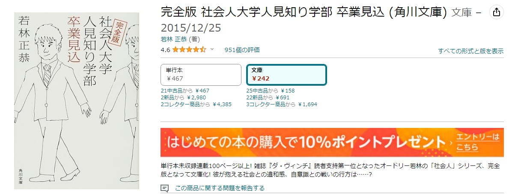

<script async src="https://pagead2.googlesyndication.com/pagead/js/adsbygoogle.js?client=ca-pub-2844921131740253"
     crossorigin="anonymous"></script>
<!-- Global site tag (gtag.js) - Google Analytics -->
<script async src="https://www.googletagmanager.com/gtag/js?id=G-H1234VX5NE"></script>
<script>
  window.dataLayer = window.dataLayer || [];
  function gtag(){dataLayer.push(arguments);}
  gtag('js', new Date());

  gtag('config', 'G-H1234VX5NE');
</script>


```
この記事にはこんなことが書かれています。
- 完全版 社会人大学人見知り学部 卒業見込　の感想
 　→ 若林さんの脳内すごいなぁ。ほんと面白い
- 表参道のセレブ犬とカバーニャ要塞の野良犬 の感想
　 → 一緒に世界を旅してみたい気分になる。資本主義のありがたさを知った。
```

----
### 完全版 社会人大学人見知り学部 卒業見込 (角川文庫)
めちゃくちゃ面白かった本があったので、ちょっと感想を書いておきたい。<br>
ふと本屋を歩いていて、目に留まったんです。<br>
若林さんって芸人（オードリー）だよな…本も書いているんだと。<br>
<br>
<a target="_blank" href="https://www.amazon.co.jp/gp/product/4041026148/ref=dbs_a_def_rwt_bibl_vppi_i2?&_encoding=UTF8&tag=skup07-22&linkCode=ur2&linkId=77f64c8c1408f249a7eced3de40f34c3&camp=247&creative=1211">完全版 社会人大学人見知り学部 卒業見込 (角川文庫)</a><br>
<br>
<br>
<br>
この本を読むと分かるんですが<br>
**若林さんは、本当にびっくりするくらいこじらせている！！**<br>
<br>
オードリーが有名になった時、売れない時代の苦労話（お金がないから、コインシャワーを100円で終わらせるために、歩きながらシャンプーしてた話とか）をTV見たことがあって、どんな人生を歩んできたのか、興味をもっていました。<br>
<br>
そんな苦労話は一場面でしかなくて、そんな毎日をどんな気持ちで暮らしていたのか思い知らされます。<br>
<br>
ある一人の人生を垣間見ているような体験と、その人生観に魅せられました。
<br>
そんな苦労話は、悲しいというよりは、コミカルに描いていて、
読んでいて、にやにやというか声出して笑っちゃいそうなときもあって注意が必要ですが、面白いことに全部実話なんですよね。<br>
<br>
コラム集なので、2、3ページくらいで一つのお話が終わることもあって、電車とかちょっとした時間に読むのもいいんじゃないかなと思います。<br>
<br>
Amazonレビュー見たらわかると思うんですが、★も多くて、口コミも多くて、共感してる人が多いんですよね。割と薄い本なので、久々に本読んでみようという気持ちがあったら、ポチって見てください。<br>
<br>

----
### 表参道のセレブ犬とカバーニャ要塞の野良犬 (文春文庫)<br>
上で紹介した本を読んで、他の若林さんの本も読んでみたいなという思いからこの本も手に取りました。<br>
「完全版 社会人大学人見知り学部 卒業見込」の中でも少し言及されていました。<br>
<br>
<a target="_blank" href="https://www.amazon.co.jp/%25E8%25A1%25A8%25E5%258F%2582%25E9%2581%2593%25E3%2581%25AE%25E3%2582%25BB%25E3%2583%25AC%25E3%2583%2596%25E7%258A%25AC%25E3%2581%25A8%25E3%2582%25AB%25E3%2583%2590%25E3%2583%25BC%25E3%2583%258B%25E3%2583%25A3%25E8%25A6%2581%25E5%25A1%259E%25E3%2581%25AE%25E9%2587%258E%25E8%2589%25AF%25E7%258A%25AC-%25E6%2596%2587%25E6%2598%25A5%25E6%2596%2587%25E5%25BA%25AB-25-1-%25E8%258B%25A5%25E6%259E%2597-%25E6%25AD%25A3%25E6%2581%25AD/dp/4167915820/ref=pd_ci_mcx_mh_mcx_views_0?pd_rd_w=FxuLt&amp;content-id=amzn1.sym.b7ff8ae3-d3eb-4b00-a35f-7c651f284b6c%253Aamzn1.symc.409c7fce-cbd2-4cf4-a6cb-824c258c8778&amp;pf_rd_p=b7ff8ae3-d3eb-4b00-a35f-7c651f284b6c&amp;pf_rd_r=8KCN28K567TGKKJM33MJ&amp;pd_rd_wg=Y3Lfi&amp;pd_rd_r=8cf636b4-764e-4a28-abac-8b80e3b1dc83&amp;pd_rd_i=4167915820&_encoding=UTF8&tag=skup07-22&linkCode=ur2&linkId=124086ef6023c36cd2c42b50c9215f3d&camp=247&creative=1211">表参道のセレブ犬とカバーニャ要塞の野良</a>
<br>
<br>


こじらせている若林さんが売れて、芸能活動に勤しむ中、隙間に海外に旅立った時の紀行文です。斎藤茂太賞も受賞されています。<br>
<br>
色んな国に行かれていますが、キューバの紀行文が面白くて、ドキドキしたり、哀愁を感じたりと、一緒に旅をしている気分になります。<br>
<br>
社会主義と資本主義について考えたことがなかったのですが、キューバという国がどんな状況かを知ることで、我々の置かれている日本という世界が、どれだけ幸せ・不幸かというのを思い知らされた、という感想もあります。<br>
<br>
これまた、コミカルな文体で書かれていて、すらすらと読み進められますので、おすすめです！
<br>
<br>
こっちの本の方が売れている感じがしますね。どちらから入るでもよい気がしますが、「完全版 社会人大学人見知り学部 卒業見込」を読んでから、若林さんがどんなバックグラウンドを持った人なのかをちょっと知ってから、紀行文を読んだ方が、面白いかもしれません。<br>
<br>


----
### おわりに<br>
どんなジャンルの本も好きなのですが、ノンフィクションがやはり好きです。その人のリアルを、ガツンと喰らって、新しい発見だったり、考えさせられることが多いんですよね。<br>
<br>
最近、他にもいろいろと本を読んでいて、おすすめがあるのでまた投稿しようと思います。逆にこれおすすめだよ、というのがあればそれも知りたいです。ぜひ教えてください。
<br><br>
今回はこれにて！<br>

----


## [Mainページに戻る](https://kissshot-skup.github.io/webpage)

