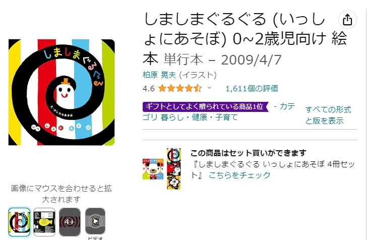

<script async src="https://pagead2.googlesyndication.com/pagead/js/adsbygoogle.js?client=ca-pub-2844921131740253"
     crossorigin="anonymous"></script>
<!-- Global site tag (gtag.js) - Google Analytics -->
<script async src="https://www.googletagmanager.com/gtag/js?id=G-H1234VX5NE"></script>
<script>
  window.dataLayer = window.dataLayer || [];
  function gtag(){dataLayer.push(arguments);}
  gtag('js', new Date());

  gtag('config', 'G-H1234VX5NE');
</script>

```
この記事にはこんなことが書かれています。
- 赤ちゃんが生まれて、どんな絵本を買えば・読み聞かせすればいいか
　30冊以上読み聞かせてみて反応が良かった（赤ちゃんが楽しんでいる）
　絵本をランキング形式で10冊紹介
```

----
## はじめに
初めて赤ちゃんが生まれました。ほんとに大変だけど、可愛いです。<br>
育休もとって、育児に全力投球な毎日ですが、どんな本を読めばよいか<br>
悩みませんか。自分の経験が参考になるかわかりませんが、<br>
うちの子が反応が良かった本を紹介したいと思います。<br>
<br>
本も結構値段がしますので、プレゼント選び中の方や、わが子にできるだけ刺さる本を買いたい！という方の参考になれば、幸いです。<br>
<br>
ちなみに、以下の本を読んでいて、幼児期の教育で将来の年収が何十万も変わるような統計データを見ました。更に、成長して高い塾代につぎ込むより、幼児期の今のうちに良い教育をすることが、コスパが良いということも知りました。<br>
なので、絵本とか沢山読み聞かせして、学ぶことを教えたいんですよね。<br>
そんな気持ちで選んだので、このランキングが参考になるとうれしいです。<br>
<br>
<a target="_blank" href="https://www.amazon.co.jp/%25E3%2580%258C%25E5%25AD%25A6%25E5%258A%259B%25E3%2580%258D%25E3%2581%25AE%25E7%25B5%258C%25E6%25B8%2588%25E5%25AD%25A6-%25E4%25B8%25AD%25E5%25AE%25A4%25E7%2589%25A7%25E5%25AD%2590-ebook/dp/B00ZTXKHQ0/ref=sr_1_1?__mk_ja_JP=%25E3%2582%25AB%25E3%2582%25BF%25E3%2582%25AB%25E3%2583%258A&amp;crid=2123X7J7C2BE4&amp;keywords=%25E5%25AD%25A6%25E5%258A%259B%25E3%2581%25AE%25E7%25B5%258C%25E6%25B8%2588%25E5%25AD%25A6&amp;qid=1703752356&amp;s=books&amp;sprefix=%25E5%25AD%25A6%25E5%258A%259B%25E3%2581%25AE%25E7%25B5%258C%25E6%25B8%2588%25E5%25AD%25A6%252Cstripbooks%252C151&amp;sr=1-1&_encoding=UTF8&tag=skup07-22&linkCode=ur2&linkId=13dcac2e454d0c1e2b78c65e0978af1d&camp=247&creative=1211">■学力の経済学</a><br>

<br>
Kindle版は無料みたいです！
<br>


----
## 【第１位】すてきなピアノえほんDX (たまひよ楽器あそび絵本) <br>
ごめんなさい！本というよりおもちゃと言われそうなんですが、これめっちゃくちゃ良かったのでどうしても、1位にせざるを得ないです。子供めちゃ食いつきます。<br><br>
音楽も！楽譜の絵も！ピアノも！電気がピカピカするのも！全部が楽しいって感じで最高に楽しんでます<br>
寝返りしてからは、手を叩きつけて、自分が音をならせたんだ！と喜んでたりと30分くらい遊んでくれてたりします…最高です。<br>
有名曲も多数入ってるので、歌ったり踊ったりしながら楽しむこともできます。
<br>
<a target="_blank" href="https://www.amazon.co.jp/%25E3%2581%2599%25E3%2581%25A6%25E3%2581%258D%25E3%2581%25AA%25E3%2583%2594%25E3%2582%25A2%25E3%2583%258E%25E3%2581%2588%25E3%2581%25BB%25E3%2582%2593DX-%25E3%2581%259F%25E3%2581%25BE%25E3%2581%25B2%25E3%2582%2588%25E6%25A5%25BD%25E5%2599%25A8%25E3%2581%2582%25E3%2581%259D%25E3%2581%25B3%25E7%25B5%25B5%25E6%259C%25AC/dp/4828868739/ref=sr_1_1?__mk_ja_JP=%25E3%2582%25AB%25E3%2582%25BF%25E3%2582%25AB%25E3%2583%258A&amp;crid=22X6MWIL8TOON&amp;keywords=%25E3%2581%2599%25E3%2581%25A6%25E3%2581%258D%25E3%2581%25AA%25E3%2583%2594%25E3%2582%25A2%25E3%2583%258E%25E3%2581%2588%25E3%2581%25BB%25E3%2582%2593+DX&amp;qid=1703752551&amp;s=books&amp;sprefix=%25E3%2581%2599%25E3%2581%25A6%25E3%2581%258D%25E3%2581%25AA%25E3%2583%2594%25E3%2582%25A2%25E3%2583%258E%25E3%2581%2588%25E3%2581%25BB%25E3%2582%2593+dx%252Cstripbooks%252C223&amp;sr=1-1&_encoding=UTF8&tag=skup07-22&linkCode=ur2&linkId=36a58d9a7d8e6049dd2890a7f66fe24f&camp=247&creative=1211">■すてきなピアノDX</a>
<br>
<br>
ちょっと、皿洗いしたいときとかも、これを置いてひかせておいて作業したり、助かってます。<br>
<br>
また、大人も楽しいんですよね。楽譜読めなくても番号がついてて弾けちゃうんですよ。<br>
子供がある程度大きくなっても楽しめると思っていて、0~5歳対象なので、コスパも良いと思います。<br>
<br>
この本以外にもピアノのおもちゃ絵本沢山あるんですけど、<br>
「速度調整機能」がついているのがいいなと思ってこれを買いました。
<br>
まだ今の月齢では無理ですが、大きくなってきてちょっと弾けるようになったときに、遅いテンポで練習とかできるとすごく自信がつくと思っています。<br><br>
自分もピアノやギター習っていたので、始めは速度遅くしてついていけるようになることが、上達の道だなと思っています。<br>
1個目から書きすぎましたが、それくらいおすすめです。<br><br>


----
## 【第２位】じゃあじゃあびりびり <br>
え。あの有名な赤ちゃん絵本「しましまぐるぐる」シリーズは？と言われそうですが、いろんな本がある中で総合的に実質1位（シンプルな読み聞かせの絵本として1位）と思っています。<br>
<br>
この本で、擬音語と物体（くるま、みず、紙）を紐づけることができると思っていて、しかもけっこう色鮮やかなんですよね。<br>
<br>
車のページが出てきたら、子供が手を伸ばしてでてきたら叩いたり興奮したりするのを見て、面白いんだなと伝わってきました。<br>
とにかく反応がある絵本です。<br>
<a target="_blank" href="https://www.amazon.co.jp/%25E3%2581%2598%25E3%2582%2583%25E3%2581%2582%25E3%2581%2598%25E3%2582%2583%25E3%2581%2582%25E3%2581%25B3%25E3%2582%258A%25E3%2581%25B3%25E3%2582%258A-%25E3%2581%25BE%25E3%2581%25A4%25E3%2581%2584%25E3%2581%25AE%25E3%2582%258A%25E3%2581%2593%25E3%2581%25AE%25E3%2581%2582%25E3%2581%258B%25E3%2581%25A1%25E3%2582%2583%25E3%2582%2593%25E3%2581%25AE%25E3%2581%25BB%25E3%2582%2593-%25E3%2581%25BE%25E3%2581%25A4%25E3%2581%2584-%25E3%2581%25AE%25E3%2582%258A%25E3%2581%2593/dp/4031024401/ref=sr_1_1?__mk_ja_JP=%25E3%2582%25AB%25E3%2582%25BF%25E3%2582%25AB%25E3%2583%258A&amp;crid=3MG3ZLJT66MLC&amp;keywords=%25E3%2581%2598%25E3%2582%2583%25E3%2581%2582%25E3%2581%2598%25E3%2582%2583%25E3%2581%2582%25E3%2581%25B3%25E3%2582%258A%25E3%2581%25B3%25E3%2582%258A&amp;qid=1703832400&amp;s=books&amp;sprefix=%25E3%2581%2598%25E3%2582%2583%25E3%2581%2582%25E3%2581%2598%25E3%2582%2583%25E3%2581%2582%25E3%2581%25B3%25E3%2582%258A%25E3%2581%25B3%25E3%2582%258A%252Cstripbooks%252C161&amp;sr=1-1&_encoding=UTF8&tag=skup07-22&linkCode=ur2&linkId=99cdb51930a2cac92be71cfc8c3d2ac6&camp=247&creative=1211">■じゃあじゃあびりびり (まついのりこのあかちゃんのほん) </a>
<br>
<br>
<br>
あーとかうーを喋るようになったのが早かったような気がします。<br>
<br>
<br>

----
## 【第３位】しましまぐるぐる (いっしょにあそぼ) 0~2歳児向け 絵本 <br>
どの書店でも売っている人気絵本です。初めに買った本でよく吟味せずに買ったのですが、そのあと何冊か買った中でも未だに興味を引いている絵本です。<br>
<br>
色彩が豊かで、ページをめくるたびに興味を引くかんじがあります。<br>
100均でもよくコラボ商品が売られていたりして、本当に人気なんだなと思います。<br>
<br>
<a target="_blank" href="https://www.amazon.co.jp/%25E3%2581%2597%25E3%2581%25BE%25E3%2581%2597%25E3%2581%25BE%25E3%2581%2590%25E3%2582%258B%25E3%2581%2590%25E3%2582%258B-%25E3%2581%2584%25E3%2581%25A3%25E3%2581%2597%25E3%2582%2587%25E3%2581%25AB%25E3%2581%2582%25E3%2581%259D%25E3%2581%25BC-0-2%25E6%25AD%25B3%25E5%2585%2590%25E5%2590%2591%25E3%2581%2591-%25E7%25B5%25B5%25E6%259C%25AC-%25E6%259F%258F%25E5%258E%259F/dp/4052031113/ref=sr_1_1?__mk_ja_JP=%25E3%2582%25AB%25E3%2582%25BF%25E3%2582%25AB%25E3%2583%258A&amp;crid=3EZXBP8742I4V&amp;keywords=%25E3%2581%2597%25E3%2581%25BE%25E3%2581%2597%25E3%2581%25BE%25E3%2581%2590%25E3%2582%258B%25E3%2581%2590%25E3%2582%258B&amp;qid=1703832840&amp;s=books&amp;sprefix=%25E3%2581%2597%25E3%2581%25BE%25E3%2581%2597%25E3%2581%25BE%25E3%2581%2590%25E3%2582%258B%25E3%2581%2590%25E3%2582%258B%252Cstripbooks%252C174&amp;sr=1-1&_encoding=UTF8&tag=skup07-22&linkCode=ur2&linkId=34e66d45599d9109d72fd06bd941f21e&camp=247&creative=1211">しましまぐるぐる (いっしょにあそぼ) 0~2歳児向け 絵本</a>
<br>
<br>
唯一の難点はちょっと重い・・・寝ころんで一緒に読んだりすると腕がつらいです（笑）<br>
実家に帰るときとかに2冊くらい絵本持っていきたいなと思うんですが、この本は重いので選ばれません。<br>
<br>
<br>

----
## 【第４位】だるまさんと (かがくいひろしのファーストブック 3) <br>
これも有名なだるまさんシリーズですが、シリーズ３のこの本が一番受けが良かった気がします。<br><br>
「だるまさんと・・・」と言って<br>
次のページで何かが起きる！<br>
という展開が続くのですが<br>
ずっと、にこにこしています。<br><br>
<a target="_blank" href="https://www.amazon.co.jp/%25E3%2581%25A0%25E3%2582%258B%25E3%2581%25BE%25E3%2581%2595%25E3%2582%2593%25E3%2581%25A8-%25E3%2581%258B%25E3%2581%258C%25E3%2581%258F%25E3%2581%2584%25E3%2581%25B2%25E3%2582%258D%25E3%2581%2597%25E3%2581%25AE%25E3%2583%2595%25E3%2582%25A1%25E3%2583%25BC%25E3%2582%25B9%25E3%2583%2588%25E3%2583%2596%25E3%2583%2583%25E3%2582%25AF-3-%25E3%2581%258B%25E3%2581%258C%25E3%2581%258F%25E3%2581%2584-%25E3%2581%25B2%25E3%2582%258D%25E3%2581%2597/dp/4893094521/ref=sr_1_1?__mk_ja_JP=%25E3%2582%25AB%25E3%2582%25BF%25E3%2582%25AB%25E3%2583%258A&amp;crid=2R70FC5V6Z51T&amp;keywords=%25E3%2581%25A0%25E3%2582%258B%25E3%2581%25BE%25E3%2581%2595%25E3%2582%2593%25E3%2581%25A8&amp;qid=1703836861&amp;sprefix=%25E3%2581%25A0%25E3%2582%258B%25E3%2581%25BE%25E3%2581%2595%25E3%2582%2593%25E3%2581%25A8%252Caps%252C171&amp;sr=8-1&_encoding=UTF8&tag=skup07-22&linkCode=ur2&linkId=1eb72b942e958161e6ccedeedaaefe0e&camp=247&creative=1211">■だるまさんと</a>
<br>
<br>
<br>
<br>

----
## 【第５位】きんぎょが にげた (幼児絵本シリーズ) <br>
5カ月ごろに買ったんですが、もっと早く買えばよかった！<br>
ピンクのきんぎょが逃げるストーリーなんですが、色んな場面でどこにきんぎょがいるかを見つけるという楽しさがあるんですよね！<br>
<br>
うちの子は、まだ5カ月なのにストーリーを理解していて、ここ！ここ！と手をバンバン叩きます！これにはびっくりしました。<br>
<a target="_blank" href="https://www.amazon.co.jp/%25E3%2581%258D%25E3%2582%2593%25E3%2581%258E%25E3%2582%2587%25E3%2581%258C-%25E3%2581%25AB%25E3%2581%2592%25E3%2581%259F-%25E5%25B9%25BC%25E5%2585%2590%25E7%25B5%25B5%25E6%259C%25AC%25E3%2582%25B7%25E3%2583%25AA%25E3%2583%25BC%25E3%2582%25BA-%25E4%25BA%2594%25E5%2591%25B3-%25E5%25A4%25AA%25E9%2583%258E/dp/4834008991/ref=sr_1_1?__mk_ja_JP=%25E3%2582%25AB%25E3%2582%25BF%25E3%2582%25AB%25E3%2583%258A&amp;crid=2ZIFI2CNHI58E&amp;keywords=%25E3%2581%258D%25E3%2582%2593%25E3%2581%258E%25E3%2582%2587%25E3%2581%258C+%25E3%2581%25AB%25E3%2581%2592%25E3%2581%259F+%2528%25E5%25B9%25BC%25E5%2585%2590%25E7%25B5%25B5%25E6%259C%25AC%25E3%2582%25B7%25E3%2583%25AA%25E3%2583%25BC%25E3%2582%25BA%2529&amp;qid=1703836531&amp;sprefix=%25E3%2581%258D%25E3%2582%2593%25E3%2581%258E%25E3%2582%2587%25E3%2581%258C+%25E3%2581%25AB%25E3%2581%2592%25E3%2581%259F+%25E5%25B9%25BC%25E5%2585%2590%25E7%25B5%25B5%25E6%259C%25AC%25E3%2582%25B7%25E3%2583%25AA%25E3%2583%25BC%25E3%2582%25BA+%252Caps%252C274&amp;sr=8-1&_encoding=UTF8&tag=skup07-22&linkCode=ur2&linkId=7ce302969a994318d1a88a46a18c4db9&camp=247&creative=1211">■きんぎょが にげた (幼児絵本シリーズ)</a>
<br>
<br>
誰かに読んでもらって、本の裏側から赤ちゃんの顔を見ると、ほんと目がいろんなところに動くんですよね！<br>
動体視力もよくなりそうです。<br>
<br>

----
## 【第６位】 だるまさんが<br>
第４位に設定した「だるまさんと」の別バージョンですが、これが1作目のシリーズで不動の人気があります。<br>
初めてにこって笑った絵本かもしれません。<br>
「だるまさんが・・・ぷぅ」というページがお気に入りになっています。毎回笑ってくれる（笑）<br>
<br>
<a target="_blank" href="https://www.amazon.co.jp/%25E3%2581%25A0%25E3%2582%258B%25E3%2581%25BE%25E3%2581%2595%25E3%2582%2593%25E3%2581%258C-%25E3%2581%258B%25E3%2581%258C%25E3%2581%258F%25E3%2581%2584-%25E3%2581%25B2%25E3%2582%258D%25E3%2581%2597/dp/4893094319/ref=sr_1_2?crid=26CD9CWYU57DC&amp;keywords=%25E3%2581%25A0%25E3%2582%258B%25E3%2581%25BE%25E3%2581%2595%25E3%2582%2593%25E3%2581%258C+%25E7%25B5%25B5%25E6%259C%25AC&amp;qid=1703837066&amp;sprefix=%25E3%2581%25A0%25E3%2582%258B%25E3%2581%25BE%25E3%2581%2595%25E3%2582%2593%25E3%2581%258C%252Caps%252C169&amp;sr=8-2&_encoding=UTF8&tag=skup07-22&linkCode=ur2&linkId=6196b2649a7eac69fcc7f360d8c50f11&camp=247&creative=1211">■だるまさんが</a>
<br>
<br>
<br>
だるまさん「の」という本もるのですが、これはあまり受けなかったです。このランキングには出てきません。<br>
<br>

----
## 【第７位】Sassyのあかちゃんぬのえほん あーそーぼ <br>
これには何度助けられたかわかりません・・・<br>
布絵本なので、ベビーカーにつけたり、手持ちしています。軽いし洗えるし最高！<br>
<br>
レストランや電車など人目があるところにいるときに持っていくのですが、ぐずりが止みます！！！<br>
しかけが多くて、手指も器用になっている気がします。<br>
<br>
<a target="_blank" href="https://www.amazon.co.jp/Sassy%25E3%2581%25AE%25E3%2581%2582%25E3%2581%258B%25E3%2581%25A1%25E3%2582%2583%25E3%2582%2593%25E3%2581%25AC%25E3%2581%25AE%25E3%2581%2588%25E3%2581%25BB%25E3%2582%2593-%25E3%2581%2582%25E3%2583%25BC%25E3%2581%259D%25E3%2583%25BC%25E3%2581%25BC-%25E3%2583%2590%25E3%2583%25A9%25E3%2582%25A8%25E3%2583%2586%25E3%2582%25A3-ZOO/dp/4041078857/ref=sr_1_18?__mk_ja_JP=%25E3%2582%25AB%25E3%2582%25BF%25E3%2582%25AB%25E3%2583%258A&amp;crid=HSOYQPBHOSWJ&amp;keywords=%25E8%25B5%25A4%25E3%2581%25A1%25E3%2582%2583%25E3%2582%2593%25E7%25B5%25B5%25E6%259C%25AC&amp;qid=1703837366&amp;sprefix=%25E8%25B5%25A4%25E3%2581%25A1%25E3%2582%2583%25E3%2582%2593%25E7%25B5%25B5%25E6%259C%25AC%252Caps%252C165&amp;sr=8-18&_encoding=UTF8&tag=skup07-22&linkCode=ur2&linkId=50d32ac3476b14d7ff640afab1ea1363&camp=247&creative=1211">■Sassyのあかちゃんぬのえほん あーそーぼ</a>
<br>
<br>
<br>
<br>

----
## 【第８位】まるまる ぽぽぽん (いっしょにあそぼ) 0~2歳児向け 絵 <br>
しましまぐるぐるが調子が良かったので、似たような絵本を買いました。<br>
しまぐるほどではないですが、これも注目してみています。<br>
ぽん！とかぷかぷかとか擬音語が多いんですよね、音の楽しさはこちらの本の方があると思います。<br>
<br>
<a target="_blank" href="https://www.amazon.co.jp/%25E3%2581%25BE%25E3%2582%258B%25E3%2581%25BE%25E3%2582%258B-%25E3%2581%25BD%25E3%2581%25BD%25E3%2581%25BD%25E3%2582%2593-%25E3%2581%2584%25E3%2581%25A3%25E3%2581%2597%25E3%2582%2587%25E3%2581%25AB%25E3%2581%2582%25E3%2581%259D%25E3%2581%25BC-0-2%25E6%25AD%25B3%25E5%2585%2590%25E5%2590%2591%25E3%2581%2591-%25E7%25B5%25B5%25E6%259C%25AC/dp/4052048067/ref=sr_1_145?__mk_ja_JP=%25E3%2582%25AB%25E3%2582%25BF%25E3%2582%25AB%25E3%2583%258A&amp;crid=HSOYQPBHOSWJ&amp;keywords=%25E8%25B5%25A4%25E3%2581%25A1%25E3%2582%2583%25E3%2582%2593%25E7%25B5%25B5%25E6%259C%25AC&amp;qid=1703837604&amp;sprefix=%25E8%25B5%25A4%25E3%2581%25A1%25E3%2582%2583%25E3%2582%2593%25E7%25B5%25B5%25E6%259C%25AC%252Caps%252C165&amp;sr=8-145&_encoding=UTF8&tag=skup07-22&linkCode=ur2&linkId=09779d7f6005529a51e3010c78abf728&camp=247&creative=1211">■まるまる ぽぽぽん (いっしょにあそぼ) 0~2歳児向け</a>
<br>
<br>
<br>
<br>

----
## 【第９位】スライムぴぴぴ (0・1・2さいの絵本)  <br>
これは。。。個人的に好きというのもあるのですが、とにかく可愛いし、あかちゃんも色彩豊かな絵本に目を奪われています。<br>
最後のページが、他の絵本にないくらい大きくなるギミックがあって、これもわぁ！という表情を引き出してくれる絵本です。<br>
<br>
ベビザラスで、スライムのカバーオールを買ったので、これとセットで写真を撮りまくりました…（笑）
<br>
<a target="_blank" href="https://www.amazon.co.jp/%25E3%2582%25B9%25E3%2583%25A9%25E3%2582%25A4%25E3%2583%25A0%25E3%2581%25B4%25E3%2581%25B4%25E3%2581%25B4-0%25E3%2583%25BB1%25E3%2583%25BB2%25E3%2581%2595%25E3%2581%2584%25E3%2581%25AE%25E7%25B5%25B5%25E6%259C%25AC-%25E3%2582%25B9%25E3%2582%25AF%25E3%2582%25A6%25E3%2582%25A7%25E3%2582%25A2%25E3%2583%25BB%25E3%2582%25A8%25E3%2583%258B%25E3%2583%2583%25E3%2582%25AF%25E3%2582%25B9/dp/4757562667/ref=sr_1_1?__mk_ja_JP=%25E3%2582%25AB%25E3%2582%25BF%25E3%2582%25AB%25E3%2583%258A&amp;crid=2CRKLCFPI9MRQ&amp;keywords=%25E3%2582%25B9%25E3%2583%25A9%25E3%2582%25A4%25E3%2583%25A0%25E3%2581%25B4%25E3%2581%25B4%25E3%2581%25B4+%25E7%25B5%25B5%25E6%259C%25AC&amp;qid=1703839027&amp;s=books&amp;sprefix=%25E3%2582%25B9%25E3%2583%25A9%25E3%2582%25A4%25E3%2583%25A0%25E3%2581%25B4%25E3%2581%25B4%25E3%2581%25B4+%25E7%25B5%25B5%25E6%259C%25AC%252Cstripbooks%252C149&amp;sr=1-1&_encoding=UTF8&tag=skup07-22&linkCode=ur2&linkId=f66b9a8eba7f051cde9bd25dc3c1fd83&camp=247&creative=1211">■スライムぴぴぴ (0・1・2さいの絵本)</a>
<br>
<br>
<br>
<br>

----
## 【第１０位】まるてん いろてん (0.1.2.えほん) <br>
内容はとにかく色と形と大きさを認識させることにフォーカスされています。<br>
すごくいいなと思ったのは、例えば、黄色と赤のまるが書いてあるページにオレンジのまるが登場します。こんな感じで、他の色んな色が登場してきていることです。<br>
<br>
つまり、黄色と赤を混ぜるとオレンジになるよね！って配色の捉え方ができるという点が素晴らしいなと思いました。<br>
<br>
<a target="_blank" href="https://www.amazon.co.jp/gp/product/4834081362/ref=ppx_od_dt_b_asin_title_s00?ie=UTF8&amp;psc=1&_encoding=UTF8&tag=skup07-22&linkCode=ur2&linkId=0056e850b58e1faab3018988d8d14ca1&camp=247&creative=1211">■まるてん いろてん (0.1.2.えほん) </a>
<br>
<br>
<br>
<br>

----
## ランキングにはなかったけど <br>
素晴らしい絵本多いです。これはまたの機会に書きたいと思います。<br>
例えば以下の本は反応を確認しています。<br>
<br>
- だるまさんと<br>
- Sassyのちいくえほん いろいろ ぱっ<br>
- 松谷みよ子 あかちゃんの本「いないいないばあ」<br>
- はらぺこあおむし<br>
- おしくら・まんじゅう<br>
- ぴょーん (はじめてのぼうけん (1))<br>
- Hug Alborough, Jez<br>
- しろくまちゃんのほっとけーき (こぐまちゃんえほん)<br>
- おおきなかぶ (はじめてのめいさくしかけえほん)<br>
- しろくまのパンツ<br>
- まいごのたまご<br>
<br>
下の４つは、もうちょっと大きくなってから刺さりそうだなという予感もあります。<br>
また詳しく書きたいと思います。<br>
<br>
<br>
----

## [Mainページに戻る](https://kissshot-skup.github.io/webpage)
<!-- 
----
### 【第位】 <br>
<br>
<br>
<br>
<br>

<br>
<br>
<br>
<br>

---- -->
