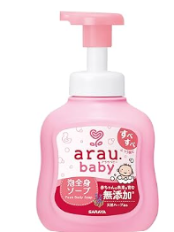
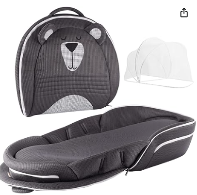

<script async src="https://pagead2.googlesyndication.com/pagead/js/adsbygoogle.js?client=ca-pub-2844921131740253"
     crossorigin="anonymous"></script>
<!-- Global site tag (gtag.js) - Google Analytics -->
<script async src="https://www.googletagmanager.com/gtag/js?id=G-H1234VX5NE"></script>
<script>
  window.dataLayer = window.dataLayer || [];
  function gtag(){dataLayer.push(arguments);}
  gtag('js', new Date());

  gtag('config', 'G-H1234VX5NE');
</script>

```
この記事にはこんなことが書かれています。
- 共働き夫婦。赤ちゃんが初めて生まれる！
　何を用意したらいいか迷って色々買ったけど
　買ってよかったものを紹介する
```
----
## はじめに
子供が生まれて半年ですが、本当に生活が一変しました。<br>
初めてなので、いろんなことが初体験、育児に全力投球な毎日ですが<br>
買ったものやメソッドでよかったことを10項目紹介したいと思います<br>
<br>
生まれる前に用意する・しない　目線でも書いてみました。<br>
タイトルに以下の目印を記載します。<br>

```
★：生まれる前から用意したほうがよいもの
〇：あった方がいいけどどっちでもよいもの
◆：生まれた後に用意でよいもの
```
<br>
この記事が参考になれば幸いです<br>
<br>


----

## ★スキンケア商品：アロベビー<br>
赤ちゃんの肌って想像以上にめちゃくちゃ荒れます…朝綺麗だったのに、夕方にはガサガサ・赤くなってるとかざらですよね。<br>
しかも、自分の爪で引っかいたりして傷もよくできるんですよね…<br>
そんなときに、これで保湿しておいたら、半日くらいで治ります。<br>
<br>
<a target="_blank" href="https://amzn.to/3U94TK2">■ベビーローション アロベビー  ←リンク</a>
<br>
<br>
<br>
もともと赤ちゃんって新陳代謝がいいので、すぐ直ると思うんですけど、これがなかったら長期化していたと思います<br>
<br>
毎朝とお風呂上り、プラス気になった時に、そっと塗ってました。<br>
先輩ママに聞いて、これは強くお勧めされて。うちでも習ってみてよかったと思っています。成分にも気を使っているのが良いですね。<br>
<br>
ちょっと高いので、躊躇するんですが、顔用はこれで、体はもう少し安いもの（アラウベビー）とかを使っていました。<br>
Amazonでセット売りで安く買えたりするので、最近では塗り分けがめんどくさくなって全身これです（笑）<br>
<br>
<br>
ただ、これでもよくならない、ひどい荒れの時は、やっぱり病院で処方してもらった薬を使うことがあります。<br>
基本のメンテナンスは、アロベビーで十分かなと思います。
<br><br>


----
## ★哺乳瓶と乳首、哺乳瓶除菌：ピジョン哺乳瓶<br>
確実に出産前にいります。始め、上手く母乳が出ないだとか、赤ちゃん側が上手く吸えないとかで出番になります。<br>
一本産院からもらいましたが、何本もあった方がいいです。<br>
なぜなら、毎回洗って＆除菌がいるからです…。か弱い生き物なんですね、赤ちゃんは。<br>
なので、一気に何本も除菌しておいて、24時間以内ならOKなので、そこから次々使うのが良いと思います。<br>
<br>
<a target="_blank" href="https://amzn.to/3vJmqOB">■哺乳瓶と乳首 ←リンク</a>
<br>
<br>
この哺乳瓶、小さくて扱いやすいのと、乳首部分を結合する時に、ゴムみたいに引っ張ってくっつけるので楽です。<br>
もう少し容量の大きな哺乳瓶だと、間にねじが切ってある器具をつけないといけなくて、それも除菌して…とかになってくるので、一発でつくのは非常に楽です<br>
<br>
除菌については、電子レンジでやるこれ↓を使っていました。特に不便感じず使っていましたが、錠剤で除菌するのもあります。<br>
そちらのが好きという方もいて、これはどっちも良いのではないかなと思っています。除菌ができればよいです。<br>
<a target="_blank" href="https://amzn.to/48KLPGm">■コンビ除菌じょーず ←リンク</a>
<br>
<br>
<br>
あと、哺乳瓶洗う時の洗剤ですね…洗剤はこれ使ってました。<br>
<br>
<a target="_blank" href="https://amzn.to/3vJmDRT">■ミルトン哺乳びん・さく乳器・野菜洗い ←リンク</a>
<br>
<br>
<br>
粉ミルクも色んな種類ありますが、これは産院で使っていたものが良いかなと思います。赤ちゃんも慣れている状態と思うので。
<br>
<br>

----
## ★綿のガーゼハンカチ <br>
もう大量にいります。最初10枚くらい買っておいたのですが、なんだかんだ今は40枚くらいあるかも…<br>
吐いたり、よだれが垂れたり、鼻水がでたり、母乳まき散らしたり、お風呂で使ったり、もうバサバサ使います。<br><br>
気づいたら洗濯物かごに大量在庫になってて、すぐ洗濯しなきゃ…という感じ<br>
1カ月を超えて、安定してきたら、散歩とかに行くようになり、マザーズバックとかにも常備することになります。<br>
そうすると、色んなところに分散するので、また足りなくなって買い足しという感じ。<br>
少なくとも10枚はあるといいかもです<br>

<a target="_blank" href="https://amzn.to/3SeD3t9">ガーゼハンカチ　←リンク</a>
<br>
<br>
ティッシュでいいじゃん～～♪<br>
って最初は思っていました…もうね、肌が荒れる荒れる。<br>
ティッシュで拭くのは、ガラス片で拭くのと同じ！！とかいう人もいて、そんな繊細なのか・・・と思い知らされました<br>
ぜひ、綿のガーゼハンカチで。<br>
<br>

----
## ★爪切りやすり <br>
ハサミとか売ってるんですけど、見た瞬間無理だなって思います。ハサミじゃ指を切断してしまうよ・・・<br><br>
細かいやすりが回転して爪を削るんですが、当たっても全く痛くないレベルの強度です。<br>
ほんと買っておいた方がよいと思います。<br>
<a target="_blank" href="https://amzn.to/48PxXun">■コンビ ベビーレーベル ネイルケアセット　←リンク</a>
<br>
<br>
<br>
<br>

----
## 〇おむつとおしりふき <br>
え、おむつは★（＝生まれる前に用意したほうがよいもの）じゃないの？<br>
と自分でもおもいましたが、生まれてから周りの人が買いに行けばいいです。<br>
色んな種類があるんです、ほんとにピンキリで。価格も全然ちがいます。一枚20円くらいのから、35円くらいのものまで<br>
多いと、一日10回以上変えたりしますので、その違いは馬鹿にならないです。
<br><br>
なので、どのおむつがいいかは産院で使っていたものとか、サンプル（大量にもらうと思いますし、Amazonの赤ちゃん生まれた報告でもらえたりする）でしばらく試しながら、どれがいいか見定めていいと思います。<br>
うちの子は、おしりが蒸れて荒れるおむつと、そうでないおむつがありました。<br>
<br>
心配なら、パンパース（比較的高いけど）Sサイズ（テープタイプ）を1セット買っておくと良いかもしれません。<br>
<a target="_blank" href="https://amzn.to/3S95p7X">■テープ Sサイズ】パンパース オムツ はじめての肌へのいちばん　←リンク</a>
<br>
<br>
Amazonセール中は、3箱入りの段ボール×3～5注文したりして業者みたいですが、おむつの出費はえげつないです。<br>
<br>
おしりふきはこれ一択です。水分量が断然違う・・・おしりが荒れない。最高。
<br>
<a target="_blank" href="https://amzn.to/48R3Pis">■おしりふき】ムーニー おしりふき やわらか厚手　←リンク</a>
<br>
<br>
<br>
<br>
----
## ★ 肌着<br>
これは言わずもがなです。西松屋とかで買ってました。5枚くらいあればよいでしょう。冬は暖房たいてればあまり厚着させる必要もないと思うのですが、心配なら2枚重ね着するくらいでいいと思います。<br>
<br>
肌着のポイントは、初めは紐で結ぶタイプがよいかもです（結ぶのめんどくさいですが、大きくなってもある程度着れます）。<br>
<br>

----
## ★お風呂セット（シャンプー、体洗うせっけん、マット） <br>
あまりこだわりがなかったですが、色々使ってみてこのセットに落ち着きました。<br>
今半年経ちましたが未だにこれ使ってます。<br>
<br>
<a target="_blank" href="https://amzn.to/49931VR">■リッチェル ひんやりしないおふろマットR 新生児　←リンク</a>
<br>
<br>
<br>
これ最高です。お風呂のオケみたいなのは粗大ごみになりますけど、これは発泡スチロールです。捨てるのも簡単だし軽いしすぐ乾くし。<br>
唯一の欠点は、発泡スチロールなので、擦るとキュって音がします…私は気になりませんが、
赤ちゃんはびっくりすることがあるかも。うちの子は今は全く気にしてなさそうです。<br>
<br>
<a target="_blank" href="https://amzn.to/48WLPTk">■ピジョン Pigeon ベビー泡シャンプー ベビーフラワーの香り　←リンク</a>
<br>
<br>
シャンプーは、固形使っていましたが結局こちらに落ち着きました。洗い残しなどで湿疹が出たりするので、泡タイプが良かったですね。<br>
<br>
体用せっけん<br>
<a target="_blank" href="https://amzn.to/3u6lAek">■arau.(アラウ)アラウ.ベビー 泡全身ソープ 　←リンク</a>
<br>
<br>
<br>
あとは、体洗うものとかは、ガーゼで良いと思います。顔拭いたりもしますし。<br>
体拭くのは、家にあるでかいバスタオルでやってました。西松屋とかでも売っています。<br>
<br>

----
## ★ 寝床<br>
ベビーベットって場所とるし、持ち運べないしというので、これを買って大正解でした。<br>
里帰りから使って、旅行にも持っていける代物。しかも、洗える！！！！ベストバイです。<br>
<br>
<a target="_blank" href="https://amzn.to/3Su8NM9">■【ベビーアムール】 Bebamour折りたたみ式 　←リンク</a>
<br>
<br>
<br>
<br>

----
## ★ライト  <br>
夜中に何度も起こされます。これはもうしょうがない。よく寝てくれても3時間でしょう。<br>
良く寝てくれるように、昼夜をつけるといいますが、ライトは重要な役割を果たします。<br>
オレンジ色のライトで、眠るモードにさせるのは非常に効果があったと思います。<br>
<br>
ニトリのこのライト、かなりいいです。ニトリ ライトって検索すると“授乳”ってでるので、皆さん使われているんだと思います。<br>
<br>
<a target="_blank" href="https://www.nitori-net.jp/ec/product/8370612s/">■LEDランタン(ホルン)　←リンク</a>
<br>
<br>
<br>
欠点は、すぐ電池切れるんですよ。。。直列で単三4本なので、結構痛いです。<br>
ので、Amazonでこれを買って、使いまわしてます。<br>
<a target="_blank" href="https://amzn.to/4b95Pnp">■Amazonベーシック 充電池 充電式ニッケル水素電池 単3形8個セット　←リンク</a>
<br>
<br>
<br>
<br>
<br>

----

## ★乳頭クリーム  <br>
奥様が乳首が痛い・・・と泣きながら赤ちゃんと格闘している姿を見ることになるでしょう・・・<br>
これはそんな時のケアに役立ちます。<br>
あと、赤ちゃんも食べれるくらいのものなので、リップクリームとしても使えます。<br>
<br>
<a target="_blank" href="https://amzn.to/3SwsPFY">■Medela(メデラ) 乳頭ケアクリーム ピュアレーン ３7g 天然ラノリン100% 　←リンク</a>
<br>
<br>
<br>
<br>

----

## その他あるといいもの <br>
列挙していきます。<br>
<br>
・ベビーカーorチャイルドシートor抱っこ紐<br>
　すぐいるかというと要らないのですが、<br>
　産院からどう帰ってくるか<br>
　で生まれた時に用意するかが決まってきます。<br>
　特に自車で帰る場合、義務なので必ずチャイルドシートが必要になります。<br>
　もしくは、タクシーでなら、チャイルドシートは免除になります<br>
・搾乳機<br>
　乳首が痛くて少し休ませたいとか、赤ちゃんが入院していて直接与えられないとか、そんな時に使うことになります。<br>
　これは、必要となったら買えばいいかなと思います<br>
・ベビースケール【1カ月レンタルでよい】<br>
　これは賛否分かれますが、生まれたばかりの赤ちゃんが<br>
　何g母乳を飲めたのか、測ることは大切です。<br>
　一日ずつ〇mlずつ増やして与えてね<br>
　と言われて途方にくれます…わかんねぇと。<br>
　母乳で足りない分を粉ミルクで補強したりします。<br>
　めちゃ場所もとるのに、一時的に必要なものなので、レンタルできるところがあるか探しましょう。<br>
　1カ月レンタルで十分でした。<br>
　体重計で測ればいいじゃんって思うんですけど、残念ながら100g単位と思うので使えません…<br>
・ベビー用綿棒<br>
　赤ちゃんのあらゆる小さい隙間のお掃除に役立ちます。<br>
　特に初期はおへそ周りがちょっとグロテスクなので<br>
　お掃除しながら、だんだん綺麗になっていきます<br>
・お尻シャワー<br>
　荒れたときは、こいつで洗い流してあげるとだいぶ回復します<br>
<a target="_blank" href="https://amzn.to/48NesCI">■リッチェル 赤ちゃんおしりシャワー 　←リンク</a>
<br>
<br>
<br>
・AIカメラ<br>
　寝かせた後、リビングで落ち着けるようになった…<br>
<a target="_blank" href="https://amzn.to/48IBISd">■Cubo Ai Plus スマートベビーモニター 　←リンク</a>
<br>
<br>
<br>

----

## 買ったけど今のところ要らなかったと思うもの <br>
列挙していきます。<br>
<br>
・おむつ専用ゴミ箱<br>
　離乳食始まってうんちが臭くなったけど結局ゴミ袋に捨てている・・・<br>
・手口あしふき<br>
　ガーゼ濡らして拭いてたらいらないかも。外出時くらいか<br>
<br>
<br>

----

今日はここまで。また思い出した良品があれば書いていきます<br>
<br>
<br>

----

## [Mainページに戻る](https://kissshot-skup.github.io/webpage)
<!-- 
----
### 【第位】 <br>
<br>
<br>
<br>
<br>

<br>
<br>
<br>
<br>

---- -->
