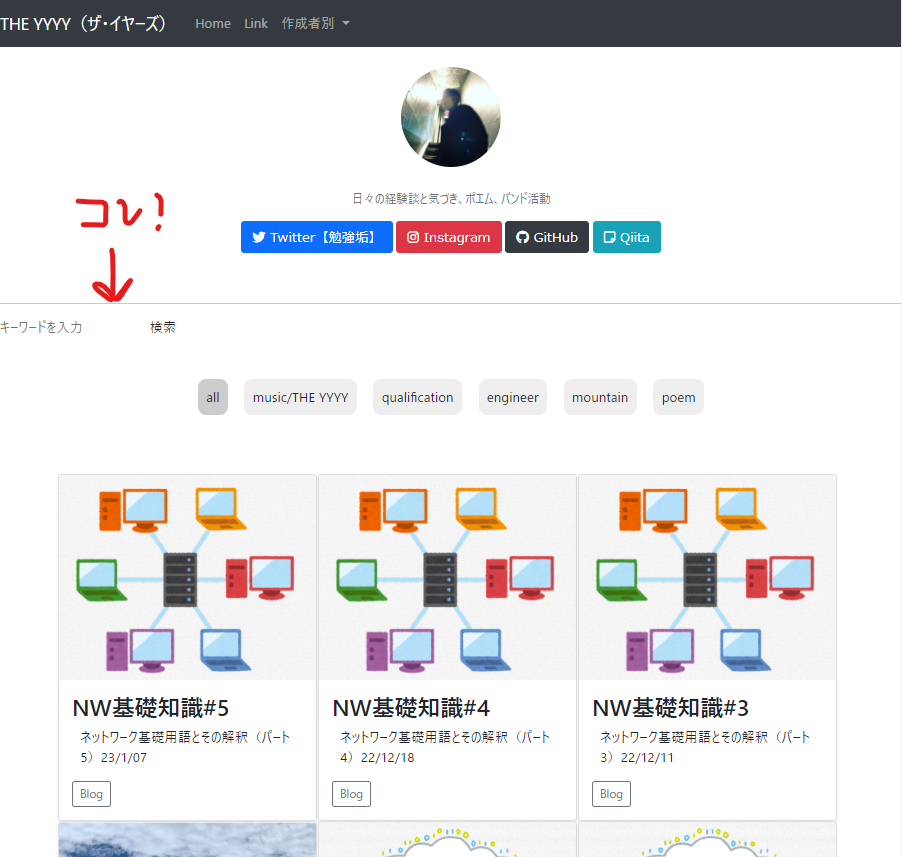

<script async src="https://pagead2.googlesyndication.com/pagead/js/adsbygoogle.js?client=ca-pub-2844921131740253"
     crossorigin="anonymous"></script>
<!-- Global site tag (gtag.js) - Google Analytics -->
 <script async src="https://www.googletagmanager.com/gtag/js?id=G-H1234VX5NE"></script>
<script>
  window.dataLayer = window.dataLayer || [];
  function gtag(){dataLayer.push(arguments);}
  gtag('js', new Date());

  gtag('config', 'G-H1234VX5NE');
</script>

```
この記事には以下ネットワーク基礎知識が書かれています。
- ホームページに検索フォームを追加する方法
- HTMLの基礎的な話をおさらい（今までなんとなくでやってきたつけが…）
- 静的サイトと動的サイトの違い
```

----

ホームページの記事も増えてきて、自分でもどこに何を書いたのかわからなくなってきました。<br>
カード形式に記事を配置して、技術系の記事や趣味とか分類してソートできるようなボタンを配置したりとかしてきましたが、分類はわかるんだけどあの話ってどこに書いたっけ…というのがちらほら。<br>
よくある検索フォームを作る奮闘記です。参考になれば。<br>
<br>
<br>

----
■検索フォームを作る方法<br>
色々とググってみて、以下構文をHTMLファイルに埋め込めばなんとかなりそう。と分かりましたが、初心者にとってどの行が何をしているのかさっぱりです…。まずは少し構文理解を進めてみることに。<br>


```
<form method="post" action="URL" method="get">
	<div>
		<label for="search">検索する</label>
		<input type="search" name="s" placeholder="キーワードを入力">
	</div>
	<input type="submit" value="検索する" />
</form>
```

<br>
<br>

----

■ "form"とかってなんだっけ？<br>
今まで適当にやってきたツケが回ってきました。<br>
恥ずかしながら、上記を調べていたときに、divで記載してあったりformで記載してある記事があり違いがわかりませんでした。<br>

HTMLのタグと呼ばれる構文を調べてみると以下記事がわかりやすかったです。<br>
[HTMLのよく使うタグ一覧！この15個さえ押さえればOK！](https://zero-plus.io/media/html-tags-and-usage/)<br>

上記記事で、divタグはわかりました。formタグは載っていませんでしたが、タグの一種で、送信フォームなどを作るタグのようです。独自の使い方があるようで、少し学習する必要がありそうです。
<br>
<br>

----
■formの使い方を調べた結果<br>
以下の記事を参考にしました。特に２つ目の記事は好みの記事です。<br>
[【HTML入門】formタグを使ってフォームを作る方法を1から解説](https://www.sejuku.net/blog/81862)<br>
[HTMLのフォーム（form）コンプリートガイド](https://catnose.me/learning/html/form)<br>

```
・methodはPOSTかGETを指定する項目で、サーバに対して送信するか受信するかを決める
　検索フォームとしては検索したいワードを問い合わせるのでPOSTが正しい
・actionは問い合わせ先のサーバ：検索フォームとしてはgoogle先生か自身のホームページ
・inputは入力欄をつくるコマンド：検索フォームとしては検索
・labelは入力欄の項目名を表示させるコマンド
・nameは入力されたデータの名前を決めるもの
　入力された値が、どの入力欄に対応しているのかをサーバー側が分かるようになる
```
と分かったところで、以下に編集してHTMLに埋め込みました。<br>

```
<form action="https://kissshot-skup.github.io/webpage/#" method="post">
  <input type="search" name="search" placeholder="キーワードを入力">
  <input type="submit" name="submit" value="検索">
</form>
```

<br>
出力結果はこんな感じ↓<br>
<br>
<br>
<br>
適当な文字列を入力して検索ボタンを押したものの、以下エラーが。<br>
<br>
405エラーをググると“Webサーバで起きるエラーの種類の一つで、クライアントが指定した要求の種類が受付不可に指定されていることを示すもの。”とあります。<br>
もう少しうまくいかない理由を考えてみました。
<br>
<br>

----
■そもそもGithubpageで検索フォームって機能しないかも<br>
原因究明のためネットの荒波をくぐっていた時、以下のような記事をみつけました（てしまいました）。<br>
```
“静的ウェブサイト生成システムであり、検索機能は付いていない”<br>
```
確かGithub Pageは静的ウェブサイトだったような・・・<br>
→でした<br>
[Jekyll製ウェブサイトに簡易検索機能を実装する](https://genjiapp.com/blog/2013/12/08/simple-search-feature-on-jekyll-generated-website.html)<br>
<br>

<br>
少しおさらい。静的とは何か？<br>
→静的：内容の変化しないWebサイトのこと。HTMLファイルをサーバにアップロードした段階で内容が決まり、誰が見ても同じ内容が表示される。<br>
AmazonのHPのような人によっておすすめが変わったりするHPは動的という。JavaScriptが含まれているかで切り分けはできない点注意（Javascriptでも静的はある）<br>
クライアントがサーバへアクセスした後にHTMLファイルを作成して表示するのが動的。<br>
<br>
動的サイトだと何が良いか？以下のようなことができる。<br>

```
・マイページにログイン等、アカウント情報に基づいて表示を変更できる
・SNS連携（リアルタイムに表示を変更する）
・ECサイトの利用者に合わせた広告表示
```

上記記事の方法で検索機能は実装できなくはなさそうだが、少し時間がかかりそう。 
<br>
<br>

----
今回はここまで<br>

## [Mainページに戻る](https://kissshot-skup.github.io/webpage)

