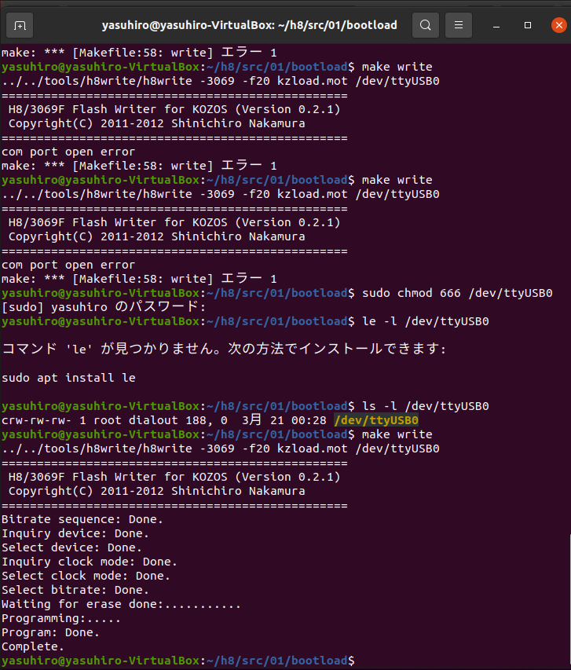
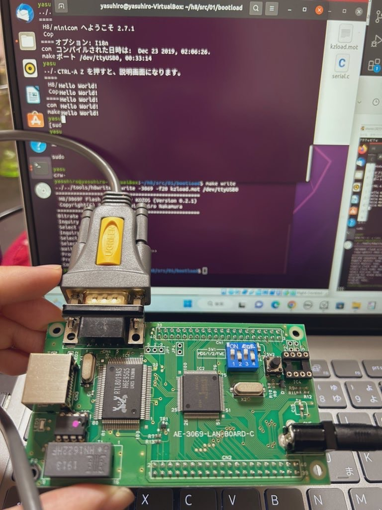

<script async src="https://pagead2.googlesyndication.com/pagead/js/adsbygoogle.js?client=ca-pub-2844921131740253"
     crossorigin="anonymous"></script>
<!-- Global site tag (gtag.js) - Google Analytics -->
<script async src="https://www.googletagmanager.com/gtag/js?id=G-H1234VX5NE"></script>
<script>
  window.dataLayer = window.dataLayer || [];
  function gtag(){dataLayer.push(arguments);}
  gtag('js', new Date());

  gtag('config', 'G-H1234VX5NE');
</script>


```
この記事にはこんなことが書かれています。
- OSを自作するモチベーション
- 仮想環境の立ち上げ
- 自作OSでHallo World表示までの軌跡
```
----
■モチベーション<br>
一言でいうと<br>
マイコン、組み込みOSなど下回りを意識したモノ作りができるようになると<br>
数多いるアプリ開発者とはひと味異なる（OS・F/W周りも意識した設計ができる）エンジニアに成ることができると思っています。<br>
なんだか面接みたい…笑。<br>
こんなこと、ふと思いつかないことなので、少しだけ背景を書かせてください<br>
<br>
<br>
私には尊敬する先輩が2人いて、どちらも知の巨人と言っても過言ではないお二方だ。<br>
歳は2個、4個しか違わないしフランクな関係なんだが、4個違いの先輩は会社に行きながら土日に大学に通い博士課程をとるような、そんな人だ（博士取得に伴い得た会社からの一時報酬金は、赤十字に全額寄付するという人格者でもある）。コロナ前の話だが、課の宴会があったときも電車で向かう道中で論文を査読していた。スキマ時間でやることが違う…と感激した。<br>
<br>
2個違いの先輩は天才と呼ばれた人で、業務の傍らで業務効率を向上させる自作ツールをいくつも排出している。皆がそのツールを使って感謝している。従業員一人一人の作業時間が1日5分短くなるだけで掛け算で会社の人件費がウン百万/年規模の削減に役立つと思う。<br>
<br>
そんな二人は仲がよく、スキルアップについての情報のやり取りをしているという。<br>
そこに、私なんかがちょっと混ぜてもらっているという構成だ。<br>
非常に恐縮だが、ありがたすぎるゥ！！<br>
<br>
さて、OSを自作するモチベーションに繋がっていくのだが、そんなお二人が「ソフトウェア開発においてアプリ制作ばかりに目がいってしまうが、下回りを勉強するには何がよいだろう？」という会話から、選ばれた教材は以下2本。<br>
<br>
[1⃣12ステップで作る組込みOS自作入門](https://www.amazon.co.jp/12%E3%82%B9%E3%83%86%E3%83%83%E3%83%97%E3%81%A7%E4%BD%9C%E3%82%8B%E7%B5%84%E8%BE%BC%E3%81%BFOS%E8%87%AA%E4%BD%9C%E5%85%A5%E9%96%80-%E5%9D%82%E4%BA%95-%E5%BC%98%E4%BA%AE/dp/4877832394)<br>
[2⃣CPUの創りかた](https://www.amazon.co.jp/gp/product/4839909865/ref=ppx_yo_dt_b_asin_title_o03_s00?ie=UTF8&psc=1)<br>
<br>
<br>
下回りについては何となくでやってきた私。OSを作る？ナニソレ？な状態から少しでも脱却したい…。<br>
1⃣は環境構築にすごく時間がかかったと話しているお二人に少しでもついていくべく、奮闘が始まりました。<br>
<br>
さっそく、1⃣の教材で環境構築を行ってみました。<br>

----
■必要なもの<br>
基板から自作ではないです！H/Wはできるだけ購入品でということで、教本にもある以下を用意しました。
<br>
```
- 12ステップで作る組み込みOS自作入門
- H8/3069F マイコンボード
- ACアダプタ 5V1A AD-D50P100.
- シリアル延長ケーブル MXT10050CMBK.
- USB-シリアル変換ケーブル BSUSRC0605BS.
```
あとやる気！<br>
ものが揃ったら、環境構築です。<br>

----

■VirtualboxとUbuntuのインストール＆初期設定<br>
以下HPを参考にインストールとセッティングを実施<br>
私の環境はWin11だが、あまり気にせず進めました。<br>
[VirtualBox と Ubuntu のインストール](https://www.ci.seikei.ac.jp/advpro/docs/VirtualBox%EF%BC%86Ubuntu%E3%82%A4%E3%83%B3%E3%82%B9%E3%83%88%E3%83%BC%E3%83%AB%E3%83%9E%E3%83%8B%E3%83%A5%E3%82%A2%E3%83%AB.pdf)<br>
<br>
一個だけ詰まったところは以下<br>
```
$ sudo apt update
```
リンクの指示どおり上記コマンドを打った時に、以下エラーが出た
```
$ sudo apt update
エラー:1 http://jp.archive.ubuntu.com/ubuntu bionic InRelease
'jp.archive.ubuntu.com' を解決できませんでした
エラー:2 http://jp.archive.ubuntu.com/ubuntu bionic-updates InRelease
'jp.archive.ubuntu.com' を解決できませんでした
エラー:3 http://jp.archive.ubuntu.com/ubuntu bionic-backports InRelease
'jp.archive.ubuntu.com' を解決できませんでした
エラー:4 http://security.ubuntu.com/ubuntu bionic-security InRelease
'security.ubuntu.com' を解決できませんでした
エラー:5 http://archive.ubuntulinux.jp/ubuntu bionic InRelease
'archive.ubuntulinux.jp' を解決できませんでした
エラー:6 http://archive.ubuntulinux.jp/ubuntu-ja-non-free bionic InRelease
'archive.ubuntulinux.jp' を解決できませんでした
```
これは以下サイトを参考に解決<br>
['jp.archive.ubuntu.com' を解決できませんでしたの解決](https://hayana.work/archives/1244)<br>
<br>
尚、configファイルをいじる時にvimを操作する必要があるが、私は触ったことがなかった。<br>
操作方法が難しいので以下サイトを参考に操作して解決<br>
[UbuntuでVimを使ってファイルを編集する](https://7ka.org/ubuntu_terminal_vim/)<br>
[vi の基本コマンドの一覧](https://docs.oracle.com/cd/E19253-01/816-3946/editorvi-tbl-83/index.html)<br>
<br>

----

■Ubuntu シリアルポートの認識<br>
h8write 指令をしてもh8writeが見つかりませんとなり実行されない…。
h8writeのパスを変えてみたり、インストールし直したりしたが解消しなかった。
ファイルの受け渡しがしやすいように、ホストOSとゲストOSの共有フォルダにクロスコンパイラ環境を作っていた（教本P37のフォルダ体系を作りそこでビルド等をしていた）が、どうやら共有フォルダではだめなようだった。理由は不明。
Ubuntuのローカルファイルで実行したところ上記エラーはなくなった。
```
具体的にはhome/*/ ←*はusername　で実行すれば問題がなくなった
```

その後、通ったはいいものの、以下エラー
```
com port open error 
```
が出るようになった。

以下サイトを参照に対策を実施する<br>
[https://monoist.itmedia.co.jp/mn/articles/0808/22/news123_2.html](https://monoist.itmedia.co.jp/mn/articles/0808/22/news123_2.html)<br>

まずは、シリアルポートの認識を確認した。
```
 ls -l /dev/ttyUSB0 
```
USBを外していると、そのようなファイルやディレクトリはありません　と表示される。つけていると以下のようなメッセージ
```
crw-rw---- 1 root dialout 188,0 日付 /dev/ttyUSB0
```
これでmake writeしても未だにcom port errorが消えないが
上記ページの下の方に読み書き権限を与えておくという話があります。
この対策後に成功！

```
入力
# make write
出力
 ../../tools/h8write/h8write -3069 -f20 kzload.mot
～
～うんたらかんたら～
～
complete.
```
写真はこんな感じ。
<br>
<br>
<br>

教本にあるminicomとやらは以下サイトを参考に導入&起動<br>
[https://qiita.com/baggio/items/3db759da67c0123e993e](https://qiita.com/baggio/items/3db759da67c0123e993e)
<br>
今回私が使ったのはUbuntu(Linux)なので、/dev/ttyUSB0　をシリアルポートとして<br>
Linux(Ubuntu)でCOMポート（シリアルポート：RS-232C：/dev/ttyS1など）を使う<br>
[https://minokamo.tokyo/2022/03/14/4470/](https://minokamo.tokyo/2022/03/14/4470/)
<br><br>

----
■HalloWorldの表示<br>
教本に従い、基板のDIPスイッチをいじりデバックモードにしました。<br>
そして、ついに！！で、でたーーー！<br>
<br>
<br>
<br>
<br>
今回はここまで<br>

----


## [Mainページに戻る](https://kissshot-skup.github.io/webpage)

