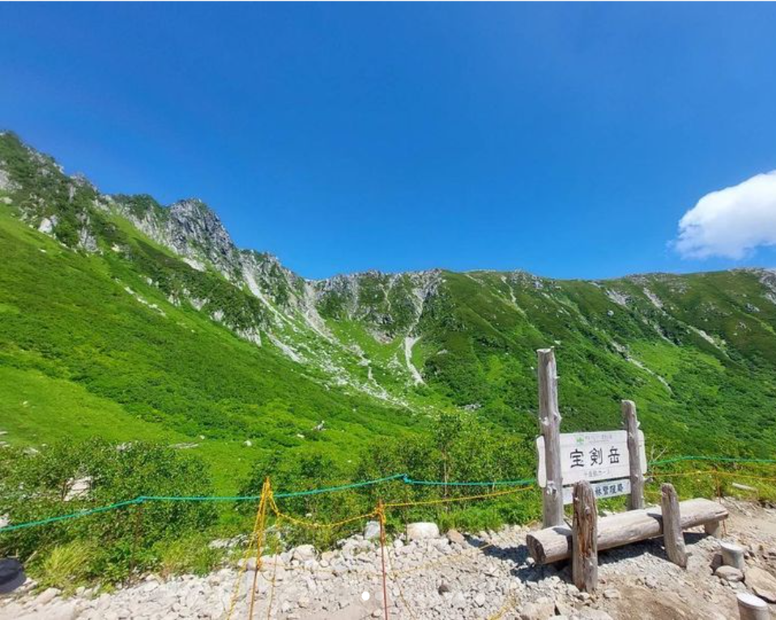
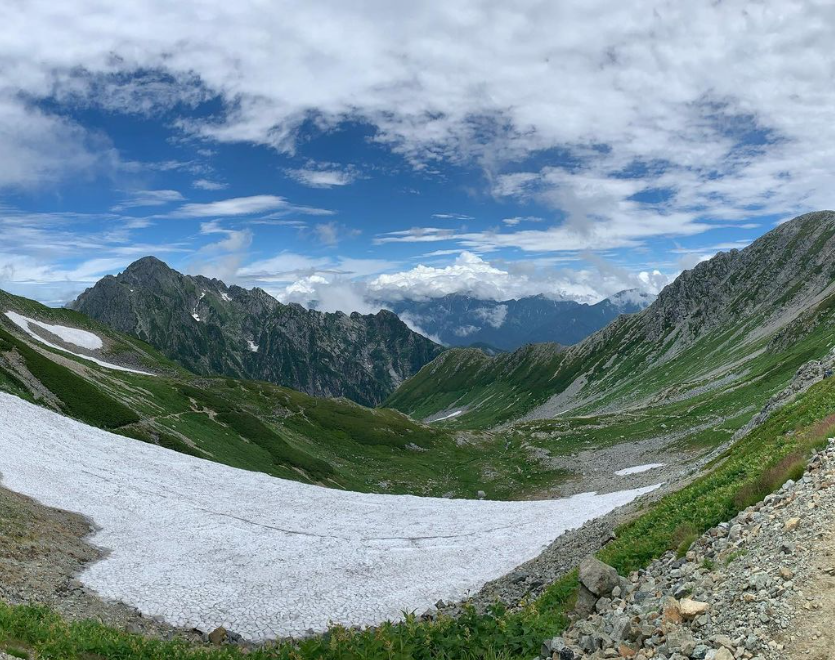
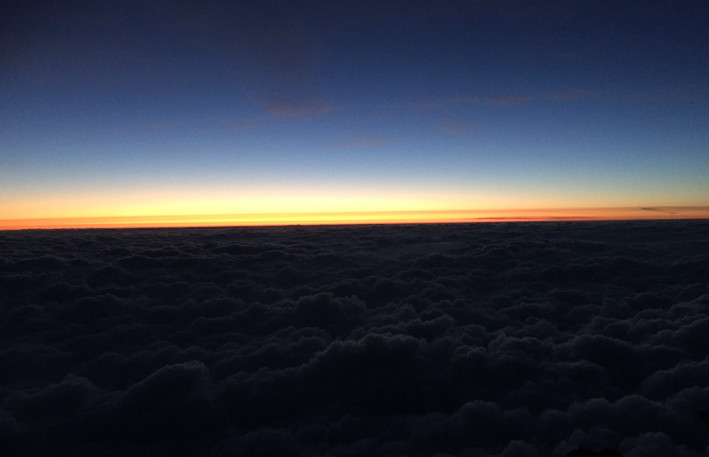
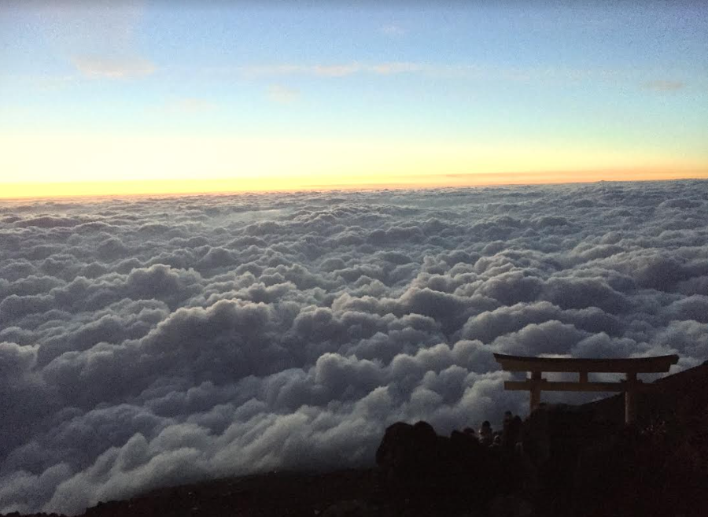

<script async src="https://pagead2.googlesyndication.com/pagead/js/adsbygoogle.js?client=ca-pub-2844921131740253"
     crossorigin="anonymous"></script>
<!-- Global site tag (gtag.js) - Google Analytics -->
<script async src="https://www.googletagmanager.com/gtag/js?id=G-H1234VX5NE"></script>
<script>
  window.dataLayer = window.dataLayer || [];
  function gtag(){dataLayer.push(arguments);}
  gtag('js', new Date());

  gtag('config', 'G-H1234VX5NE');
</script>


```
この記事にはこんなことが書かれています。
- 今まで登った山一覧
- 2022年夏に登った山（木曽駒ケ岳・剣岳）
- 登山のはじまり 
```
----
■経緯<br>
たまには、趣味的なものをと思い登山の記録です。<br>
登山は冒険と称しても良いのではと思っているくらいワクワクするものです。<br>
この記事を読んで少しでも興味を持ってもらえたらうれしいです。
 <br>
 <br>

---- 
■今まで登った山<br>

```
乗鞍岳 奥穂岳 焼岳 大台ケ原 富士山×2 伊吹山 多度山
金華山 木曽駒ケ岳x2 白馬岳縦走(白馬 小蓮華 乗鞍岳)
槍ヶ岳 剣岳
```

愛知からアクセスしやすい北・中央アルプスが多めです。<br>
奥穂高、富士山、槍ヶ岳、剣岳以外はすべて日帰りでした。<br>
まずは日帰り登山から始めてみてはどうでしょうか。以下、写真付きで紹介しますが、木曽駒ケ岳は初心者にもおすすめです。<br>
<br>

----

■2022年夏に登った山<br>
まずは木曽駒ケ岳の写真です。<br>
インスタに動画や写真をあげたので見てやってください。山頂からの景色は絶景でした。<br>
[https://www.secure.instagram.com/p/ClLpoQLS9WY/?utm_source=ig_web_copy_link](https://www.secure.instagram.com/p/ClLpoQLS9WY/?utm_source=ig_web_copy_link)<br>
 
<br>

2600mくらいまでロープウェイでいけるので、本当にお手軽に絶景が望めます。お花畑も綺麗です。<br>
<br>

バンドメンバーで毎年どこかの山に登っており、2022年一つ目は木曽駒ケ岳でした。<br>
毎年のゴールデンウィークを過ぎたあたりから、今年はどこに行こうかなと考え始めます。<br>
今年の目標とする山を決めて（2022年は剣岳）、その前段階で軽く1～3回登っておきたいという考えになり、2山以上登ることが多いです。<br>
木曽駒ケ岳は、高所に体を慣らすのに最適でした。本当に楽しかった。<br>

次は、剣岳です。岩と雪の殿堂と言われており、アルピニスト憧れの地です。<br>
昨年槍ヶ岳に登ったので、二大巨塔の剣と槍を制覇したいという思いから目標の山に選びました<br>
これもインスタにあげましたので見てやってください。<br>

[https://www.secure.instagram.com/p/ClLrnPqy1TY/?utm_source=ig_web_copy_link](https://www.secure.instagram.com/p/ClLrnPqy1TY/?utm_source=ig_web_copy_link)<br>
 
<br>
<br>

----

■登山のはじまり<br>
大学生のころ、友人が登山したいと言いだしあまり考えずに了承したのが始まり。<br>
レンタカーを借りて、奈良の山奥へ。もう名前も覚えていないような、こんなとこいくの？という感じの雑木林に近い山へ友人の案内で行くことに。<br>
準備もよくわからず、家にあったザックと長袖長ズボン運動靴をかき集めて、地図なんかも友人にたよりきりでした。<br>
<br>
さっそく登り始めましたが。もう獣道なのか雑木林なのかわからないほどの登山道でした。ただ、等間隔に枝にくくられた赤い紐があるのを見つけ出して、登山道なんだとひたすら歩いた記憶があります。<br>
皆1日に何キロも泳ぐような水泳部メンバーでしたので体力だけはあったのですが、今思うと、皆初心者でしたし一番怒られるパターンだと思います。<br>
<br>
ずっと景色も悪く、草や木が顔にあたったり最悪な気分でした。いくぶんか登ったところで、事件発生です。<br>
足がかゆいなと思ってふとズボンをめくると・・・ヒルがいるではありませんか！！<br>
虫嫌いの友人はもうパニック‼暴れていました。<br>
<br>
僕はあまりの気持ち悪さに冷静になっていました。ほんとは火であぶるとかあるみたいですが、葉っぱでつかんで引っ張りました。口が残ることがあるみたいですね・・・。ぬるぬるしているしほんとに気持ち悪かった。<br>
結局その一件で下山しました。<br>
初めての山はあまりいいものではありませんでした。<br>
※安心してください。山を選べばヒルに出会うことはそうそうないと思います。出会ったのはそれ以来なく、上記で挙げた山では見てもいないです<br>
<br>　

----
■あこがれの富士山へ！<br>
それから1年後、ひょんなことから富士山に登ろうという話になりました。<br>
人生一度は頂上からの景色を眺めてみたい・・・<br>
そんな期待と不安が混じったような、ワクワクした気分を覚えました<br>
ここで初めて、計画するワクワク・大切さを知りました。<br>
<br>
ここで見た景色。雲の上の世界は本当に感動的でした。<br>
下界では見られない流れ星も3000m以上の場所からみるとたくさん見えました。<br>
<br>
<br>

今日はここら辺まで。また機会があれば詳しく書いていきたいと思います。<br>
<br>
■Yamap<br>
もしよかったら友達申請してみてください！<br>
[https://yamap.com/users/1027073](https://yamap.com/users/1027073)<br>
 <br>
 <br>

----

 <br>

## [Mainページに戻る](https://kissshot-skup.github.io/webpage)

