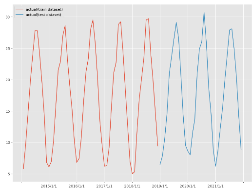
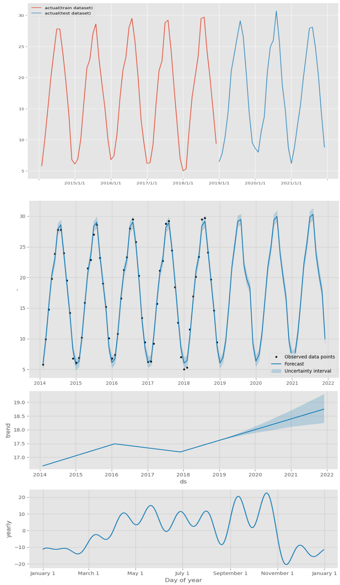

<script async src="https://pagead2.googlesyndication.com/pagead/js/adsbygoogle.js?client=ca-pub-2844921131740253"
     crossorigin="anonymous"></script>
<!-- Global site tag (gtag.js) - Google Analytics -->
<script async src="https://www.googletagmanager.com/gtag/js?id=G-H1234VX5NE"></script>
<script>
  window.dataLayer = window.dataLayer || [];
  function gtag(){dataLayer.push(arguments);}
  gtag('js', new Date());

  gtag('config', 'G-H1234VX5NE');
</script>


```
この記事にはこんなことが書かれています。
- 機械学習によって得られたモデルを評価するには
- 線形回帰とは
- 評価指標MAE, RMSE, MAPE, Rの使い分け
```
----
■経緯<br>
前回、前々回の記事でモデルを作成してみました。<br>
これらをどう評価していくのか疑問に思ったので調べてみましたので共有します。<br>
[前回の記事](https://kissshot-skup.github.io/webpage/aiskillup2/) 
[前々回の記事](https://kissshot-skup.github.io/webpage/aiskillup/) 
 <br>
 <br>

---- 
■モデルを評価するとは<br>
作成したモデル＝関数の正確さを確認するということになり、以下に尽きます。 <br>
```
真値（正解データ）と推測値（モデルにより導かれる値）の差分
```
その差分を捉える算出式がいくつかあるということになります。
種類と見方をざっくりまとめてみました。

```
- MAE・RMSE:真値-推測値の差分を見る。0に近いほどモデルの精度が高いといえる。
- MAPE:真値-推測値の差分を割合（%）を見る。0に近いほどモデルの精度が高いといえる。
- R:相関係数とも呼ばれ、2つのデータの適合度を見る。R^2は決定係数と呼ばれ1に近い方がモデルの精度が高いといえる。
```

■MAEとRMSEの使い分け
MARは、各点の差分を足し合わせていき、測定点数で割って平均化したもの。<br>
RMSEは、各点の差分を「二乗」して足し合わせていき、測定点数で割って平均化した後、最後に平方根をとっている。つまりRMSEの方が、差分を二乗して評価しているので、真値と推測値の差が大きいところが顕著に現われる。<br>

■MAE・RMSEとMAPEの使い分け
MAPEは、平均絶対パーセント誤差とも呼ばれており、真値と推測値の相対誤差を算出したもの。<br>
割合で評価できるため、スケールが異なるデータの誤差を比較しやすい。<br>

■
数式の意味については、以下記事がわかりやすい。
[決定係数について](https://datawokagaku.com/r_squared/) <br>
今回は2014年1月から2021年12月までのデータを使用します。 <br>
学習データは、2014年～2016年の12×3のデータとし、2017年～2021年の傾向を予測できるか試します <br>
圧倒的にデータ点数が足りない気がしますが、練習としてやってみます <br>
 <br> <br>
ライブラリのインポート等は前回ソースから変更なし。学習データを分割する部分は以下。 <br>

```
# # 学習データとテストデータ12の分割
test_length = 36
df_train = df.iloc[:-test_length]
df_test = df.iloc[-test_length:]
# # グラフ化
fig, ax = plt.subplots()
plt.xticks(np.arange(-1, 132, 12))
ax.plot(df_train.ds, df_train.y, label="actual(train dataset)")
ax.plot(df_test.ds, df_test.y, label="actual(test dataset)")
plt.legend()
```

オレンジが学習データとした部分で、青が予測したいデータです。 <br>
 
<br>
<br>
次に、予測の部分のソースです。 <br>

```
# create instance
m = Prophet()

# fitting 
#m.fit(df)
m.fit(df_train)
# first create datetime of datetime
future = m.make_future_dataframe(periods=36,freq='M')
forecast = m.predict(future)
forecast

#描画
# plt.figure(figsize=(2,3))
m.plot(forecast)
plt.legend()
<br>
```
青線が学習結果です。黒い点が入力点になります。 <br>
 

それなりの精度で予測できいそうです。 <br>
以下に、二つの図を並べて正解データと比べてみました。<br>
また、以下ソースで、prophetで予測した傾向を表示することができるようで、trendグラフも追加で表示してみました。 <br>

 
 <br>
パラメータチューニングをしていないのにそれなりの精度で予測できていそうです。 <br>
<br>
以下、メモ。<br>
学習結果をcsvに吐き出したいと思って調べました。以下コードでできました。1行だけで樂ですね。<br>
```
forecast.to_csv("output.csv")
```
 <br>
 <br>

----
■今後やっていきたいこと <br>
prophetで使う関数の数学的意味も理解しないといけないと思っています。<br>
下記記事で紹介してくれていて、とても参考になりそうです。理解を深めていきます<br>
[数式説明](https://devblog.thebase.in/entry/2019/12/20/110000_1) 
 <br>
 <br>
----


## [Mainページに戻る](https://kissshot-skup.github.io/webpage)

