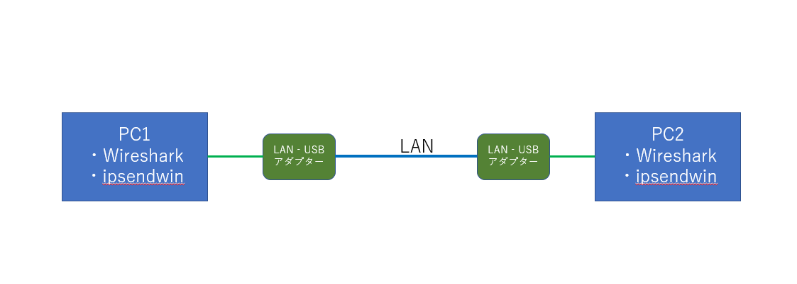

<script async src="https://pagead2.googlesyndication.com/pagead/js/adsbygoogle.js?client=ca-pub-2844921131740253"
     crossorigin="anonymous"></script>
<!-- Global site tag (gtag.js) - Google Analytics -->
<script async src="https://www.googletagmanager.com/gtag/js?id=G-H1234VX5NE"></script>
<script>
  window.dataLayer = window.dataLayer || [];
  function gtag(){dataLayer.push(arguments);}
  gtag('js', new Date());

  gtag('config', 'G-H1234VX5NE');
</script>


```
この記事にはこんなことが書かれています。
- ものは試し。2台のPCを繋いでパケットの中身を見てみよう
- MACアドレス、IPアドレスの確認と設定
- wireshark, ipsendwinの使い方
```

----
 <br>
■準備<br>
・PC2台<br>
・LAN‐USBアダプター（最近のPCは薄型のため、LAN端子がないためアダプターを2台用意。会社から勝手に借用…）<br>
・LANケーブル（通信の本を読んでると、PC同士を繋げる時はクロスケーブルが必要とありますが、昔の話で最近はあまり考えなくて良さそう。そこらへんに落ちていたRANケーブルを使用）<br>
・アプリ「wireshark」<br>
無料のパケット解析ツール。通信屋さんには必須アイテム。<br>
ダウンロードは下記からできます。リンク貼っておきます。<br>
[https://forest.watch.impress.co.jp/library/software/wireshark/](https://forest.watch.impress.co.jp/library/software/wireshark/)
<br>
・アプリ「パケットジェネレータipsendwin」<br>
無料の自分でパケットを作成して送信することができるツール<br>
ダウンロードは下記からできます。リンク貼っておきます。<br>
[https://www.vector.co.jp/soft/win95/net/se363834.html](https://www.vector.co.jp/soft/win95/net/se363834.html)
<br>
<br>
----
■接続構成<br>
下図のような構成を構築。ただ上記を繋いだだけです。<br>
事前にPCに各アプリをインストールしておきましょう。<br>
 
<br>
<br>
----
<br>
■さっそく通信テスト！<br>
ここから本番です。<br>
まず、パケットの送り先と送り元を確認しましょう。<br>
2台のPCでコマンドプロンプトを起動して、ipconfig/allと入力。<br>
イーサネットx（xは数字が入ります）の下に記載されている物理アドレスがMACアドレス（機器番号）になり、IPv4アドレスと記載の数字がIPアドレス（住所）になります。<br>
お互いのIPが分かったところで、pingコマンド(通信できるかの確認)を実施してみましょう。<br>
<br>
例えば、先ほどの図でPC1⇒PC2に通信確認をしてみる場合、PC1のコマンドプロンプトで下記を入力します。<br>
<br>
ping xxx.xxx.xxx.xxx<br>
(上記xxxにはPC2で確認したIPアドレスを入力します)<br>
<br>
どうでしょうか？<br>
私は、これで失敗しました・・・<br>
wiresharkを見ても、pingコマンドは受信していない様子。<br>
※wiresharkの使い方は下記参照<br>
[https://beginners-network.com/wireshark.html](https://beginners-network.com/wireshark.html)
<br>
ググって調べてみると下記記事があり解決しました。<br>
ありがとうございます。つまり、ファイアウォールが邪魔しています。<br>
[https://chirorin.hatenadiary.com/entry/2021/06/20/134823](https://chirorin.hatenadiary.com/entry/2021/06/20/134823)
<br>
上記記事の設定で再度Pingを打つと通りました。<br>
wiresharkでも検知しています。<br>

<br>
<br>
----
<br>
■好きなパケットを流してみよう<br>
通信確認がとれたので、パケットを流してみます。<br>
ipsendwinを起動します。<br>
ここで、問題が・・・<br>
「xxx.dll」が見つからないので起動できないといわれました。<br>
これは、Npcapというwiresharkインストール時に一緒にインストールされるソフトが上手くインストールされていないと思って、再度インストールしてみると治りました。<br>
ipsendwinのインストール後に再起動が必要だったのでその線もあります。<br>
<br>
再度起動してみると、今度は「インターフェースが見つからない」と怒られました。<br>
ただ、起動はしている様子。なんだこの状態は？と思いググったところ、ipsendwinはwinxp以降非対応でこのメッセージが出るものの、界隈では使えているという情報がありました。<br>
なので、一旦無視でOKの様子。<br>
<br>
PC1でパケットを作成します。作りかたは下記が参考になります。<br>
[https://qiita.com/JunichiWatanuki/items/d4b1196272af9275cf03](https://qiita.com/JunichiWatanuki/items/d4b1196272af9275cf03)
<br>
やったことは下記のみ。<br>
・UDPを流してみようとUDPを選択<br>
・設定でMACアドレスとIPアドレスを設定<br>
※送信先はPC2のMACアドレスとIPアドレス、送信元はPC1のという感じです<br>
・パケット送信数を適当な値に設定。とりあえず100<br>
<br>
パケットの中身は変えずにとりあえず「送信」ボタンを押下！<br>
<br>
おおおおお～<br>
PC2のwiresharkでUDPを受信したことを確認できました。<br>
<br>
逆（PC2⇒PC1）もまたしかり。<br>
<br>
<br>
----
<br>
■最後に<br>
MACやIPアドレスの設定が間違っていたりすると通信できません。<br>
ipconfig/allでイーサネットとは違う項目のipなどを見て入力すると、届かなかったりします。<br>
こういう失敗を見ながらやっと通信ができる仕組みがわかっていくように感じます。<br>
こんな簡易実験記録のような記事が少しでも役立てば幸いです。<br>
<br>
あ、実験が終わったらファイアウォールの設定は元に戻しておこう。ググったりできなくなったりしましたので。<br>
忘れないうちに
<br>

----


## [Mainページに戻る](https://kissshot-skup.github.io/webpage)

