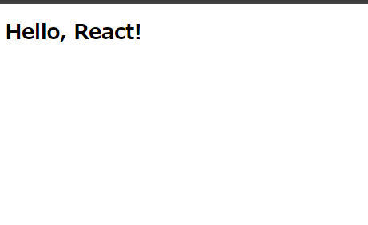
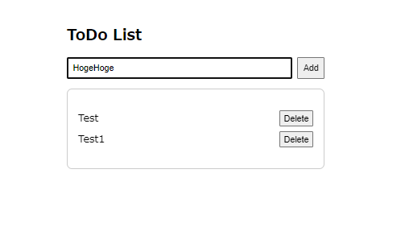

<script async src="https://pagead2.googlesyndication.com/pagead/js/adsbygoogle.js?client=ca-pub-2844921131740253"
     crossorigin="anonymous"></script>
<!-- Global site tag (gtag.js) - Google Analytics -->
<script async src="https://www.googletagmanager.com/gtag/js?id=G-H1234VX5NE"></script>
<script>
  window.dataLayer = window.dataLayer || [];
  function gtag(){dataLayer.push(arguments);}
  gtag('js', new Date());

  gtag('config', 'G-H1234VX5NE');
</script>


```
この記事には以下ネットワーク基礎知識が書かれています。
- Reactの製作ローカル環境立ち上げ方法
- 簡単な試作（ToDoリストを作ったよ！）
```

----

巷で話題のReactを触っていきたいと思います。まずは環境立ち上げから。<br>
<br>

----

### ■参照すべきはどこ？<br>
良く触っている同僚に聞いたら「公式ドキュメントが一番いいよ！」と教えてくれました。<br>
QittaとかZennで調べた方がいいのでは？と思っていましたが<br>
色々とリサーチして、公式ドキュメントが一番わかりやすいし・丁寧ですｗ<br>
郷に従いましょう！！<br>
[React公式](https://ja.react.dev/learn/installation)<br>
<br>

----

### ■ローカル環境の設定<br>
公式ドキュメントによると、一番手軽に始めるのはブラウザ環境で。となっています。<br>
簡単にやるならそれでいいですが、手元で何個もプロジェクトを立ち上げることがするので<br>
今後のことを考えてローカルに環境立ち上げます。<br>
<br>
Reactのバージョン19が最新ですが、色々とエラーが発生します・・・<br>
バージョン18に指定して以下にてプロジェクトフォルダを立ち上げ。<br>
ToDoリストアプリを試作したくて、フォルダ名はToDoアプリっぽくしました。<br>
<br>
```
mkdir my-todo-app
cd my-todo-app
npm init -y
npm install react@18 react-dom@18 react-scripts
```

<br>
次に、フォルダ構造を作成します。<br>
my-todo-app フォルダの中に以下のフォルダとファイルを作成します。<br>
<br>
```
my-todo-app/
  ├── public/
  │     └── index.html
  └── src/
        ├── App.js
        └── index.js
```
<br>
で、手動でやるのがめんどくさいので、GPTさんにコマンドでおねがいして、以下叩けば自動でできます。<br>
<br>

```

mkdir public src
echo ^<!DOCTYPE html^> > public\index.html
echo ^<html lang="en"^>^<head^>^<meta charset="UTF-8" ^/^>^<title^>React App^</title^>^</head^>^<body^>^<div id="root"^>^</div^>^</body^>^</html^> >> public\index.html
echo import React from 'react'; > src\App.js
echo function App() { return (^<div^>^<h1^>Hello, React!^</h1^>^</div^>); } export default App; >> src\App.js
echo import React from 'react'; > src\index.js
echo import ReactDOM from 'react-dom/client'; import App from './App'; const root = ReactDOM.createRoot(document.getElementById('root')); root.render(^<React.StrictMode^>^<App ^/^>^</React.StrictMode^>); >> src\index.js

```
<br>

フォルダができたら「npm start」を実行したけれど、色々パッケージが足りない模様。<br>
「npm init -y」実行すると、フォルダ下にpackage.jsonができるので、<br>
以下を記述した後「npm install react react-dom react-scripts」を実行してインストール。<br>

```
{
  "name": "my-todo-app",
  "version": "1.0.0",
  "description": "",
  "main": "index.js",
  "scripts": {
    "start": "react-scripts start",
    "build": "react-scripts build",
    "test": "react-scripts test",
    "eject": "react-scripts eject"
  },
  "dependencies": {
    "react": "^18.0.0",
    "react-dom": "^18.0.0",
    "react-scripts": "latest"
  },
  "author": "",
  "license": "ISC"
}
```
<br>

```

npm init -y
<!-- ここでjsonファイルを修正 -->
npm install react react-dom react-scripts
npm start

```
<br>
上手くいけばローカルでアプリが動いて以下画面になります。<br>
<br>
<br>

----
### ■お試しToDoアプリ<br>
全部AIに指示して書いてもらったので、数分でできてしまった。作業メモ。<br>
まずApp.jsを以下に<br>
<br>

```

// 外部コンポーネントのインポートを削除
import React, { useState } from 'react';

export default function TodoListApp() {
    const [tasks, setTasks] = useState([]);
    const [newTask, setNewTask] = useState('');

    const addTask = () => {
        if (newTask.trim() !== '') {
            setTasks([...tasks, { text: newTask, completed: false }]);
            setNewTask('');
        }
    };

    const toggleTaskCompletion = (index) => {
        const updatedTasks = tasks.map((task, i) =>
            i === index ? { ...task, completed: !task.completed } : task
        );
        setTasks(updatedTasks);
    };

    const deleteTask = (index) => {
        setTasks(tasks.filter((_, i) => i !== index));
    };

    return (
        <div style={{ padding: '16px', maxWidth: '400px', margin: 'auto' }}>
            <h1 style={{ fontSize: '24px', fontWeight: 'bold', marginBottom: '16px' }}>ToDo List</h1>
            <div style={{ display: 'flex', gap: '8px', marginBottom: '16px' }}>
                <input
                    value={newTask}
                    onChange={(e) => setNewTask(e.target.value)}
                    placeholder="Add a new task..."
                    style={{ flex: 1, padding: '8px' }}
                />
                <button onClick={addTask} style={{ padding: '8px' }}>Add</button>
            </div>
            <div style={{ border: '1px solid #ccc', padding: '16px', borderRadius: '8px' }}>
                {tasks.length === 0 ? (
                    <p style={{ color: '#999' }}>No tasks yet. Add a task to get started!</p>
                ) : (
                    <ul style={{ listStyle: 'none', padding: 0 }}>
                        {tasks.map((task, index) => (
                            <li key={index} style={{ display: 'flex', justifyContent: 'space-between', marginBottom: '8px' }}>
                                <span
                                    style={{
                                        flex: 1,
                                        textDecoration: task.completed ? 'line-through' : 'none',
                                        color: task.completed ? '#999' : '#000'
                                    }}
                                    onClick={() => toggleTaskCompletion(index)}
                                >
                                    {task.text}
                                </span>
                                <button onClick={() => deleteTask(index)}>Delete</button>
                            </li>
                        ))}
                    </ul>
                )}
            </div>
        </div>
    );
}

```
<br>
次に、index.jsを以下に。<br>

```

import React from 'react';
import ReactDOM from 'react-dom/client';
import TodoListApp from './App';

const root = ReactDOM.createRoot(document.getElementById('root'));
root.render(
  <React.StrictMode>
    <TodoListApp />
  </React.StrictMode>
);

```
<br>

最後に、index.htmlを以下に。<br>

```

<!DOCTYPE html>
<html lang="en">
  <head>
    <meta charset="UTF-8" />
    <meta name="viewport" content="width=device-width, initial-scale=1.0" />
    <title>React App</title>
  </head>
  <body>
    <div id="root"></div>
  </body>
</html>

```
<br>
「npm start」をすると、上手くいくとこうなる↓5分くらいでできてしまった・・・AI恐るべし<br>
<br>

<br>
<br>
実際に触れる？画面↓（静的ページにもビルドして埋め込めた！！地味にすごい）<br>
<iframe src="https://kissshot-skup.github.io/webpage/react/" width="100%" height="500px" frameborder="0"></iframe>
<br>
今日はここまで！！<br>
<br>

----


## [Mainページに戻る](https://kissshot-skup.github.io/webpage)

