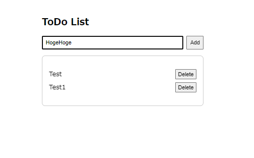

<script async src="https://pagead2.googlesyndication.com/pagead/js/adsbygoogle.js?client=ca-pub-2844921131740253"
     crossorigin="anonymous"></script>
<!-- Global site tag (gtag.js) - Google Analytics -->
<script async src="https://www.googletagmanager.com/gtag/js?id=G-H1234VX5NE"></script>
<script>
  window.dataLayer = window.dataLayer || [];
  function gtag(){dataLayer.push(arguments);}
  gtag('js', new Date());

  gtag('config', 'G-H1234VX5NE');
</script>


```
この記事には以下ネットワーク基礎知識が書かれています。
- Reactで前回Hello React！を表示したが、次のアプリを作る
- それをAWSに展開して、Webアプリとして展開したい
```

----


### ■まずはプロジェクト作成<br>
Reactプロジェクトを新規に立ち上げる。以下で、フォルダ作成します。<br>
普通に「npx create-react-app my-react-app」すると、React ver19エラーが発生します・・・。<br>
<br>

```

<!-- 競合関係を無視してインストール -->
npx create-react-app count-app --legacy-peer-deps
<!-- Ver19は手動で修正 -->
npm install react@18 react-dom@18
<!-- 再度依存関係をインストール。キャッシュクリア -->
npm install
npm cache clean --force
<!-- モジュールが足りないらしいので以下インストール -->
npm install web-vitals

```

別プロジェクト立ち上げた時に、上記でいけないこともあって、以下で回避できるかも？のメモです<br>

```

npx create-react-app <自分の作りたいフォルダ名> --template typescript --force

```
<br>
--forceを入れるとどうなるか、AIの回答は以下<br>
--legacy-peer-deps を使っても解決しない場合は、<br>
--force オプションで無理やりインストールを試みる方法もあります。<br>
ただし、強制的に依存関係を解決するため、ランタイムで予期しない問題が発生する可能性もあるので、最終手段として検討してください。<br>
まぁ何とかなるでしょう精神でいきましょう<br>
<br>
で、私は結局どうしたかというと、手動でバージョンを合わせました。よくわからないですが、解決せずでしたので<br>
<br>

```
まずpackage.jsonの以下を変更
    "react": "^19.0.0",
    "react-dom": "^19.0.0",
を↓に変更
    "react": "^18.2.0",
    "react-dom": "^18.2.0",

した後に、以下を実行
npm install --legacy-peer-deps

```

これで作業用フォルダが完成しました。<br>

----

### ■バックエンド側開発のための環境構築<br>
Amplify CLIをインストールします。<br>

```
<!-- 初回だけ：amplify cliは以下で使えるようにします -->
npm install -g @aws-amplify/cli
<!-- バージョン確認 -->
amplify --version
<!-- 初期化  -->
amplify init

```

これでもうまくいかないときは、<br>

```
2. PATH の確認
もし上記を実行しても依然として「amplify」というコマンドが認識されない場合、npm のグローバルインストール先（通常は
C:\Users\<ユーザー名>\AppData\Roaming\npm）が PATH に含まれているかを確認してください。

Windows の場合
「環境変数の編集」から「システム環境変数」→「環境変数」で、PATH に上記のパスが含まれているか確認し、含まれていなければ追加してください。
```

<br>
できたら「npm start」!<br>
<br>
上手くいけばローカルでアプリが動いて以下画面になります。<br>
<br>
<br>

----
### ■お試しToDoアプリ<br>
全部AIに指示して書いてもらったので、数分でできてしまった。作業メモ。<br>
まずApp.jsを以下に<br>
<br>

```

// 外部コンポーネントのインポートを削除
import React, { useState } from 'react';

export default function TodoListApp() {
    const [tasks, setTasks] = useState([]);
    const [newTask, setNewTask] = useState('');

    const addTask = () => {
        if (newTask.trim() !== '') {
            setTasks([...tasks, { text: newTask, completed: false }]);
            setNewTask('');
        }
    };

    const toggleTaskCompletion = (index) => {
        const updatedTasks = tasks.map((task, i) =>
            i === index ? { ...task, completed: !task.completed } : task
        );
        setTasks(updatedTasks);
    };

    const deleteTask = (index) => {
        setTasks(tasks.filter((_, i) => i !== index));
    };

    return (
        <div style={{ padding: '16px', maxWidth: '400px', margin: 'auto' }}>
            <h1 style={{ fontSize: '24px', fontWeight: 'bold', marginBottom: '16px' }}>ToDo List</h1>
            <div style={{ display: 'flex', gap: '8px', marginBottom: '16px' }}>
                <input
                    value={newTask}
                    onChange={(e) => setNewTask(e.target.value)}
                    placeholder="Add a new task..."
                    style={{ flex: 1, padding: '8px' }}
                />
                <button onClick={addTask} style={{ padding: '8px' }}>Add</button>
            </div>
            <div style={{ border: '1px solid #ccc', padding: '16px', borderRadius: '8px' }}>
                {tasks.length === 0 ? (
                    <p style={{ color: '#999' }}>No tasks yet. Add a task to get started!</p>
                ) : (
                    <ul style={{ listStyle: 'none', padding: 0 }}>
                        {tasks.map((task, index) => (
                            <li key={index} style={{ display: 'flex', justifyContent: 'space-between', marginBottom: '8px' }}>
                                <span
                                    style={{
                                        flex: 1,
                                        textDecoration: task.completed ? 'line-through' : 'none',
                                        color: task.completed ? '#999' : '#000'
                                    }}
                                    onClick={() => toggleTaskCompletion(index)}
                                >
                                    {task.text}
                                </span>
                                <button onClick={() => deleteTask(index)}>Delete</button>
                            </li>
                        ))}
                    </ul>
                )}
            </div>
        </div>
    );
}

```
<br>
次に、index.jsを以下に。<br>

```

import React from 'react';
import ReactDOM from 'react-dom/client';
import TodoListApp from './App';

const root = ReactDOM.createRoot(document.getElementById('root'));
root.render(
  <React.StrictMode>
    <TodoListApp />
  </React.StrictMode>
);

```
<br>

最後に、index.htmlを以下に。<br>

```

<!DOCTYPE html>
<html lang="en">
  <head>
    <meta charset="UTF-8" />
    <meta name="viewport" content="width=device-width, initial-scale=1.0" />
    <title>React App</title>
  </head>
  <body>
    <div id="root"></div>
  </body>
</html>

```
<br>
「npm start」をすると、上手くいくとこうなる↓5分くらいでできてしまった・・・AI恐るべし<br>
<br>

<br>

<!-- <br>
実際に触れる？画面↓（静的ページにもビルドして埋め込めた！！地味にすごい）<br>
<iframe src="https://kissshot-skup.github.io/webpage/react/app/index.html" width="100%" height="500px" frameborder="0"></iframe>
<br> -->

今日はここまで！！<br>
<br>

----


## [Mainページに戻る](https://kissshot-skup.github.io/webpage)

