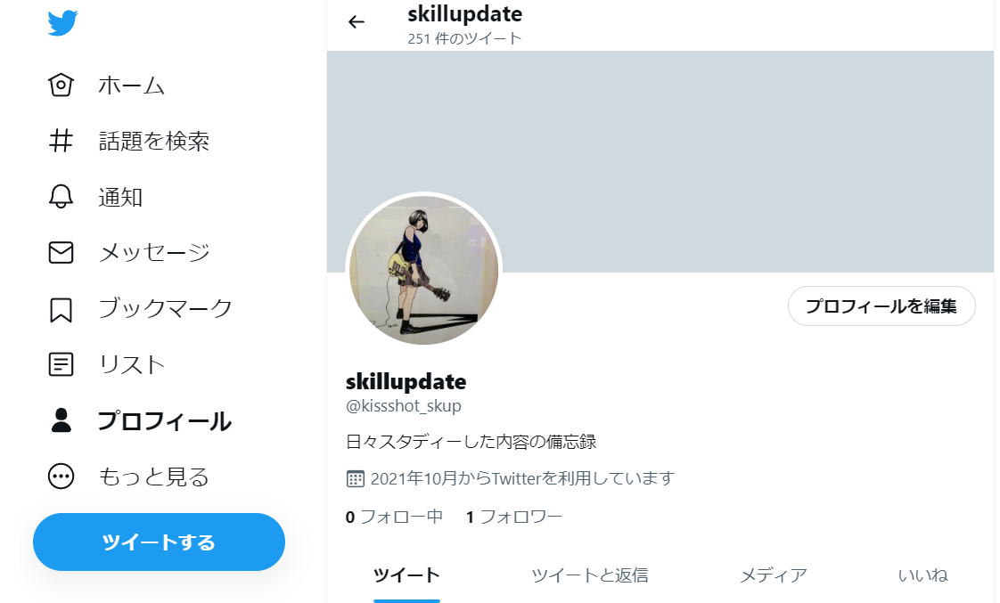
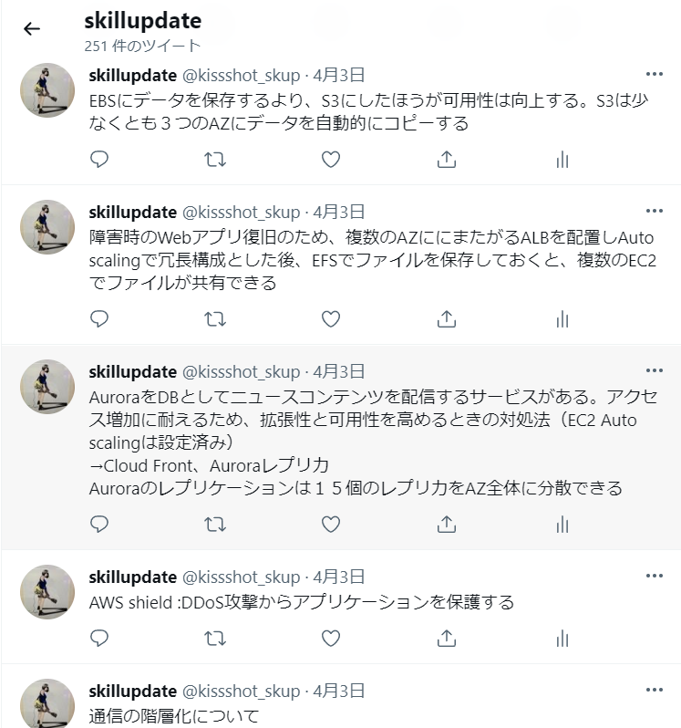
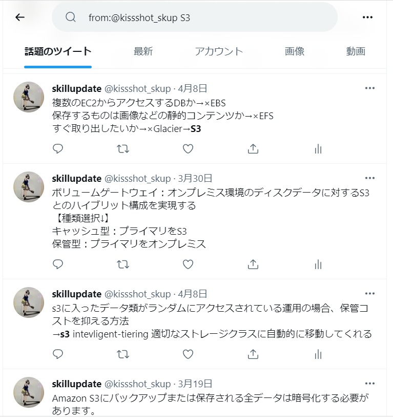

<script async src="https://pagead2.googlesyndication.com/pagead/js/adsbygoogle.js?client=ca-pub-2844921131740253"
     crossorigin="anonymous"></script>
<!-- Global site tag (gtag.js) - Google Analytics -->
<script async src="https://www.googletagmanager.com/gtag/js?id=G-H1234VX5NE"></script>
<script>
  window.dataLayer = window.dataLayer || [];
  function gtag(){dataLayer.push(arguments);}
  gtag('js', new Date());

  gtag('config', 'G-H1234VX5NE');
</script>


```
この記事にはこんなことが書かれています。
- ノートをとる時代はもう古い
- 推奨勉強法その２（Twitterの活用）
```

----

## ノートをとる時代はもう古い?
学生時代、生徒たちは黒板に書かれた文字列を
紙のノートに書き写すのに必死だった。
しかも、綺麗に丁寧にわかりやすく書くことに注力する人が
自分を含めて多かったと思う。

今はスクリーンに映像を映したり、
個人PCがあって配信形式になっていて無用かもしれないが
授業内容を綺麗にまとめることに重きを置いていないだろうか。


今、社会人になって、残業で力尽き、家に帰って寝るだけの毎日。
少しでも今の生活を変えようとする僅かな力で本やPCを開く時、
綺麗にノートをとることはない。

今になってわかる。
本当に大事なのは
- 先生が嚙み砕いて説明した何気ない説明
- 黒板に書かれた文字列に
　どんなエッセンスが入っているのか
　問題であればどんなプロセスがあるのか

ということを理解することだったと。


サラリーマン、学生、主婦、どんな人であっても
今の生活が精いっぱいで、やりたいことのため、将来のために使う時間は
限りなく少ない。
そんな時に、少しでもやる気がでるインプット方法を取り入れらるように、
自分の体験記が参考になれば幸いです。


----

## 最短で脳みそに刻み込む！
前述のとおり、ノートに綺麗にまとめてインプットした気になる
というのは意味がない。
未だに、「できる人のノート術」的な本が売られているのを見て
金儲けの闇と感じてしまうのは自分だけだろうか。

完全に否定するつもりはなく、ノートに書くことで
ある程度インプットできることもあるし
そんな学習スタイルが自分に合っている人もいるだろう。
ただ、私には合わなかった。持論としては下記のとおり。

- 人はすぐ忘れてしまう
- 人は繰り返し体験したことや教訓を覚える
- アウトプットすることが、自分や世の中の価値になる

ノートに書いた瞬間はいい。でも次の日に思い出せないこと
沢山ある。記憶は曖昧だし、一日に色々な仕事や授業や出来事があって
そりゃあ忘れるさ。
じゃあどうしたらよいか【繰り返し脳みそに体験させる】これに尽きると思う。
お前これもう忘れたんか？ともう一度同じことをやらせる。
その繰り返しが、脳みそに刻み込まれる。

自転車の運転だって最初は転んでばかりだが
手足の力の入れ方・姿勢・こぎだすタイミングなんかを
次第に覚えて、いつの間にか何を意識することなく自転車に乗れている。
エッセンスとなる修行を繰り返す。これにつきる。


最後にアウトプット！
ノートに書いたことを後から見返したとき
それはただ見ているだけのことが多い。
手を動かしてもう一度まっさらな空白で問題を解いてみてほしい。
その繰り返しが大切だと思う。

仕事も同じ。文章を読んでそこから大事なことを読み取って
レポートにアウトプットする。
それで自分の中に学びが刻みこまれ&世の中のためになる。
とにかくアウトプットする。
ただ読んでいるだけでは×

長くなったけど、それを体現したのが下記に示す方法です。


----

## Twitterの活用

導入が長すぎてすみません。上記考えから思いついた方法です。
下記手順になります。

1. Twitterに登録（登録している人は省略OK（サブ垢作ってもOK））
2. 日々学習した内容をとにかくツイート
3. 同じ過ちをしたらチェック（いいね・もしくは返信）の繰り返し作業


なんだ、それだけ？という感じですがこれが効きました。
下記の記事で、AWS認定資格を取りましたがこの方法はとても良かったです。

[【資格とってみた】クラウド(AWS)資格取得について](https://kissshot-skup.github.io/webpage/AWS_SAA)

まず1.について。twitterの説明は省きますがアカウントを作ってください。
私は、サブ垢を作りました。ただの記録用なのでフォロー・フォロワーはゼロです。


  


教本やUdemyを開きながら、PCでtwitterを開いていました。
スマホでも大丈夫だと思います。
覚えなきゃいけない内容や間違えた問題があれば、ツイートをします。
こんな感じです。

  


ノートに綺麗に書く必要はなく、こんなメモを連ねるだけでよいと思っています。
これなら、過去のツイートをさらっと再確認できて復習もできます。

そして、みそなのはここから。
検索欄で下記コマンドを使うと、自分の過去ツイートを
キーワードで検索することができます。


```
from:@**** キーワード

@****は自分のアカウント名が入ります。キーワードは調べたいワードです。

```

こんな感じ。

  


検索したら、前こんなこと調べてたんだ…忘れてた。
というのが良くあります。いいねしてリストに残したり
更に調べたことを自分のツイートへの返信で追加しましょう。

自分の勉強ツイートが一本一本の木だとすると
どんどん葉を増していき、林となり森となる。
そのころには、自分の知識も大きなものとなっているはずです。


ツイートするというアウトプットが、自分のやる気にもつながります。
ぜひ活用してみてください。


他にも推奨勉強法の記事もよかったら見てください。

[【紹介したい】推奨勉強法 その1 StudyPlus他](https://kissshot-skup.github.io/webpage/studyplus)


----


## [Mainページに戻る](https://kissshot-skup.github.io/webpage)

