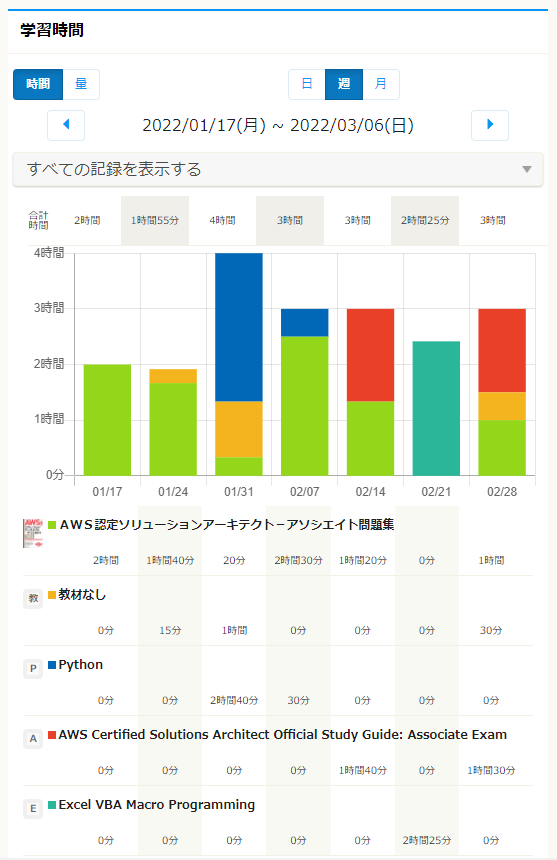
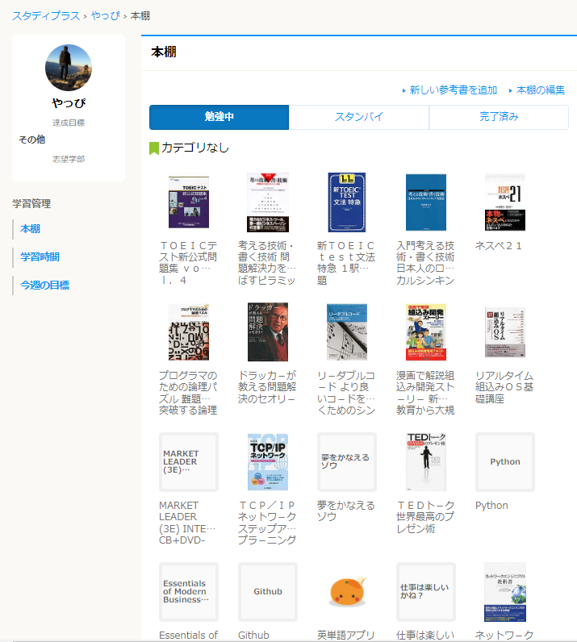
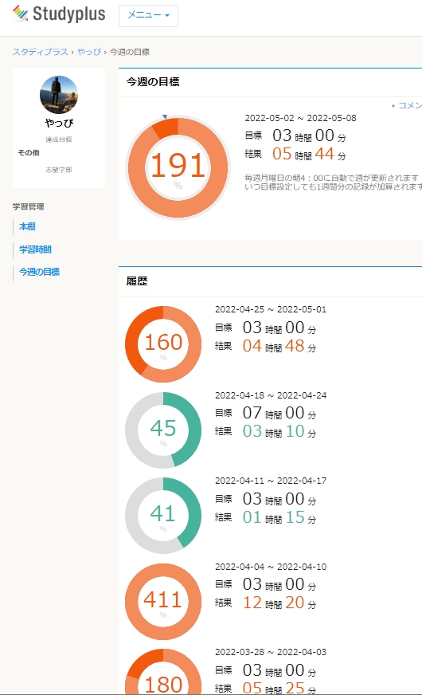
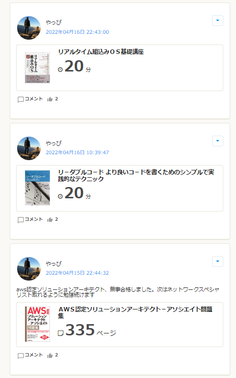
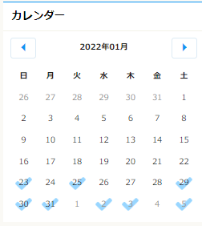
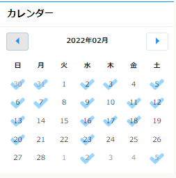
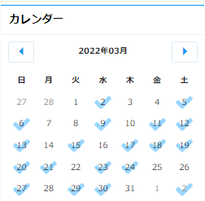

```
この記事にはこんなことが書かれています。
‐ 勉強方法探索方法（Quiitaの活用）
‐ StudyPlusを活用した勉強時間
```

----

## 最短の勉強法とは？
特にソフトウェア系のエンジニアは、新しい言語・ツールやら新技術・規格に
常にアンテナを張っておく、ある程度の使える能力と知識を持っておかないと
スピード感のある開発・設計業務を行えなくなる時代になりつつあると感じています。
情報処理技術者試験をはじめとする資格も多数存在しており、
年間数万人規模の人が受験をしています。

こんな時代に、最短で技術力を高めるにはどうすればいいか。
私は知恵袋的な情報交換の場を活用するのが一番早いのでは？と思っています。
狙いとしては下記です。

- 自分が考え付くことはたいてい他の人もやっている
- ので、同じ失敗、轍を踏まない。事前に対策しておける
- 成功した人と同じ道を通った方が上手くいく確率が高い


別の記事でAWS SAAの合格体験記を記載していますが
そこで実践して良かった経験を下段で解説します。

----
本記事で紹介した方法はたった2つです。


# 1.Quittaの活用
ソフト系のエンジニアはここで知識・失敗談の共有をしていると思います。
私はここでSAAの体験記を多く読み、Udemy（オンラインの講座）や
必要になりそうな参考書を買う参考にしていました。

数多ある参考書の中から何が良さそうか、探す方法は幾つかあるかと思います。
昔はAmazonの口コミやら確認して買っていましたが、結局読まないものもありました。
Quiitaで見てから買うのとでは信頼度が違いますし、
活用方法（〝熟読しないで辞典的に使う″等）を書いてくれている人もいるので、
知識を取り入れるためにどう使っていくかをイメージして参考書を買うことができます。
例えば、下記の記事で書いている内容などです。
[〈経験談〉AWS 認定ソリューションアーキテクト - アソシエイトの受験について](https://qiita.com/kissshot_skup/items/fc820b495155128d8336)


----

# 2.StudyPlusの活用
これはソフト系のエンジニアに限らず、万物の勉強で使えると思います。
1．で勉強法は何となくわかるものの、このモチベーションを維持するのが
一番難しいと感じています。
皆さん私生活はそれぞれかと思いますが、勉強時間を確保するのも難しくないでしょうか。

そんなか、モチベを維持するのに用いていたツール「StudyPlus」を紹介します。
無料枠での使用ですので安心して使うことができます。

- [スタディプラスHP](https://www.studyplus.jp/)

一言で言うと「読んだ本のページや作業時間を記録できる」サービスです。
例えばSAAを勉強していたころは、下記のような感じでした

  

スマホで参考書のバーコードを読み込むと本を追加できます。

  

他の人が登録している本や作業名を借りることもできます。
一日に●分▲▲の本を読んだという感じで記録すると
自分の作業時間に計上されます。

また、週の初めに目標時間を設定することができます。

  

私は毎週3時間設定していて、これをクリアするために、
眠くてもとりあえず本を開くようになりました。
10分しかできない日もざらにありますが、何もしない頃に比べると改善です。

最後に、モチベ維持に貢献していることとして
他のユーザーからいいねが押されることがあります。

  

↑自分のタイムラインのみ表示していますが、
タイムライン上にやったことを表示させることができ、
他ユーザの勉強状況にいいね！ボタンを押すしくみがあります。
フォローされたユーザと共に励ましあっているような感覚になります。

●●に何分時間を費やしたのか、なんとなくやってた頃より
具体化されてとても良いアプリだと思います。

サボっていたころは下記だったのが...
※毎日1分でも作業した日にチェックマークが入ります

  

最近ではこんな感じです↓

  
  


皆さんもぜひ初めてみてください。
良かったら一緒に頑張りましょう！

他にもTwitterを使った勉強法も考えて実践しています。
それは次回の記事で。


----


## [Mainページに戻る](https://kissshot-skup.github.io/webpage)

