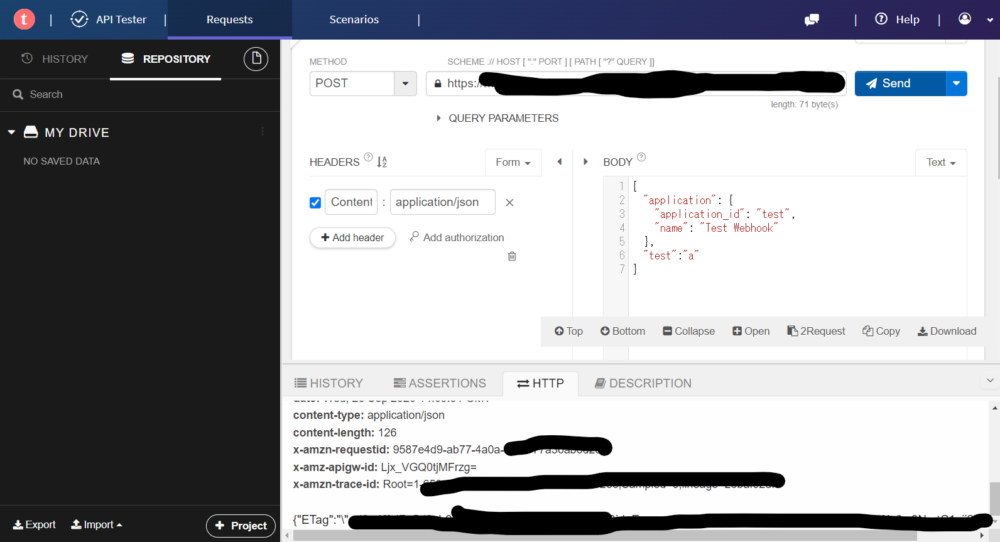

<script async src="https://pagead2.googlesyndication.com/pagead/js/adsbygoogle.js?client=ca-pub-2844921131740253"
     crossorigin="anonymous"></script>
<!-- Global site tag (gtag.js) - Google Analytics -->
<script async src="https://www.googletagmanager.com/gtag/js?id=G-H1234VX5NE"></script>
<script>
  window.dataLayer = window.dataLayer || [];
  function gtag(){dataLayer.push(arguments);}
  gtag('js', new Date());

  gtag('config', 'G-H1234VX5NE');
</script>


```
この記事にはこんなことが書かれています。
- web APIとは
- REST API
- 
```

----
 <br>
■モチベーション <br>
以下、前回記事でWebhookを使った情報伝達方法について実装してみたりしました。 <br>
[【情報処理】AWSでwebhookの受信＆メール通知を実装する（API Gateway＋Lambda）](https://kissshot-skup.github.io/webpage/webhook/)<br>
<br>
Webhookは、イベント駆動で相手や自分から何かを発信して終わりですが<br>
もっと色々なことをやろうとすると、情報のやり取りが必要になってきます<br>
（相手から情報をもらってそれを処理するとか）<br>
<br>
なので、もう少しWebAPIなるものを深堀してみようと思いました。<br>
<br><br>

----
■WebAPIとは<br>
以下資料がわかりやすかったです↓ <br><br>
[WebAPIについての説明](https://qiita.com/busyoumono99/items/9b5ffd35dd521bafce47)<br>
[【初心者向け】APIとは？概要や活用メリット・使い方を解説](https://blog.hubspot.jp/website/api)
<br><br>
まとめると、WebAPIは“Webサービス機能の一部として提供されているAPI”。<br>
例えば、レストランでスタッフに料理を注文し（＝要求を渡し）たらコックが料理を作りスタッフに返す（＝加工した情報を返信する）流れにおいて、正しくやり取りが行われるように事前に取り決められた仕組み。<br>

----
■WebAPIの種類<br>
WebAPIは、"Web上で公開されていて外部からプログラムの呼び出しができるAPI"という理解になるかと思います。<br>
そして、情報の公開範囲にしたがって、以下のように分類されるようです。<br>
```
- オープンAPI
- パートナーAPI
- プライベートAPI
- 複合API
```
上記、オープンAPI（外部利用が可能なAPI）というのがイメージしやすかったので、それをベースに考えてみましょう。<br>
ネットサーフィンをしていて以下の記事を見つけました。<br>
こんなにも沢山オープンAPIが世の中にあふれているんですね…<br>
[APIを探そう。国内外のインデックスサービスまとめ](https://developer.ntt.com/ja/blog/API%E3%82%92%E6%8E%A2%E3%81%9D%E3%81%86%E3%80%82%E5%9B%BD%E5%86%85%E5%A4%96%E3%81%AE%E3%82%A4%E3%83%B3%E3%83%87%E3%83%83%E3%82%AF%E3%82%B9%E3%82%B5%E3%83%BC%E3%83%93%E3%82%B9%E3%81%BE%E3%81%A8%E3%82%81)
<br>
天気情報などを活用して〇〇するとか、いろんなことに使えそうですね。
<br>
<br>
ちまたでよく聞くREST APIとは何でしょうか。
以下サイトが分かりやすかったです。引用すると<br>

```
RESTとは、広く普及したWebのインフラをそのまま利用して、
簡易な手順でアクセスを可能にした、Webサービス向けのソフトウェア設計アーキテクチャ。

Webの仕組み（HTTP手順）をそのまま利用することや、
テキストベースのデータをやりとりするなど通信手順が非常に簡易なため、
Webアプリケーションやスマートフォンアプリ、ソーシャルゲームなどで幅広く利用されている。
```

また、具体例としてWeb版Twitter（現x）の例が提示されています。<br>

```
RESTはURLを指定するだけでAPIを呼び出せる。例えば、Web版のTwitterで、
ツイートの中から「Windows」を含むものを検索して表示するには以下のURLを呼び出す。

https://twitter.com/search?q=%22Windows%22

　これと同じ検索をTwitter REST APIで実行するには、URLの一部を置き換えて以下のようにする。

https://api.twitter.com/1.1/search/tweets.json?q=%22Windows%22

　このように、通常のWeb呼び出しと同様にして、APIを呼び出せる手軽さが大きな特徴だ。
```

参照<br>
[REST](https://atmarkit.itmedia.co.jp/ait/articles/1601/13/news033.html)<br>

RESTは以下原則に基づいて実装されます。
<br>
```
1：ステートレスであること
2：全てのリソース（情報）はURI（Uniform Resource Identifier）で表現する
3：HTTPメソッドで操作方法を表現した統一されたインターフェース
　　HTTPで定義されている "GET"、"POST"、"PUT"、"DELETE" などを使用
4：アプリケーション情報と状態遷移の両方を扱えるデータ形式の使用
　　HTML、XML、JSON、バイナリで表現
```
ステートレス（お互いの状態を気にしない）で、1方向のやり取りをする上、HTTPという一般的な通信方式を使うのでお手軽というところがポイントです<br>
<br>

参照<br>
[REST API （RESTful API）](https://www.infraexpert.com/study/sdn09.html)<br>
<br>

----

■REST APIとWeb APIの関係
私だけでしょうか。REST APIとWeb APIの関係がわからなくなってきました。<br>
もう一度整理してみましょう。<br>

```
Web APIは、ブラウザなどの一般に利用されている基盤を経由して
別のサーバー上にあるプログラムを呼び出したり、情報を受け取ったりする
仲介者の役割をする“概念”。

で、その実装方式について定義したものがRESTという理解でよいかと思います。
RESTの原則は上記で記載した1~4の内容です。

```

とわかったところで、また細かい疑問が・・・RESTとRESTfullって何…？<br>
ですが、それは以下の方が解説下さっています。名詞と形容詞の関係というのは言い得て妙です。


----
■テスト方法	　　<br>
上記で紹介したURLを参考にコンソールのテストツールでもテストできますが<br>
実際に他のサイトからwebhookを受けてみたいと思いました。以下を試しました。<br>
<br>
[WebブラウザでAPIを投げることができる](https://qiita.com/e99h2121/items/4409af3879e8638b8200#:~:text=%E3%83%AD%E3%82%A4%E3%83%BB%E3%83%95%E3%82%A3%E3%83%BC%E3%83%AB%E3%83%87%E3%82%A3%E3%83%B3%E3%82%B0%E3%81%AE%E8%AB%96%E6%96%87%E3%81%A7,%E6%84%8F%E5%91%B3%E3%81%A7%E4%BD%BF%E7%94%A8%E3%81%95%E3%82%8C%E3%81%BE%E3%81%99%E3%80%82)<br>
インストールしたりするのが大変だと思ったので調べてみると、Google Chromeの拡張機能で便利なものがありました。非常に使いやすく、1分くらいで使えちゃいます。<br>
API Gatewayで作ったエンドポイントを入力して、適当にBodyを書いて、POSTするだけです。<br>
操作画面は、以下の写真のような感じです。
<br>
<br>
※Bodyの内容が間違ってたり、エンドポイントを誤っているとサーバーエラーが出てしまいます<br><br>

また、Webhookは色々なところで標準対応しているので、手短なところとしてGithubのWebhook通知との連携を試してみました。以下サイトを参考にしました<br>
[GithubでWebhook通知を行う](https://docs.github.com/ja/webhooks/using-webhooks/creating-webhooks)<br>
<br>
リポジトリにソースをアップしたら通知がくることを確認しました。<br>
皆さんの参考になれば幸いです。即席で色々と書きましたが、詳しくは別の機会に。
<br><br>

----


## [Mainページに戻る](https://kissshot-skup.github.io/webpage)

