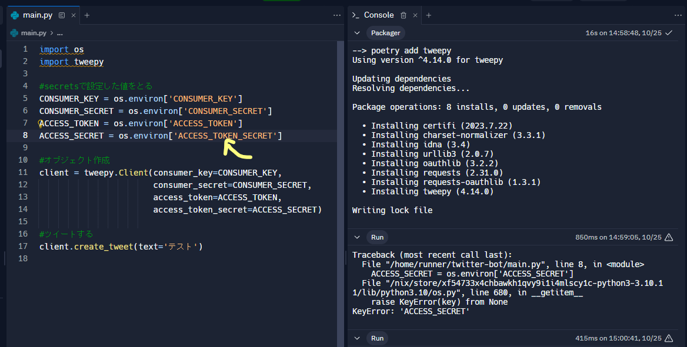

<script async src="https://pagead2.googlesyndication.com/pagead/js/adsbygoogle.js?client=ca-pub-2844921131740253"
     crossorigin="anonymous"></script>
<!-- Global site tag (gtag.js) - Google Analytics -->
<script async src="https://www.googletagmanager.com/gtag/js?id=G-H1234VX5NE"></script>
<script>
  window.dataLayer = window.dataLayer || [];
  function gtag(){dataLayer.push(arguments);}
  gtag('js', new Date());

  gtag('config', 'G-H1234VX5NE');
</script>


```
この記事にはこんなことが書かれています。
- 記事紹介
　　Twitterの名前を5分毎に東京の天気⛅☂☃と連動させるサーバレスプログラムを書いた
　　個人でも使える！おすすめAPI一覧
- Web APIで何を作るかきめよう
- X（旧Twitter）でAPIを利用する際の諸々手続き
- Replitを使って、Xにツイートできた
- バックエンドはFirebaseで構築が良さそう
```

----
### ■モチベーション <br>

前回記事でWebhookを使った情報伝達方法について実装したり、Web APIについて深堀してみたりしました。 <br>
[1.【情報処理】AWSでwebhookの受信＆メール通知を実装する（API Gateway＋Lambda）](https://kissshot-skup.github.io/webpage/webhook/)<br>
[2.Web APIについて](https://kissshot-skup.github.io/webpage/webapi/)<br>
<br>
2つ目の記事の最後に書きましたが、今回は実践してみた紹介記事になります。<br>
この記事を書きながら色々試していこうと思っていて、現時点で何ができるか想像もついていません…。<br>
もし詰まって、次回！ということになっても、一緒に悩んで進めていただけたらと思っています。<br><br>

----
### ■何を作るかきめよう<br>
まずは先人たちがどんな面白いことをやっているか検索してみました。面白いですねぇ↓ <br><br>
[Twitterの名前を5分毎に東京の天気⛅☂☃と連動させるサーバレスプログラムを書いたら色々知らないことが出てきた話](https://qiita.com/issei_y/items/ab641746be2704db98be)<br>
もうちょっと調べてみましたら、以下色々なAPIがあるようです。
[個人でも使える！おすすめAPI一覧](https://qiita.com/mikan3rd/items/ba4737023f08bb2ca161)<br><br>

上記踏まえて、以下のサービスなんか作ると面白いかなと思ったりしています。<br>
**「地域（ランダム）の出生数や経済指数などの統計情報をツイートするbot」を作成する**
ちょっと変わってると思いますが、Open APIについて調べていて、内閣府が統計情報をAPIで提供していることを知りました。↓<br>
[地域経済分析システムRESAS](https://resas.go.jp/#/13/13101)<br>

私が住んでいる愛知県の人口ピラミッドなんかも図式化できたりします。<br>
<br>

<br>

**なんかここ20年くらい女性より男性の人口が多いんだな！？** とか、何となく面白いものが見えてこないでしょうか。<br>

個人的な話をすると、最近祖父が亡くなったり、子供が生まれたりと人生の始まりと終わりについて考える機会が多くて、<br>
**「命は限りあるものだから今日はちょっとでも頑張ろう」とか「生まれてくる子供たちのためにできることなんだろうか」とかを少しでも考える機会になればなぁと思った次第です**<br>
本当は、昨日の出生者数とか出したかったんですが、昨日今日の出来事をAPIで提供してくれるシステムはなさそう…？でした。
<br>
安直な考えでは、難易度的にも「ある内容を引っ張ってきて自動ツイートする」ことは丁度よいかなと推測しているのと、
誰かがやった内容そのままではなくてちょっと捻りたかったというのもあり、一旦このテーマで進めてみることにします。<br>


----
### ■X（旧Twitter）でAPIを利用する際の諸々手続き<br>
XのAPI利用は、公式の許可がいるようです。以下サイトから申請をします。<br>
[X開発者プラットフォーム > Twitter API](https://developer.twitter.com/en/docs/twitter-api/getting-started/about-twitter-api)
<br>
以下のとおり有料枠もありますが、今回の利用用途にはオーバースペック、かつ、勉強のためなので基本は無料で構成したいと思います。<br>
<br>
<br>
手順は以下のとおりです。<br>

**1.開発者アカウントに登録する。**<br>
API利用の目的などを記入する必要があります。もちろん英語です…翻訳機と照らしながら確からしい英語で利用目的を記入しました。<br>
無料枠の申請なので、記入後すぐに（クレカ登録などなく）ダッシュボードにアクセス可能になりました。<br>
<br>
ダッシュボードは以下のような感じです。ツイート数のUsageがわかるようになっていそうです。<br>
色々と英語読み飛ばしてポチポチしていたので、間違って有料版に登録してないか不安になりましたが、“Free”の表記があり、ちょっと安心しました。<br>

<br>
<br>
サンプルアプリも提供されているようです。参考になりそう<br>
<br>
[公式：Twitter サンプルアプリ（@TwitterDev）](https://github.com/twitterdev)
<br>

**2.Xのbotを使うための設定をしていく**<br>
こちらの記事が非常にわかりやすかったです。「botを動かせるようにしていく」というところを進めていきます。<br>
[Twitter api freeでpythonを利用してbot（ボット）を作る](https://qiita.com/nekocat777/items/965a85195c4c7438e2be)
各種情報はローカルにメモして完了しました。<br>
<br>

**3.ツイートできるかのテストをする**<br>
上記2.で示した参考サイトに従ってテストしてみます。<br>
Replitという環境は初めて使いましたが、すぐコーディングできて初学者には嬉しいですね！<br>
<br>
ちなみに、Githubでアカウント連携してみましたが、Githubと連携した場合は1ヶ月Proモードで試用できるようです。<br>
freeで使いたかったのですが以下のようにProとなっていて焦りました…。<br>

<br><br>
上記2.のとおりアクセスキーの設定をしたあと、コードを拝借して実行してみました。<br>
以下エラーが。<br>

```
Traceback (most recent call last):
  File "/home/runner/twitter-bot/main.py", line 8, in <module>
    ACCESS_SECRET = os.environ['ACCESS_SECRET']
  File "/nix/store/xf54733x4chbawkh1qvy9i1i4mlscy1c-python3-3.10.11/lib/python3.10/os.py", line 680, in __getitem__
    raise KeyError(key) from None
KeyError: 'ACCESS_SECRET'
```
サンプルコードの引数が“ACCESS_SECRET”ではなく、“ACCESS_TOKEN_SECRET”が正しそうですね。<br>
以下修正して再実行！<br>
<br><br>
で、できたー！！！
<br>
<br><br>

ここまでで
**“外部からXのAPIを叩いて、ツイートする"**はできることを確認できました。<br>
一個ずつ見ていかないとどこがおかしいのか分からなくなるので、一歩一歩行きたいと思います<br>
<br>
さて、上記見真似でアクセストークンとやらを設定していましたが、これらがなにか気になりませんか？<br>
次章にまとめておきます。<br>
<br>

＜追記：あとから知ったことを参考までに＞
*コードで試用している「tweepy」はメンテナンスされなくなったようなので、使用するのを避けた方が良いという記事を見つけました。<br>
[PythonでTwitter](https://qiita.com/yasudaak/items/dbd0667e7658f09714f5)
<br>
*上記記事で、Twitter apiの利用目的は300 words 以上で使用目的を記載とあります。
私はそんなに書かなかったと思います。後から気づきました。<br>
偶然にもフォーマットは同じ感じで書いていますので、意味合いは伝わるとは信じていますが、もし文字数の条件が満たされないとして後から取り消しされることもあるかもしれません、できるだけ詳しく書いた方がよいということです。<br>

----
### ■認証の仕組みについて<br>
認証の仕組みについては、以下記事を参照。<br>
[一番分かりやすい OAuth の説明](https://qiita.com/TakahikoKawasaki/items/e37caf50776e00e733be)
<br>

[APIキー取得を解説！キーの役割・アクセストークンとの違いも](https://camp.trainocate.co.jp/magazine/howto-api-key/)
<br>
まとめると、<br>

**API キーは、APIにアクセスするための情報で、主に「誰がそのAPIを使用しているかを特定する」もの**<br>
**API シークレットキーは、APIにアクセスする際に使用するパスワードのような情報**<br>
<br>

**アクセストークンは、ユーザがAPIを利用する際に発行されるキーで、ユーザー・端末の数だけアクセストークンが発行されるもの。ユーザ確認のための情報**<br>
**APIキーは不変な情報で、アクセストークンはクライアントとサーバ間の通信で利用するもの**<br>
アクセストークンについては、上記参照URLの1個めの図がわかりやすいですね。<br>


----
### ■バックエンドを実装してみるか<br>
上記で紹介したbotを常時稼働させるためにはサーバ立ち上げがいるが、AWSを利用しようとするとどうしてもコストが心配になる。<br>
そんな大した情報ではないので、いいのだが、調べているとfirebaseを使用してアプリ開発をしている方が多くいる事に気づいた。<br>
<br>

[Webアプリ無料運営のススメ：FirebaseとNuxt(Vue)なら最強！](https://qiita.com/y_kawase/items/fb9f747d88af151f981a)<br>


[Firebaseとは？できることや料金体系などをわかりやすく解説](https://career.levtech.jp/guide/knowhow/article/386/)<br>

[あなたに最適なmBaaSはどれ？](https://press.monaca.io/atsushi/2667)<br>
<br>
ここらへんを掘って、最適なシステムを検討していこうと思う<br>
バックエンドの開発は次回！<br>
<br>

‐‐以下次回確認すること・メモ情報--<br>
[Firebaseとは？できることや料金体系などをわかりやすく解説](https://career.levtech.jp/guide/knowhow/article/386/)<br>
[地域経済分析システムRESAS](https://resas.go.jp/#/13/13101)<br>
[RESAS API仕様書](https://opendata.resas-portal.go.jp/docs/api/v1/index.html)<br>


----


## [Mainページに戻る](https://kissshot-skup.github.io/webpage)

