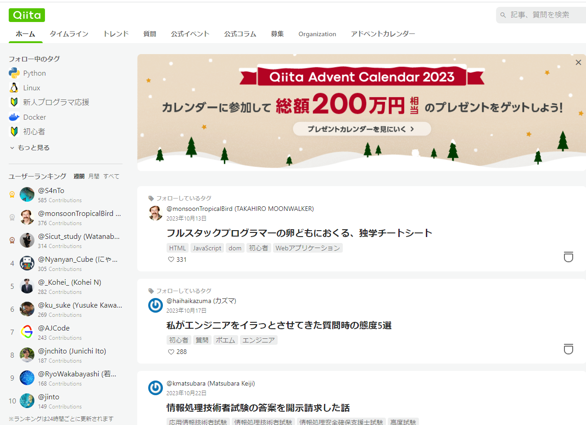
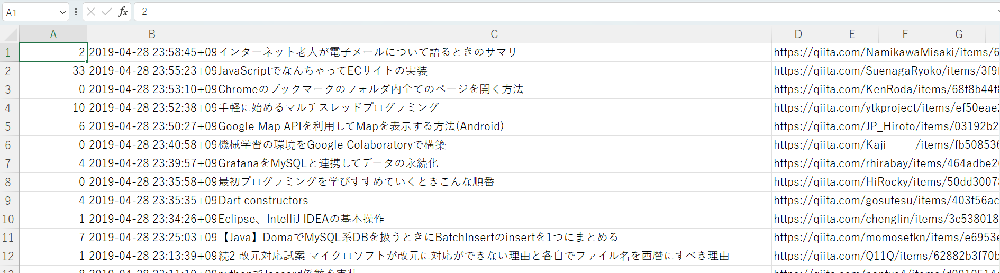

<script async src="https://pagead2.googlesyndication.com/pagead/js/adsbygoogle.js?client=ca-pub-2844921131740253"
     crossorigin="anonymous"></script>
<!-- Global site tag (gtag.js) - Google Analytics -->
<script async src="https://www.googletagmanager.com/gtag/js?id=G-H1234VX5NE"></script>
<script>
  window.dataLayer = window.dataLayer || [];
  function gtag(){dataLayer.push(arguments);}
  gtag('js', new Date());

  gtag('config', 'G-H1234VX5NE');
</script>


```
この記事にはこんなことが書かれています。
- QittaAPIを使って、ある日に投稿された記事一覧を取得してみた
- 記事を取得するまでの軌跡とイメージ
- 躓いたところ
```

----
### ■モチベーション <br>

前回記事でWebhookを使った情報伝達方法について実装したり、Web APIについて深堀してみたりしました。 <br>
[1.【情報処理】AWSでwebhookの受信＆メール通知を実装する（API Gateway＋Lambda）](https://kissshot-skup.github.io/webpage/webhook/)<br>
[2.Web APIについて](https://kissshot-skup.github.io/webpage/webapi/)<br>
[3.Web APIでBotを作ろう！](https://kissshot-skup.github.io/webpage/webapi2/)<br>
<br>

3つ目の記事で、各県のトレンド（統計情報）などをつぶやくBotを作ろうと思っていましたが。<br>
**やっぱ地味だよね…。**<br>
ということで、ちょっともがいていています。<br>
そんな中、個人的にQittaの技術記事を定期的に読んで面白いなぁと思っている身なので、QittaのAPIを使えないか試してみたという記録になります。<br><br>

----
### ■QittaAPIを使って、ある日に投稿された記事一覧を取得してみた<br>
Qitta使ったことがない人のためにサンプル載せますが、こんな感じに記事一覧が見えています。<br>
<br>
<br>

一日に何百もの記事が投稿されていますが、これを“いいね”がつく記事をピックアップしていったりすると、よく注目されている記事が探せたりします。
<br>
<br>
QittaAPIを使えば、これらの解析も楽になります。先に結果ですが、CSVにある日の記事一覧を出力してみました。<br>
<br>
<br>
A列にある数字がいいねの数になります。<br>
これを昇順にして、Bot投稿するだけでもだいぶ面白いですね。（自分的に）<br>
<br>


----
### コード<br>
‐[Qiitaの記事情報をAPIで取得しCSVに書き出す](https://qiita.com/ararie/items/94902fc0e686e59cb8c5)
<br>
上記参考資料のコードを改良して、特定の日の記事を取り出すコードにしました。<br>
とりあえず動けばいいという観点で作ったので、あまりキレイではありません。<br>

```
import http.client
import json
import pandas as pd
import math

h = {'Authorization': 'Bearer xxxxxxxx自分のアクセストークンxxxxxxxx'}
conn = http.client.HTTPSConnection("qiita.com")
url = "/api/v2/items?"

# この期間に作成されたQiitaの記事情報を取得
start = '2019-04-28'
end = '2019-04-28'

# 日付をリスト化
date_list = [d.strftime('%Y-%m-%d') 
             for d in pd.date_range(start, end, freq='D')]
print(date_list)

# カウント用変数
num = 0
p = 0

# start_listの配列の数だけ繰り返し処理　←今回は1日なのでループの意味あまりない
for i in date_list:
    num += 1
    # 日付のリストから検索の開始日と終了日を取り出す
    search_date =  date_list
    query = "&query=created:>=" + search_date[0] + "+created:<=" + search_date[0] + "&per_page=100"
     # 検索で指定した日に作成された記事数を取得
    conn.request("GET",  url + query, headers=h)
    res = conn.getresponse()
    res.read()
    print(res.status, res.reason)
    print(res.headers['Total-Count'])
    total_count = int(res.headers['Total-Count'])
    # 取得した記事数をもとにリクエスト回数を算出
    page_count = math.ceil(total_count / 100)
    print(search_date[0] + "のデータを取得します...")
    print("この日に作成されたデータを取得するのに必要なリクエスト回数は" + str(page_count) + "回です")
    #データを取得しCSVに書き出す
    for p in range(page_count):
        p += 1
        page = "page=" + str(p)
        conn.request("GET", url + page + query, headers=h)
        res = conn.getresponse()
        print(res.status, res.reason)
        data = res.read().decode("utf-8")
        df = pd.read_json(data)
        print(df)
        df.to_csv("qiita2.csv", encoding="utf-8", columns=[
            'likes_count', 
            'created_at',
            'title',
            'url'
            ], mode='a', header=False, index=False)
        print(str(p) + "/" + str(page_count) + "完了")

```


----
### ■つまったところ<br>
かなりいっぱいありました。こちらについては、Qittaの方に記載しましたので、ご参照いただければと思います。<br>
‐[Qiita API を使って、特定の日の記事データを取得する方法](https://qiita.com/kissshot_skup/items/5a1ae01b4ae4ab854a4e)<br>
<br>
次回は、これらを使ってなにか面白いものを作りたい
<br>

----


## [Mainページに戻る](https://kissshot-skup.github.io/webpage)

