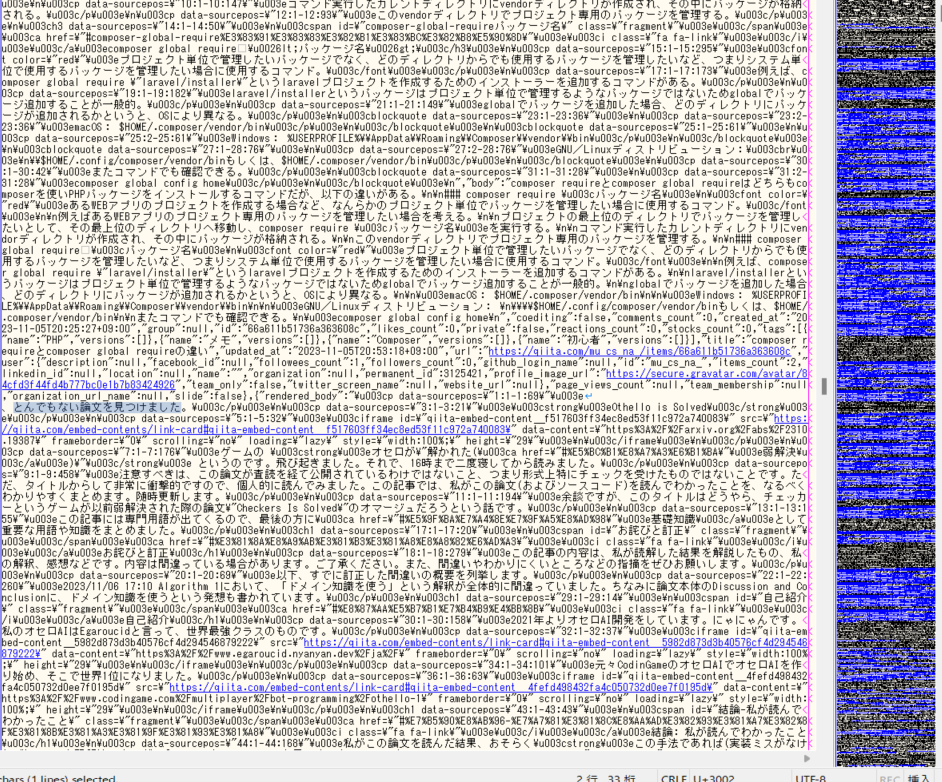
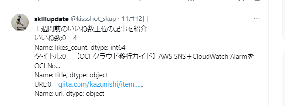
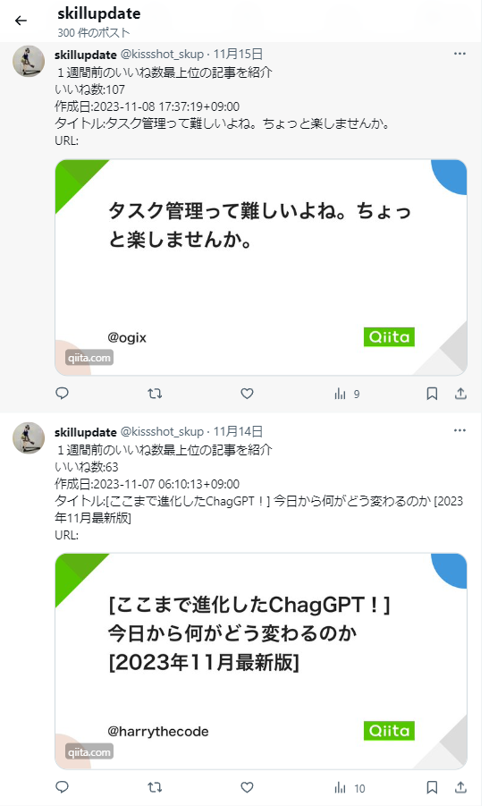

<script async src="https://pagead2.googlesyndication.com/pagead/js/adsbygoogle.js?client=ca-pub-2844921131740253"
     crossorigin="anonymous"></script>
<!-- Global site tag (gtag.js) - Google Analytics -->
<script async src="https://www.googletagmanager.com/gtag/js?id=G-H1234VX5NE"></script>
<script>
  window.dataLayer = window.dataLayer || [];
  function gtag(){dataLayer.push(arguments);}
  gtag('js', new Date());

  gtag('config', 'G-H1234VX5NE');
</script>


```
この記事にはこんなことが書かれています。
- QittaAPIを使って、1週間前の記事でいいねが最もついた記事をピックアップしXで投稿するシステムを作った
- システム構成とソースコード紹介
- 苦労したところの紹介
```

----
### ■ダイジェスト <br>
成果物はこれ↓<br>
[Xアカウント](https://twitter.com/kissshot_skup)<br><br>
製作に関するダイジェスト版としてはQittaに投稿しています↓<br>
[Qittaの良記事をピックアップして毎日投稿するBotを作ったら、思った以上に面白い記事が見つかった話）](https://qiita.com/skup/items/a0b2495e48dace0524dc)<br>
<br>
このブログでは、Qitta記事よりもう少し詳細まで書かせて頂こうと思います。<br><br>

----
### ■QittaAPIを使って、1週間前の記事を取得する&ソートする<br>
前回記事で記事を取得するところまで作っています。<br>
[QittaAPIを使って、ある日に投稿された記事一覧を取得してみた）](https://kissshot-skup.github.io/webpage/webapi3/)<br>
<br>
これで得たデータというのはこんな感じのものです↓<br>
<br>
<br>
上記表は、A列にいいね数が書かれていて、その後にタイトルが続いています。<br>
ここで、A列の情報でソートして、最もいいね数の多い記事をピックアップする・そして、その情報をXで投稿するというところが今回のミソです。<br>
<br>
意外とすぐ終わるんじゃないかと思っていましたら、かなり手こずりました。<br>
<br>
理由は、以下です。<br>
```
- 本日から7日前の日付を取得するというところは新規
‐ QittaAPIで1回の通信で得られるデータは100件までという制約がある
- 上記制約から、100件ずつ取得したデータを全件いれる箱を用意して、全件のデータからソートした上位を抽出する
- Xの投稿には文字数制限がある（無料枠に限った話かも？）
```

ということで、一個ずつ解決した内容を書いていきます。<br>
<br>

----
### システム構成<br>
システム構成を示します。<br>
<br>
<br>
自宅PCの環境で動かしており、タスクスケジューラで毎朝7時にPythonのコードを叩いて起動しています。<br>
タスクスケジューラでPythonのコードを叩くのは、以下記事を参考にしました。<br>

‐[#WindowsタスクスケジューラでPythonを走らせる](https://qiita.com/kawa-Kotaro/items/4005a43eb686eae41448)
<br>
クラウドに以降する予定ですが、AWSではコストの心配があります。<br>
LambdaとEventBridgeで定期的に実行ができそうで、かつ、一日1回程度の実行であれば、コストかからないくらいの金額になるとの記事を何処かで見ました。
<br>
が、自分の勉強も兼ねて、Googleのクラウド環境Firebaseを使ってみたいと考えています。これは次回以降に試して記事にしたいと思います。<br>
<br>


----
### ソースコード：Xに投稿するために必要な設定部分<br>
ソースコードにベタ書きするのは、あまり良くない（セキュリティ的にも・変更点管理的にも）ので、どこかのファイルにおいたものを取りに行く構成にしました。<br>
<br>
メインのPython実行環境と同じフォルダにsettings.pyという設定ファイルを置いて、以下のように各値を記述します。<br>
```
consumer_key        = 'ここに書く'
consumer_secret     = 'ここに書く'
access_token        = 'ここに書く'
access_token_secret = 'ここに書く'
```
<br>
そのあとmain.pyで取り込みをしたらOKです。<br>

```
# Twitter用
import os
import tweepy
import settings

#設定した値をとる
CONSUMER_KEY = settings.consumer_key
CONSUMER_SECRET = settings.consumer_secret
ACCESS_TOKEN = settings.access_token
ACCESS_SECRET = settings.access_token_secret

#オブジェクト作成
client = tweepy.Client(consumer_key=CONSUMER_KEY,
                       consumer_secret=CONSUMER_SECRET,
                       access_token=ACCESS_TOKEN,
                       access_token_secret=ACCESS_SECRET)

# Twitter用‐ここまで‐
```
<br>

----
### ソースコード：今日から1週間前の日付を取ってくる<br>
datetimeというライブラリを使って、取ってくる事ができました。こんな感じ。<br>
```
import datetime

～

# 本日から7日前の日付を取得して文字列に変換して
# 指定したフォーマットに整形
today = datetime.date.today()
ago7days = today - datetime.timedelta(days=7)
ago7days_str = ago7days.strftime("%Y-%m-%d")
print(ago7days_str)

```
これで、今日をtodayに格納した上で、1週間前の日付をago7daysに格納できます。<br>
確認のため、文字型でプリント出力しています。<br>
<br>

----
### ソースコード：全件のデータを格納してソートする<br>
全件のデータを格納する箱all_dataを用意して、いいね数を降順に並び替えて入れました。<br>
こんな感じ<br>
```
# 取得するQiitaの記事情報の日付を指定
start = ago7days_str
end = ago7days_str

# 日付をリスト化
date_list = [d.strftime('%Y-%m-%d') 
             for d in pd.date_range(start, end, freq='D')]
print(date_list)

# カウント用変数
num = 0
p = 0

# start_listの配列の数だけ繰り返し処理
for i in date_list:
    num += 1
    # 日付のリストから検索の開始日と終了日を取り出す
    search_date =  date_list
    query = "&query=created:>=" + search_date[0] + "+created:<=" + search_date[0] + "&per_page=100"
    # 検索で指定した期間内に作成された記事数を取得
    conn.request("GET",  url + query, headers=h)
    res = conn.getresponse()
    res.read()
    print(res.status, res.reason)
    print(res.headers['Total-Count'])
    total_count = int(res.headers['Total-Count'])
    # 取得した記事数をもとにリクエスト回数を算出
    page_count = math.ceil(total_count / 100)
    print(search_date[0] + "のデータを取得します...")
    print("この日に作成されたデータを取得するのに必要なリクエスト回数は" + str(page_count) + "回です")
    
    # すべてのページのデータをまとめるための空のDataFrameを作成
    all_data = pd.DataFrame()
    all_data_page = pd.DataFrame()

    #データを取得
    for p in range(page_count):
        p += 1
        page = "page=" + str(p)
        conn.request("GET", url + page + query, headers=h)
        res = conn.getresponse()
        print(res.status, res.reason)
        data = res.read().decode("utf-8")
        df = pd.read_json(data)
        print(df)

        # 'likes_count' 列で降順にソート
        df.sort_values(by='likes_count', ascending=False, inplace=True)

        # すべてのページのデータをまとめる
        all_data_page = pd.concat([all_data_page, df], ignore_index=True)

        print(f"{p}/{page_count}完了")
    
    # すべての日付のデータをまとめる
    all_data = pd.concat([all_data, all_data_page], ignore_index=True)

    # すべてのデータを 'likes_count' 列で降順にソート
    all_data.sort_values(by='likes_count', ascending=False, inplace=True)

```
これで、all_dataにいいね数順にソートされたデータが格納されました。<br>
ちゃんとできているか確認のために、データの中身を見たりしていましたが、<br>
QittaAPIで取得したデータの中身をそのまま見ると、こんな感じです…<br>
<br>
<br>
**なので、いい感じにタイトルといいね数だけ取り出して表示させたり、Xに投稿するなら情報の取捨選択が必要になります。**<br>
<br>


----

### ソースコード：Xに投稿する内容を作成する（＝情報を絞る）<br>
前述のように、かなりの情報があるので、文字数制限に収まるように情報を取捨選択します。<br>
こんな感じ<br>
```
#　上位1位の記事をツイートする
top_data = all_data.head(1)
top_data_like = top_data['likes_count'].reset_index(drop=True)
top_data_cr = top_data['created_at'].reset_index(drop=True)
top_data_title = top_data['title'].reset_index(drop=True)
top_data_url = top_data['url'].reset_index(drop=True)
print(top_data_like)

# 余計なインデックスNoなどを削る
top_data_like_value = top_data_like.iloc[0]
top_data_cr_value = top_data_cr.iloc[0]
top_data_title_value = top_data_title.iloc[0]
top_data_url_value = top_data_url.iloc[0]
print(top_data_like_value)

try:
    tweet_message = (
        "１週間前のいいね数最上位の記事を紹介\n"
        "いいね数:" + str(top_data_like_value) + "\n"
        "作成日:" + str(top_data_cr_value) + "\n"
        "タイトル:" + str(top_data_title_value) + "\n"
        "URL:" + str(top_data_url_value) + "\n"
    )    
    client.create_tweet(text=tweet_message)
    print("ツイートしました:", tweet_message)
except Exception as e:
    print("ツイートに失敗しました:", str(e))    

```
<br>
いいね数上位一位の記事の情報をtop_dataに格納した後、いいね数と、作成日とタイトルとURLだけ取り出しています。<br>
ただ、これだけだとなんか余計な情報がついてきます。こんな感じに↓<br>
<br>
Name: likes_count, dtype: int64とかなんとかはいらないですよね。<br>
<br>
しかも、これらの情報で文字数制限を超えてしまう場合もあり。。。<br>
「余計なインデックスNoなどを削る」というところのコードで削っています。<br>
<br>
これで無事にデータを取捨選択して取り出せました！！<br>
早速2、3日見てましたが、面白そうな記事多いですね！<br>
<br>
<br>

----
### おわりに<br>
このシステムやソースコードの改良の余地は大いにありで、今後進めて行く予定はありますが、メインの部分はできたかなと思っています。
<br>
もっと他の情報を使ったら面白くなりそう！とかあったら教えてほしいです。<br>
今回はこれにて！<br>

----


## [Mainページに戻る](https://kissshot-skup.github.io/webpage)

