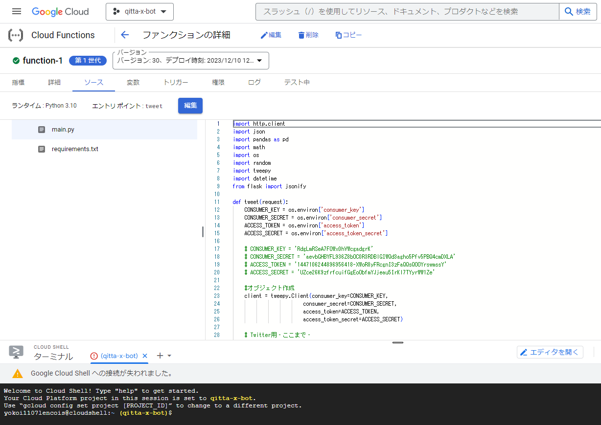
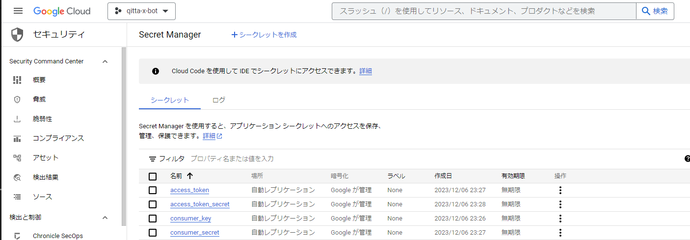
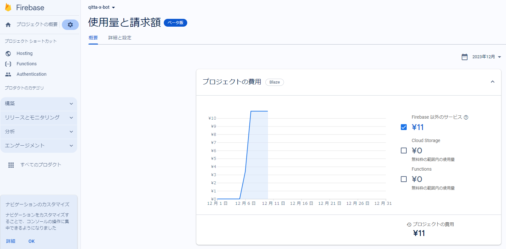

<script async src="https://pagead2.googlesyndication.com/pagead/js/adsbygoogle.js?client=ca-pub-2844921131740253"
     crossorigin="anonymous"></script>
<!-- Global site tag (gtag.js) - Google Analytics -->
<script async src="https://www.googletagmanager.com/gtag/js?id=G-H1234VX5NE"></script>
<script>
  window.dataLayer = window.dataLayer || [];
  function gtag(){dataLayer.push(arguments);}
  gtag('js', new Date());

  gtag('config', 'G-H1234VX5NE');
</script>


```
この記事にはこんなことが書かれています。
- 前回作ったQittaAPIを使って、1週間前の記事でいいねが最もついた記事をピックアップしXで投稿するシステムを
　クラウドへ移行したこと
- 参考記事とソースコード紹介
- 苦労したところの紹介
```

----
### ■ダイジェスト <br>
前回成果物はこれ↓<br>
[Xアカウント](https://twitter.com/kissshot_skup)<br><br>
製作に関する話（ダイジェスト版）はQittaに投稿しています↓<br>
[Qittaの良記事をピックアップして毎日投稿するBotを作ったら、思った以上に面白い記事が見つかった話）](https://qiita.com/skup/items/a0b2495e48dace0524dc)<br>
<br>
上記Botについて、個人PC上で動かしていたのですがクラウドへ移行して、安定稼働できたという話です。<br><br>

----
### ■Google cloudを使ってみよう<br>
自宅個人PCで動かしているとデメリットが色々とあって、例えばPCがアップデート処理になってしまったり、電源切っていたりしたら当たり前だけど動かない時があるんですよね。<br>
個人アプリなので、止まっても問題ないのですが、利益が絡むような重要なアプリの場合は安定稼働が必須になります。<br>
そこで、サーバレスで実装できるクラウドプラットフォームを利用したほうが良いという考え方になります。<br>
<br>
私自身、AmazonのクラウドプラットフォームであるAWSは使ったことがあって、今回もそちらでと思いましたが、別のプラットフォームも使ってみた経験は必要かなと思い、グーグルクラウド（以降GCP）を試してみました。<br>
<br>
GCPでは、Functionsというサービス上にpythonコードを書いて、Google schedulerという定期的にFunctionsを呼び出すサービスを使って定期実行します。
<br>
Functionsの操作画面は以下のようなフォームです。ブラウザ上でソースの編集などができます。<br>
<br>
<br>
<br>


----
### ■ソースコード<br>
コードは以下のとおり。これまた、とりあえず動かしたコードなので汚くてごめんなさい。ほぼ前回と共通です。GCP用に修正したVerです。<br>

```
import http.client
import json
import pandas as pd
import math
import os
import random
import tweepy
import datetime
from flask import jsonify

def tweet(request):
    CONSUMER_KEY = os.environ['consumer_key']
    CONSUMER_SECRET = os.environ['consumer_secret']
    ACCESS_TOKEN = os.environ['access_token']
    ACCESS_SECRET = os.environ['access_token_secret']

    client = tweepy.Client(consumer_key=CONSUMER_KEY,
                        consumer_secret=CONSUMER_SECRET,
                        access_token=ACCESS_TOKEN,
                        access_token_secret=ACCESS_SECRET)

    h = {'Authorization': 'ここにキーを記入していたが、本当はシークレットから呼び出す形の方がよさそう'}
    conn = http.client.HTTPSConnection("qiita.com")
    url = "/api/v2/items?"

    # 本日から7日前の日付を取得して文字列に変換して
    # 指定したフォーマットに整形
    today = datetime.date.today()
    ago7days = today - datetime.timedelta(days=7)
    ago7days_str = ago7days.strftime("%Y-%m-%d")

    # 取得するQiitaの記事情報の日付を指定
    start = ago7days_str
    end = ago7days_str

    # 日付をリスト化
    date_list = [d.strftime('%Y-%m-%d') 
                for d in pd.date_range(start, end, freq='D')]

    # カウント用変数
    num = 0
    p = 0

    # start_listの配列の数だけ繰り返し処理
    for i in date_list:
        num += 1
        # 日付のリストから検索の開始日と終了日を取り出す
        search_date =  date_list
        query = "&query=created:>=" + search_date[0] + "+created:<=" + search_date[0] + "&per_page=100"
        # 検索で指定した期間内に作成された記事数を取得
        conn.request("GET",  url + query, headers=h)
        res = conn.getresponse()
        res.read()
        print(res.status, res.reason)
        print(res.headers['Total-Count'])
        total_count = int(res.headers['Total-Count'])
        # 取得した記事数をもとにリクエスト回数を算出
        page_count = math.ceil(total_count / 100)
        print(search_date[0] + "のデータを取得します...")
        print("この日に作成されたデータを取得するのに必要なリクエスト回数は" + str(page_count) + "回です")
        
        # すべてのページのデータをまとめるための空のDataFrameを作成
        all_data = pd.DataFrame()
        all_data_page = pd.DataFrame()

        #データを取得
        for p in range(page_count):
            p += 1
            page = "page=" + str(p)
            conn.request("GET", url + page + query, headers=h)
            res = conn.getresponse()
            print(res.status, res.reason)
            data = res.read().decode("utf-8")
            df = pd.read_json(data)
            # print(df)

            # 'likes_count' 列で降順にソート
            df.sort_values(by='likes_count', ascending=False, inplace=True)

            # すべてのページのデータをまとめる
            all_data_page = pd.concat([all_data_page, df], ignore_index=True)

            print(f"{p}/{page_count}完了")
        
        # すべての日付のデータをまとめる
        all_data = pd.concat([all_data, all_data_page], ignore_index=True)

        # すべてのデータを 'likes_count' 列で降順にソート
        all_data.sort_values(by='likes_count', ascending=False, inplace=True)

        print(str(p) + "/" + str(page_count) + "完了")

    #　上位1位の記事をツイートする
    top_data = all_data.head(1)
    top_data_like = top_data['likes_count'].reset_index(drop=True)
    top_data_cr = top_data['created_at'].reset_index(drop=True)
    top_data_title = top_data['title'].reset_index(drop=True)
    top_data_url = top_data['url'].reset_index(drop=True)
    # print(top_data_like)

    # 余計なインデックスNoなどを削る
    top_data_like_value = top_data_like.iloc[0]
    top_data_cr_value = top_data_cr.iloc[0]
    top_data_title_value = top_data_title.iloc[0]
    top_data_url_value = top_data_url.iloc[0]
    print(top_data_like_value)

    try:
        tweet_message = (
            "１週間前のいいね数最上位の記事を紹介\n"
            "いいね数:" + str(top_data_like_value) + "\n"
            "作成日:" + str(top_data_cr_value) + "\n"
            "タイトル:" + str(top_data_title_value) + "\n"
            "URL:" + str(top_data_url_value) + "\n"
        )    
        client.create_tweet(text=tweet_message)
        print("ツイートしました:", tweet_message)
    except Exception as e:
        print("ツイートに失敗しました:", str(e))

    response_data = {"message": "OK"}
    return jsonify(response_data), 200

```


----
### ひっかかったこと <br>
上記、consumer_keyなど大事な情報は、別のセキュリティサービス（Secret Manager）に保存して、そこから呼び出す形で設計するのが一般的なようです。<br>
<br>
<br>
ここが上手く動いているかどうか不安になるので、以下Youtubeを参考にテストしました。<br>
[【サーバレス・コンピューティング】コードを書くだけでデプロイできる！！Cloud Functionsの使い方 〜 Twitter Bot 作成実演 〜](https://youtu.be/RGQETby444E?si=lKMCYn5wpdi56BKV)<br>
<br>
紹介されている方法を試してみるために、コードを書き起こしてみました。よかったらコピペで使ってください。<br>

```
import os
import random
import tweepy
import datetime
from flask import abort

CONSUMER_KEY = os.environ['consumer_key']
CONSUMER_SECRET = os.environ['consumer_secret']
ACCESS_TOKEN = os.environ['access_token']
ACCESS_SECRET = os.environ['access_token_secret']
TWEET = ['bot Test投稿中']

def tweet(request):
    if request.method != 'POST':
        return abort(404)
    dt_now = datetime.datetime.now()
    num = (dt_now.hour) % 4
    ran_num = f'[{random.randint(0,100)}]'

    client = tweepy.Client(
        consumer_key=CONSUMER_KEY,
        consumer_secret=CONSUMER_SECRET,
        access_token=ACCESS_TOKEN,
        access_token_secret=ACCESS_SECRET
    )
    client.create_tweet(text=TWEET[num] + ran_num)
    return TWEET[num]
```
<br>
<br>
自分のコードが動くまでにかなりかかりました。まずデバックの仕方がなかなかわからなかった。。。<br>
メモとして残しますが、パターンは以下。<br>
<br>
まず、デプロイした際にエラーがでる→エラーログの表示というポップアップが出て、そこから確認する。<br>
request.txtにインポートしたいパッケージの記載が必要だったりのエラー。<br>
次に、Functionsのデプロイが成功したとしても動かないことが多い。<br>
それは、Functionsのログで確認していく、Print関数でどこまで進んでいるか確認しながら修正する。<br>
<br>
<br>

----
### プロジェクトの費用<br>
右往左往してましたが、費用はそれほどでした。10円ちょい。<br>
<br>
200万呼び出し/月までは無料で、今回のテスト含めて、まだ十数呼び出しした程度。無料枠で十分そうです。<br>
<br>

----
### おわりに<br>
一旦、botシステムは終わりにしたいと思います。拡張余地大いにあると思うので、いいアイデアあれば教えてほしいです。
<br><br>
今回はこれにて！<br>

----


## [Mainページに戻る](https://kissshot-skup.github.io/webpage)

