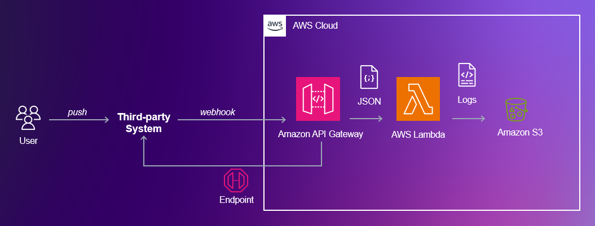
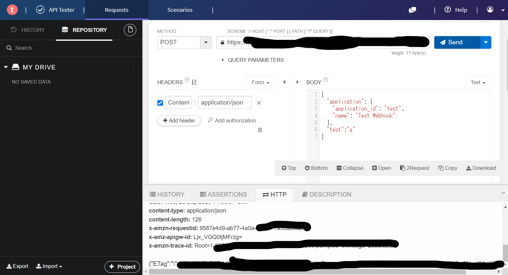

<script async src="https://pagead2.googlesyndication.com/pagead/js/adsbygoogle.js?client=ca-pub-2844921131740253"
     crossorigin="anonymous"></script>
<!-- Global site tag (gtag.js) - Google Analytics -->
<script async src="https://www.googletagmanager.com/gtag/js?id=G-H1234VX5NE"></script>
<script>
  window.dataLayer = window.dataLayer || [];
  function gtag(){dataLayer.push(arguments);}
  gtag('js', new Date());

  gtag('config', 'G-H1234VX5NE');
</script>


```
この記事にはこんなことが書かれています。
- webhookとは
- webhookを受ける口をつくってみよう（AWS活用）
- API Gateway
- Lambda
‐ Amazon SNS
```

----
### ■モチベーション <br>
客先システム導入時に担当者から「ある処理の完了通知をwebhookで投げることができる」 <br>
と連絡をうけた。webhookとは何かから勉強することになったが<br>
AWSでその受け皿をつくることができたのでその軌跡を書く <br>
<br>
＜webhook概要＞ <br>
あるアプリケーションから別のアプリに対して、リアルタイムな情報提供を実現するための仕組み。 <br>
例えばインターネットであるホームページを見るときには、自身のPCは「この情報くれよ」とあるサーバーに対して問合せをして、サーバー側から「お前は誰？」とか「誰か確認できたからこの情報あげるね」とかをやり取りしている。 <br>
それに対してWebhookは、何かイベント発生をしたら、決められた情報を通知するだけの仕組みで、送信側・受信側ともに効率のいい方法です。 <br>
<br><br>

----
### ■webhookをもう少し詳しく<br>
以下資料がわかりやすかったです↓ <br><br>
[WebhookのWeb APIとの違い 〜イベントと通信に着目してみた〜](https://qiita.com/kuwazzy/items/fdf363cc1caee9a23686)<br>
[データ連携(Webhook)](https://webiot.io/docs/console/datalinkage/)
<br><br>
まとめると、webhookは“広義のWeb API”(＝以下、HTTP通信を主体としたインターフェース)<br>
　・http(s) GET　<br>
　・http(s) POST　<br>
の一種であり、特にWebhookは、イベント駆動で情報を通知（＝POST）するものということがわかりました。<br>
つまり、情報をGETで得たりせず、イベント発生時に、相手システムにPOSTして情報を伝達するものという理解です。<br>
<br>
ボディと呼ばれる、HTTPの中身に情報をいれて送受信しますが<br>
JSONと呼ばれる形式で書くのが一般的なようです。<br>
これはWebhookに依らずよく使われる形式で<br>
非常に見やすく簡単な構造で以下のような感じです<br>
<br>
```
{
  "id":"{id}",
  "value":"{value}",
  "unit":"{unit}"
}
```
"id"部分をキーと呼び、“｛ほにゃらら｝”をバリューといいます
<br>
キーは何か概念を表すもので、バリューはその値です。非常にシンプルですね。
<br>
例えば、ある温度センサーから定期的に温度の値の値知する仕組みを作って、JSONでやり取りしましょうとなったらこんな感じでしょうか。<br>
```
{
  "id":"{1}",
  "area":"{nagoya}",
  "temperature":"{28.5}"
}
```

----
### ■webhookを実装する<br>
AWSでwebhookを受信し自分にメール通知する仕組みを作ってみる。<br>
まず結論から、こんな構成で作成しました。<br>
<br>
<br>
Webhookの受信部はAPI Gatewayで作成し、エンドポイントを提供します。<br>
Lambdaは、関数部で、API Gatewayが受け取ったデータを読み取り、ログやEmail作成のためにデータを加工します。
<br>
S3は、Lambdaで作成したデータを保存します。
<br>
Amazon SNSは、Lambdaで作成したデータを本文として、Emailに通知します。<br>
<br>
以下サイトを参考に作成しました。非常に助かります。<br>
[Webhook参考1](https://blog.braveridge.com/blog/archives/190)<br>
[Webhook参考2](https://zenn.dev/nakam_aws/articles/6562e07cfae4fd)<br><br>
本当はもっといろんなサイトを見ましたが、一番参考になったのがこの2つでした<br>


----
### ■Lambda関数のソースサンプル
pythonの方が慣れていますが、上記参考サイトがjavascript形式でしたので見よう見まねで書いてみました。<br>
初めてなので、色々とおかしいところあるかもしれません<br>

```
'use strict';

const AWS = require('aws-sdk');
const s3 = new AWS.S3({ apiVersions: '2006-03-01' });
const bucketName = 'ここに名前を入れる';

//SNS通知部分--ここから--
var sns = new AWS.SNS({apiVersion: '2010-03-31', region: 'ap-northeast-1'});
function timer(ms, name){
    console.log('name: ${name} start!')
    return new Promise((resolve, resject) => {
        setTimeout(() => resolve(name), ms)
        })
}
//SNS通知部分--ここまで--

exports.handler = async (event, context) => {

    // ファイル名のために、現在時刻を取得する
    // LambdaのタイムゾーンはUTCのためJSTに変換する
    const now = new Date(Date.now() + ((new Date().getTimezoneOffset() + (9 * 60 * 60 * 1000))));

    // フォーマット通りに変換する
    const fileName = now.toISOString().replace(/-|:|Z/g, '').replace(/T|\./g, '_');

    const eventBody = JSON.parse(event.body);

    // フォルダ名にデバイスIDを設定する
    let dirName = getDeviceId(eventBody);

    //SNS通知部分--ここから--
    console.log('publish start')
    await timer(1000, publish(event, context));
    function publish(event, context) {
        sns.publish({
            Message: JSON.stringify(eventBody, null, 2),
            Subject: '名前をいれる ' ,
            TargetArn: 'arn:を入力する'
            }, function(err, data) {
                if (err) {
                    console.log(err.stack);
                    return "failed publish".err.stack;
                }
                console.log('publish sent');
                console.log(data);
        });
    }
    //SNS通知部分　--ここまで--
    
    try {
    // S3へデータを保存する。保存するファイルは「S3bucket/dirName/fileName.json」の形式となる。
    const data = await s3.putObject(
        createParamsToPutObject(bucketName, (dirName + '/' + fileName + '.json'), JSON.stringify(eventBody, null, 2)))
        .promise();
        // 成功したらログにSUCCESSを表示する
        console.log('SUCCESS', data);
        return createResponse(data.statusCode, data);
    } catch (err) {
    // 失敗したらログにERRORを表示する
     console.log('ERROR', err.stack);
     return createResponse(err.statusCode, err.message);
    }
    

};

// S3への保存のためのパラメータ（JSON）を作る
const createParamsToPutObject = (bucket, key, body) => {
    return {
        Bucket: bucket,
        Key: key,
        Body: body,
        ContentType: 'application/json'
    };
};

// レスポンスを作る
const createResponse = (code, body, headers) => {

    if (!headers) {
        headers = {};
    }

    const response = {
        statusCode: code,
        body: JSON.stringify(body),
        headers: headers
    };
    return response;
}

// リクエスト本文にデバイスIDが含まれていればデバイスを、そうでなければ'unknown'を返す
const getDeviceId = (jsonObject) => {
    if ('device' in jsonObject) {
        const deviceId = jsonObject.device.device_id;
        if (deviceId) {
            return deviceId;
        }
    }
    return 'unknown';
}

```


----
### ■テスト方法	　　<br>
上記で紹介したURLを参考にコンソールのテストツールでもテストできますが<br>
実際に他のサイトからwebhookを受けてみたいと思いました。以下を試しました。<br>
<br>
[WebブラウザでAPIを投げることができる](https://chrome.google.com/webstore/detail/talend-api-tester-free-ed/aejoelaoggembcahagimdiliamlcdmfm?hl=ja)<br>
インストールしたりするのが大変だと思ったので調べてみると、Google Chromeの拡張機能で便利なものがありました。非常に使いやすく、1分くらいで使えちゃいます。<br>
API Gatewayで作ったエンドポイントを入力して、適当にBodyを書いて、POSTするだけです。<br>
操作画面は、以下の写真のような感じです。
<br>
<br>
※Bodyの内容が間違ってたり、エンドポイントを誤っているとサーバーエラーが出てしまいます<br><br>

また、Webhookは色々なところで標準対応しているので、手短なところとしてGithubのWebhook通知との連携を試してみました。以下サイトを参考にしました<br>
[GithubでWebhook通知を行う](https://docs.github.com/ja/webhooks/using-webhooks/creating-webhooks)<br>
<br>
リポジトリにソースをアップしたら通知がくることを確認しました。<br>
皆さんの参考になれば幸いです。即席で色々と書きましたが、詳しくは別の機会に。
<br><br>

----


## [Mainページに戻る](https://kissshot-skup.github.io/webpage)

